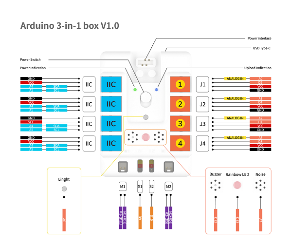
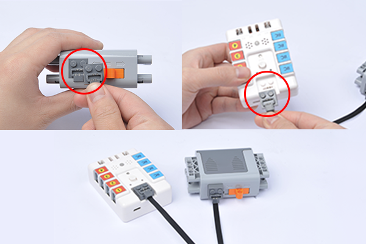
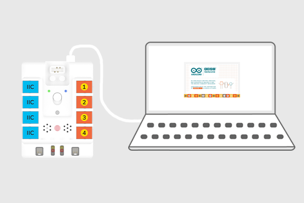
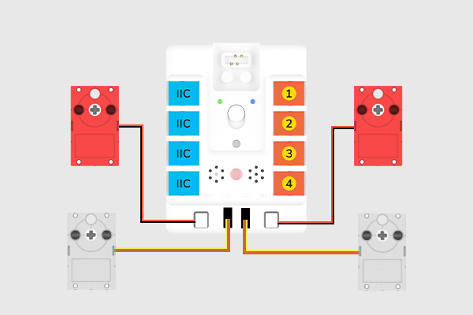

# Arduino 3合1主控盒

## 简介
Arduino 3合1主控盒是一款基于 ATMEGA328P的可编程主控，它板载2路舵机驱动，2路电机驱动，8路传感器扩展接口；传感器接口均采用RJ11接头，防呆防反插，方便学生们在课堂上快速准确连线；外壳设有乐高兼容接口，可将电子模块与乐高积木结合起来，方便学生们搭建个性化的创意编程作品。

## 产品图片


## 产品参数

|  技术类别   | 参数  |
| :----: | :----: |
| 产品名称 | 三合一扩展板 |
| 控制器 | arduino uno |
| 编程方式 | arduino ide |
| 产品尺寸 | 59.8mm × 81.9mm × 27.8mm |
| 产品重量 | 70克 |
| 电源 | 9V |
| 工作电压 | 9V |

## 产品尺寸


## 快速上手
### 主要模块介绍



### 安装电池盒



### 下载并安装Arduino IDE
Arduino 官方网站上下载最新版本的 Arduino IDE： [https://www.arduino.cc/en/Main/Software](https://www.arduino.cc/en/Main/Software)，并根据系统选择下载安装。


### 软件编程
下载并解压Arduino 3合1主控盒的库文件[Arduino-3-in-1-box](https://github.com/elecfreaks/learn-cn/raw/master/Arduino-3-in-1-box/Arduino-3-in-1-box.rar)

打开Arduino IDE 并选择工具-开发板-Arduino Uno。


使用type-c数据线将Arduino 3合1主控盒连接至电脑端。



连接完成后，点击工具-端口，设置硬件连接的端口。


点击项目-加载库-添加.ZIP库...。


选择并打开Adafruit_NeoPixel文件夹，添加Arduino 3合1主控盒的扩展库的依赖库文件。


选择并打开USmart文件夹，添加Arduino 3合1主控盒的扩展库文件。


### 硬件连接

分别将两个电机和两个舵机连接到Arduino 3合1主控盒的M1、M2和S1、S2。



### 编写程序

通过Arduino 3合1主控盒控制舵机和电机转动。
```
#include <USmart.h>
USmart device;
void setup() {
  device.begin();   //初始化蜂鸣器、电机、舵机、灯光
}
void loop() {
  device.setMotorSpeed(M1,60);  //设置电机速度，速度为百分比，范围：-100~+100
  device.setMotorSpeed(M2,60);
  device.setServoAngle(S1,180);  //设置舵机角度
  delay(2000);
  device.setServoAngle(S2,180);
  delay(2000);
  device.setServoAngle(S1,0);
  delay(2000);
  device.setServoAngle(S2,0);
  delay(2000);
}
```
点击文件-保存，保存程序文件。


选择保存路径，设置文件名并点击保存。


点击上传按钮，将程序上传至Arduino 3合1主控盒


## 结果

开启电源后，两个电机开始转动，并且两个舵机轮流转动到设定的角度。


