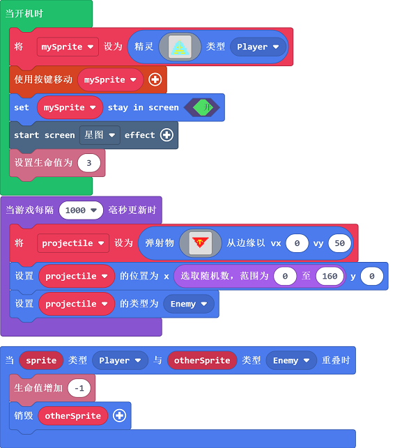
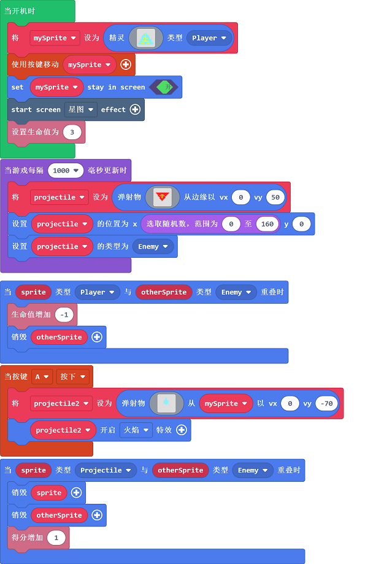

# case 03：飞机大战

## 目的
---
- 制作一个简单的飞机大战小游戏。

## 使用材料
---

- 1 x [饼干游戏编程学习机](https://item.taobao.com/item.htm?spm=a1z10.5-c-s.w4002-18602834185.82.51a95ccfE1IJt1&id=644090757603)

## 软件
---
[微软makecode](https://arcade.makecode.com/)

## 编程
---

- 新建精灵，使用按键移动精灵，设置精灵活动范围在屏幕中，设置场景特效为星图。

- 当游戏每隔1000ms时，则将弹射物从X屏幕上方的随机位置以50的速度向下弹射，设置弹射物类型，设置初始生命值为3，当碰到敌人时生命值-1，并自动销毁敌人。

- 当按键A按下时，从精灵处发射弹射物，x轴速度为0，y轴速度为-70，弹射物设为火焰特效，当弹射物和敌人碰撞时，销毁弹射物和敌人，得分+1。

- 

### 程序
- 请参考程序连接：[https://makecode.com/_gd04au22E9XJ](https://makecode.com/_gd04au22E9XJ)

- 你也可以通过以下网页直接下载程序。

<iframe style="position:absolute;top:0;left:0;width:100%;height:100%;" src="https://arcade.makecode.com/---codeembed#pub:_gd04au22E9XJ" allowfullscreen="allowfullscreen" frameborder="0" sandbox="allow-scripts allow-same-origin"></iframe>

---

## 程序下载
- 编写或者打开游戏程序后，通过USB连接掌机。

- 选择硬件“F4”。

- 设备匹配“Arcade（app）”连接。

- 单击掌机上的复位键，进入下载界面。

- 点击下载，完成程序。

## 结论
---
- 可以通过按键控制精灵在画面中移动，初始生命值为3，当玩家控制的精灵碰撞到敌人时，则-1生命值，当生命值归零则游戏结束，按下按键A则发射子弹，每击中一个敌人则+1分。

