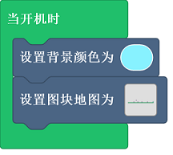
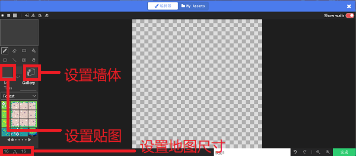
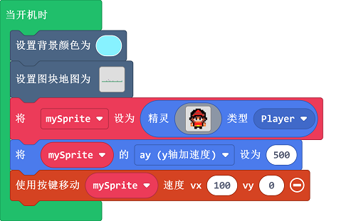
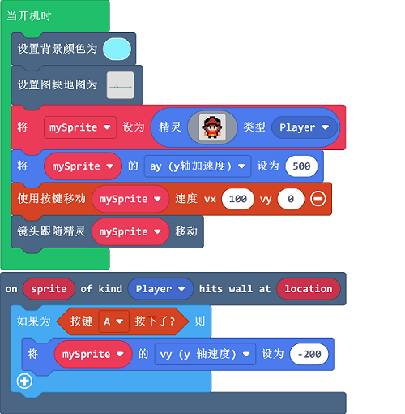

# case 04：小小英雄（上）

## 目的
---
- 学习控制角色横向移动、跳跃、以及场景制作。

## 使用材料
---

- 1 x [饼干游戏编程学习机](https://item.taobao.com/item.htm?spm=a1z10.5-c-s.w4002-18602834185.82.51a95ccfE1IJt1&id=644090757603)

## 软件
---
[微软makecode](https://arcade.makecode.com/)

## 编程
---

- 设置背景颜色，设置图块地图。

- 设置精灵，设置精灵的y轴加速度，通过按键移动精灵，设置y轴速度为0。

- 设置镜头跟随精灵移动，设置精灵跳跃功能。

- 

### 程序
- 请参考程序连接：[https://makecode.com/_EzzHsgdVhecH](https://makecode.com/_EzzHsgdVhecH)

- 你也可以通过以下网页直接下载程序。

<iframe style="position:absolute;top:0;left:0;width:100%;height:100%;" src="https://arcade.makecode.com/---codeembed#pub:_EzzHsgdVhecH" allowfullscreen="allowfullscreen" frameborder="0" sandbox="allow-scripts allow-same-origin"></iframe>

---

## 程序下载
- 编写或者打开游戏程序后，通过USB连接掌机。

- 选择硬件“F4”。

- 设备匹配“Arcade（app）”连接。

- 单击掌机上的复位键，进入下载界面。

- 点击下载，完成程序。

## 结论
---
- 可以通过按键控制精灵在自定义场景中横向移动，并跳跃。

