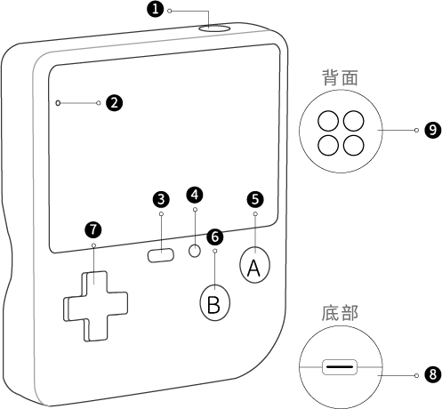
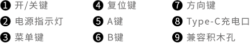
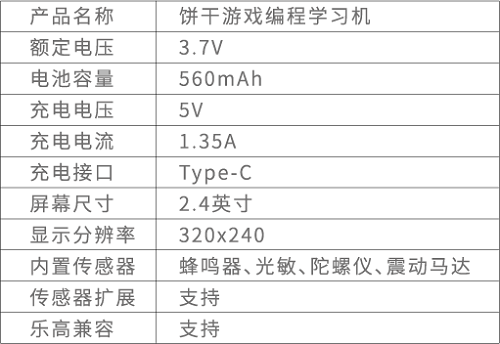

# 饼干游戏编程学习机

## 介绍
---
- 饼干游戏编程学习机是全球首款超大、超清屏幕的游戏编程学习机。它针对孩子手掌大小专门设计，采用炫彩外壳和硅胶按键，手感舒适，防滑易握；它拥有320*240彩色超大超清屏幕，将分辨率提高到行业水平的4倍；它有丰富的内置传感器，可重力、可震动、声光电一体让编程更炫酷。
- 饼干用简单趣味的方式帮助孩子自己编写游戏、了解游戏背后的奥义。它还支持自定义游戏角色、多样化场景和剧情设计，使用图形化编程软件，让每个人都能轻松实现有趣的电子创作和无限的游戏创意。
- 饼干，让孩子爱上编程，而非游戏本身。

## 购买链接
---

- 1 x [饼干游戏编程学习机](https://item.taobao.com/item.htm?spm=a1z10.5-c-s.w4002-18602834185.82.51a95ccfE1IJt1&id=644090757603)

## 产品说明。

### 开关方式

- 单击开关键，启动产品；双击开关键，关闭产品

### 产品参数

### 指示灯状态

## 软件编程平台
---
[微软makecode](https://arcade.makecode.com/)

