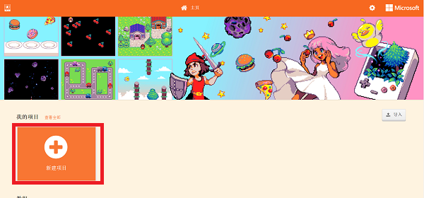
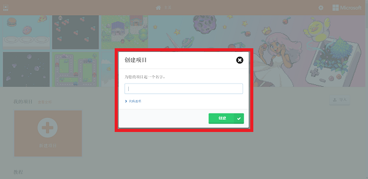
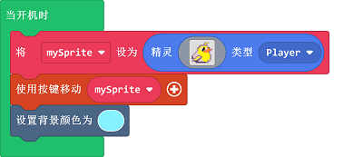
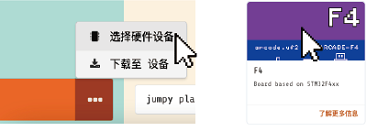

# case 01：精灵制造者

## 目的
---
- 新建一个精灵并进行控制。

## 使用材料
---

- 1 x [饼干游戏编程学习机](https://item.taobao.com/item.htm?spm=a1z10.5-c-s.w4002-18602834185.82.51a95ccfE1IJt1&id=644090757603)

## 软件
---
[微软makecode](https://arcade.makecode.com/)

## 编程
---

- 点击新建项目。

- 输入项目名称新建项目。

- 进入编程界面后，可以看到模拟器，模块选择区，积木编程区，在编程过程中，可以使用模拟器查看效果。

- 创建精灵，并点击积木块中的灰色矩形打开图片编辑器。

- 创建精灵，并点击积木块中的灰色矩形打开图片编辑器。

- 自定义精灵形象或者从图库中选择预设精灵即可。

- 使用按键移动精灵。
- 

- 设置背景颜色

- 为了防止精灵移动时走出画面外，设置精灵处于屏幕。

### 程序
- 请参考程序连接：[https://makecode.com/_aVgfaq603iJd](https://makecode.com/_aVgfaq603iJd)

- 你也可以通过以下网页直接下载程序。

<iframe style="position:absolute;top:0;left:0;width:100%;height:100%;" src="https://arcade.makecode.com/---codeembed#pub:_aVgfaq603iJd" allowfullscreen="allowfullscreen" frameborder="0" sandbox="allow-scripts allow-same-origin"></iframe>

---

## 程序下载
- 编写或者打开游戏程序后，通过USB连接掌机。

- 选择硬件“F4”。

- 设备匹配“Arcade（app）”连接。

- 单击掌机上的复位键，进入下载界面。

- 点击下载，完成程序。

## 结论
---
- 可以通过按键控制精灵在画面中移动。

