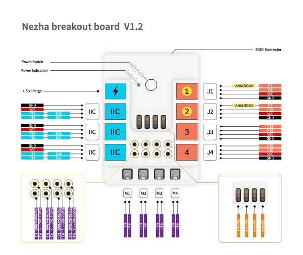

# 哪吒扩展板

## 简介
哪吒是一款全能型的micro:bit扩展板。板载4路舵机驱动，4路电机驱动，7路传感器扩展接口；传感器接口均采用RJ11接头，防呆防反插，方便学生们在课堂上快速准确连线；外壳设有乐高和慧鱼结构件兼容接口，可将电子模块与主流结构件结合起来，方便学生们搭建个性化的micro:bit创意编程作品。


## 特性
---
- RJ11端口设计，防止误插，易于使用。
## 技术规格
---


## 外形与定位尺寸
---


## 主要模块介绍
---

- 当处于关机状态下，按一次电源开关即可开机，此时电源指示灯点亮；
- 当处于开机状态下，连续按下两次电源开关即可关机，此时电源指示灯熄灭；
- 当开机状态下，发现电源指示灯闪烁，则是电量不足，可以通过USB电源接口进行充电。



## 添加专属扩展库
---

在MakeCode的代码抽屉中点击“高级”，查看更多代码选项。


为了给哪吒扩展板编程，我们需要添加一个扩展库。在代码抽屉底部找到“扩展”，并点击它。这时会弹出一个对话框，搜索“哪吒”，然后点击下载这个代码库。


*注意：*如果你得到一个提示说一些代码库因为不兼容的原因将被删除，你可以根据提示继续操作，或者在项目菜单栏里面新建一个项目。

## 使用方法

### TT马达使用案例


### 如图所示编写程序


### 参考程序
请参考程序连接：[https://makecode.microbit.org/_8g40hhK9rLvW](https://makecode.microbit.org/_8g40hhK9rLvW)

你也可以通过以下网页直接下载程序，下载完成后即可开始运行程序。

<div style="position:relative;height:0;padding-bottom:70%;overflow:hidden;"><iframe style="position:absolute;top:0;left:0;width:100%;height:100%;" src="https://makecode.microbit.org/#pub:_8g40hhK9rLvW" frameborder="0" sandbox="allow-popups allow-forms allow-scripts allow-same-origin"></iframe></div>  

---

### 结果

按键A按下时两个电机一起转动，当按键B按下时接在M1接口的电机停止转动，当按键A和B同时按下时两个电机同时停止转动。


### 舵机使用案例


### 如图所示编写程序


### 参考程序
请参考程序连接：[https://makecode.microbit.org/_hFmaEV1sAay3](https://makecode.microbit.org/_hFmaEV1sAay3)

你也可以通过以下网页直接下载程序，下载完成后即可开始运行程序。

<div style="position:relative;height:0;padding-bottom:70%;overflow:hidden;"><iframe style="position:absolute;top:0;left:0;width:100%;height:100%;" src="https://makecode.microbit.org/#pub:_hFmaEV1sAay3" frameborder="0" sandbox="allow-popups allow-forms allow-scripts allow-same-origin"></iframe></div> 

---

### 结果
按键A按下时180°舵机转动到角度0°，按键B按下时360°舵机转动到角度360°，当按键A和按键B同时按下时，连续转动舵机以100%的速度转动。

## python编程
---


### 步骤 1
下载压缩包并解压[PlanetX_MicroPython](https://github.com/lionyhw/PlanetX_MicroPython/archive/master.zip)
打开[Python editor](https://python.microbit.org/v/2.0)


为了给哪吒扩展板编程，我们需要添加nezha.py文件。点击Load/Save，然后点击Show Files（1）下拉菜单，再点击Add file在本地找到下载并解压完成的PlanetX_MicroPython文件夹，从中选择nezha.py文件添加进来。


### 步骤 2
### 参考程序
```
from microbit import *
from nezha import *

nezha = NEZHA()
nezha.set_motors(1, 100)
while True:
    nezha.set_servo(1, 90)
    sleep(1000)
    nezha.set_servo(1, 0)
    sleep(1000)


```


### 结果
- 连接在哪吒扩展板的M1的电机以100%的速度转动，连接在哪吒扩展板的S1的舵机循环转动到90度，延时一秒，转到0度，再延时一秒。


## 相关案例
---    ```
## 技术文档
---
