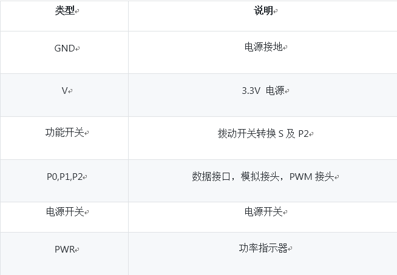

# Ring:bit一代小车扩展板（v1.0）

## 简介
---

Ring:bit扩展板是基于micro:bit的简易模块。可以从micro:bit主板引出3个IO口，3个电源接口和3个地线接口。我们会用这个模块将P0/P1/P2接口转换为通用接口，适用于GVS接口。将P2接口扩展为GVS接口,创建有更多功能。Ring:bit扩展板上有一个可滑动的小开关。将开关拨到“S”，你就可以同时连接SR和SL2（数据信号模块）；将开关拨到“P2”，你可以选择连接数据模块，或者仿真模块（两者不可同时进行）。Ring:bit扩展板需用3节7号电池供电。这是一个实用简单好操作的扩展板，你可以用它操作各种GVS模块，如舵机，巡线模组及LED灯等。

## 硬件
---

### 特点

- 开发环境：Code Kingdoms Java script, Microsoft Blocks，Microsoft Touch Develop，Python

- 兼容GVS连接器

- 操作开关，一个IO口可供双通道重复使用

- 便携小巧，更多DIY可能

- 输入电流：DC 3.9V-4.5V

- 尺寸：65.00mm X 51.70mm

- 重量：27g

### 应用

- 连接micro:bit后，可支持蓝牙4.0设备

- 可支持GVS端口，适用于恩孚八爪鱼扩展板

- 可同时驱动简易智能小车上的2到3个舵机

- micro:bit 产品教育教学

### 连接器

### 接口相关信息

#### 选择功能按钮

将开关拨动到S那端，表示与P2口连接的 SR和SL接通。同时，你可以将2个GVS模块分别连接至G-V-SR和G-V-SL。将开关拨动P2那端，表示只可用P2接口。

#### G-V-S P2 connector 接口

只有当开关拨动到P2端，以下2个连接器才可以使用。可与部分八爪鱼扩展板兼容。

#### G-V-S SR/SL Connector 接口

只有当开关拨动到S端，以下2个连接器才可以使用。可与部分八爪鱼扩展板兼容。

#### 代码示例

迷你小象车巡线电路

安装micro:bit主板

#### G-V-S P0 Connector 接口

P0接口可作为数码IO口使用，模拟IO口或PWM输出信号。

### 参数

## 软件

组装micro:bit主板和舵机

编码示例

三个舵机先顺时针旋转，暂停1秒后逆时针旋转，再1秒后顺时针旋转。此代码嵌入“forever”指令中。

