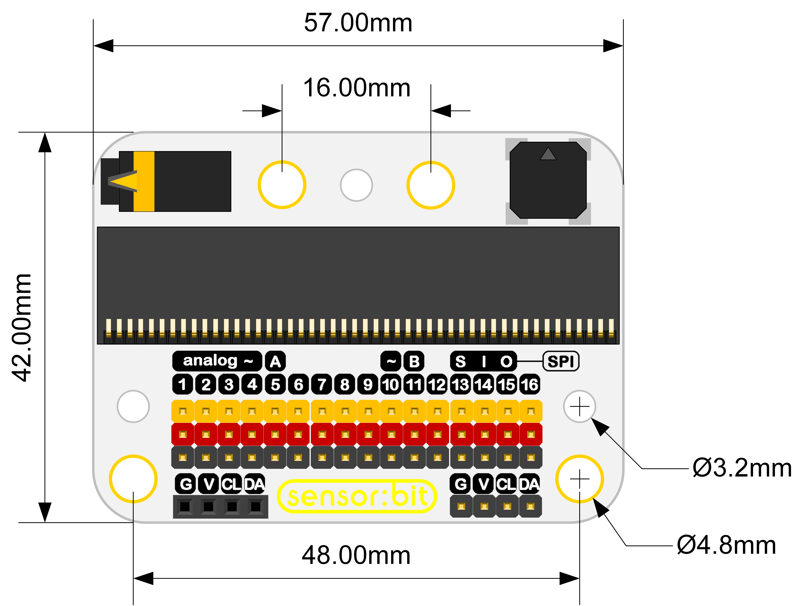

# 3V传感器扩展板（sensor:bit）

## 简介
---

sensor:bit是一款基于micro:bit的扩展板，它扩展了micro:bit上所有可用的IO口，以GVS形式引出，通过它能扩展各种3V的电子积木模块，如LED灯、光敏、舵机等。并且板载了蜂鸣器和耳机接口，不仅能够播放外音还能够插上耳机听音乐。

## 购买链接
[3V传感器扩展板（sensor:bit）](https://item.taobao.com/item.htm?ft=t&id=572685991359)

## 特性 
---

- 以GVS端子形式扩展出大部分IO口。
- 单独引出IIC接口，能直接插入OLED、BME280等IIC器件。
- 集成蜂鸣器和耳机接口。
- 支持乐高接口。
- 丝印标识出每个IO口的特性。

## 参数

### 外型与定位尺寸  

## 引脚接口框图

## 主要功能模块介绍  
---  

### 耳机插座  

耳机通过P0口控制，插入耳机时，蜂鸣器自动断开。

### 蜂鸣器  

蜂鸣器通过P0口控制，插入耳机时，蜂鸣器自动断开。

### 16路标准GVS接口  

这是16路GVS标准接口，可扩展3v的电子积木模块。

### I2C接口

这是一组I2C接口排母接口，可直接接入OLED模块。

这是一组I2C接口排针接口。

### USB电源接口

这是USB电源接口，可以通过USB进行供电。

## 快速上手  
---  

### 硬件连接  

将micro:bit主板插入sensor:bit主板。

### 软件编程  

打开makecode，编写程序让蜂鸣器播放音乐。
程序代码链接：[https://makecode.microbit.org/_3At2iE5Ue3XK](https://makecode.microbit.org/_3At2iE5Ue3XK)

你也能通过下列窗口直接下载代码

<iframe style="position:absolute;top:0;left:0;width:100%;height:100%;" src="https://makecode.microbit.org/#pub:_3At2iE5Ue3XK" frameborder="0" sandbox="allow-popups allow-forms allow-scripts allow-same-origin"></iframe>

### 结果  

按下按钮A时，蜂鸣器播放音乐，插上耳机时可以通过耳机听到音乐，同时蜂鸣器会停止播放音乐。

## 常见问题
