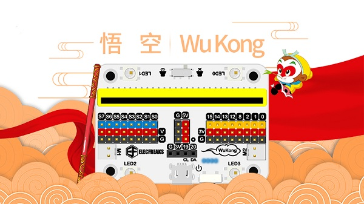
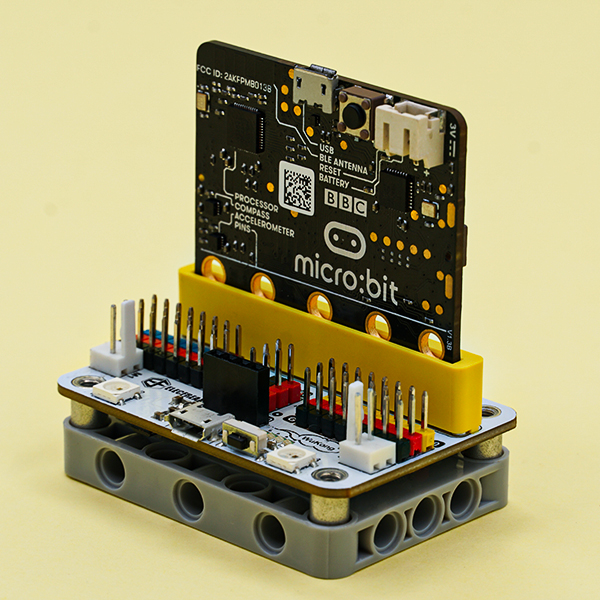
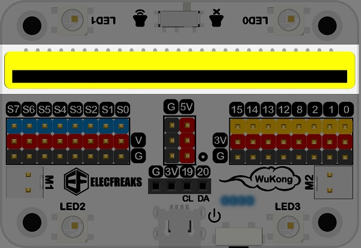
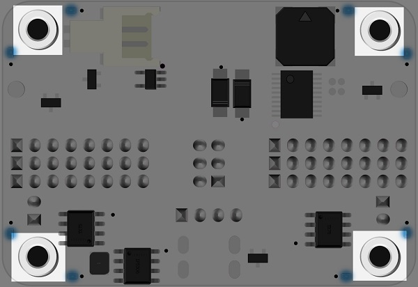

# 多功能扩展板:悟空（Wukong）

## 简介
- - - - -



悟空 是一款基于micro:bit的高集成度多功能扩展板，它的大小与micro:bit相近，功能十分丰富，集成了蜂鸣器、舵机驱动、电机驱动等。
自带400mAh锂电池包，板载电源管理系统，支持快速充电，充满仅需20分钟，满负载运行时间可达到40分钟以上。
扩展板底座为乐高标准 7 X 5 方形积木块，完美接入乐高积木。



## 特性 
- - - - -

- 外形小巧，高集成度
- 标准乐高积木接口
- 以GVS端子形式扩展出大部分IO口
- 单独引出IIC接口，能直接插入OLED、BME280等IIC器件。
- 集成蜂鸣器和蜂鸣器开关。
- 集成电机驱动电路。
- 集成舵机驱动电路。
- 支持5V传感器工作。
- 自带锂电池包，集成电池管理系统，四颗LED灯指示电量。
- 电源电路支持快充。


## 参数
- - - - -

| 参数 | 详情 | 说明 | 备注 |
|:-:|:-:|:-:|:-:|
|产品编号|EF08207|SKU|-|
| 尺 寸 |40.00 X 58.12 X 24.53 mm|高度包含乐高底座，不包含主板|手工测量，以实物为准|
| 重 量 |41.6g|包含底座，包含锂电池包|手工测量，以实物为准|
| 电源系统 |单击电源开关开机，双击关机|4颗LED灯指示电量，电路支持快充|也可通过板载USB口供电|
| 供电电池 |400mAh聚合物锂电池|快充20分钟，满载工作40分钟以上|安全防爆|
| 工作电压 |3.7v~5v|锂电池供电3.7v，USB口直供5v|-|
| 工作温度 |-20℃~60℃|充电温度0℃~40℃|-|
| 电机驱动 |2路 (M1，M2)|板载电机驱动电路驱动 |3.7V|
| 舵机驱动 |8路舵机接口 (S0~S7)|板载舵机驱动电路驱动|-|
| IO口引出 |P0、P1、P2、P8、P12、P13、P14、P15、IIC|支持拖动3V和5V器件|GVS端子|
| Rainbow LED |LED0、LED1、LED2、LED3|扩展Neopixel库使用|连接到micro:bit引脚P16|
| 蜂鸣器 |无源蜂鸣器，板载功能开关|使用music库驱动|连接到micro:bit引脚P0|
| 氛围灯 |反面边缘8颗LED灯，编程控制|常亮，闪亮，呼吸灯效果|开机时会闪亮一次，为正常现象
| 乐高底座 |标准7 x 5 长方形底座|电池包镶嵌底座中央|-|

*注意：为防止电池过充或者过放导致电池鼓包。如果有长时间不使用的情况，请将电池卸下；在电池充满电时，请及时拔掉电源线，防止过充。*
## 外型与定位尺寸
- - - - -


## 主要模块介绍  
- - - - -

### 开关，usb供电口及电量指示灯


### micro:bit主板插销



### 电机驱动接口  


### 3V舵机驱动接口


### 8路标准GVS接口及5v接口


### I2C排母接口


### 4颗Rainbow LED


### 蜂鸣器(背面)及蜂鸣器功能开关


### 8颗氛围灯(背面)


### 锂电池接口(背面)


### 乐高固定螺丝孔M3(背面)




## 快速上手  
- - - - -

### 硬件连接

- 将micro:bit主板插入主板插销座，主板带LOGO一面，朝向蜂鸣器开关一侧。
- 单击一次电源开关打开电源。


### 软件编程平台（makecode）

- [微软makecode积木块式在线编程:makecode.microbit.org](makecode.microbit.org)


### 添加专属积木块库

- 点击高级`Advanced`，在下拉菜单中点击扩展`Extensions`，进入添加积木块菜单。


- 在搜索框中搜索`wukong`，点击图片中`wukong`，添加扩展包。
- 添加完成。


## 使用方法
- - - - -
### 开机及充电方法

- 创新电源开关，单击电源开关开机，电源指示灯亮起。
- 双击电源开关，关机，电源指示灯熄灭。
- 将USB电源线连接至充电接口，常亮灯为当前所剩电量，剩余灯依次点亮则进入充电模式。


### 驱动呼吸灯

- 悟空扩展板底板有8颗蓝色LED呼吸灯，可以控制其开关或者亮度。

参考程序连接：[https://makecode.microbit.org/_4ub57g5FuJ1v](https://makecode.microbit.org/_4ub57g5FuJ1v)；你也可以通过下方网页直接下载程序。

<div style="position:relative;height:0;padding-bottom:70%;overflow:hidden;"><iframe style="position:absolute;top:0;left:0;width:100%;height:100%;" src="https://makecode.microbit.org/#pub:_4ub57g5FuJ1v" frameborder="0" sandbox="allow-popups allow-forms allow-scripts allow-same-origin"></iframe></div>  

### 驱动电机

- 悟空扩展板有两路电机驱动端口分别为M1和M2，可以连接市面上常用的电机。


参考程序连接：[https://makecode.microbit.org/_78keCLdmU1Ez](https://makecode.microbit.org/_78keCLdmU1Ez)，你也可以通过下方网页直接下载程序。

<div style="position:relative;height:0;padding-bottom:70%;overflow:hidden;"><iframe style="position:absolute;top:0;left:0;width:100%;height:100%;" src="https://makecode.microbit.org/#pub:_78keCLdmU1Ez" frameborder="0" sandbox="allow-popups allow-forms allow-scripts allow-same-origin"></iframe></div>  

### 驱动蜂鸣器

- 悟空扩展板带有一个蜂鸣器，位置在底板下方，已经连接micro:bit主板的P0口，可以直接使用`音乐`积木块驱动，同时可以拨动正面的蜂鸣器开关来启用或者禁用蜂鸣器功能。


参考程序连接：[https://makecode.microbit.org/_JmM5btU4dHUb](https://makecode.microbit.org/_JmM5btU4dHUb)

你也可以通过下方网页直接下载程序。

<div style="position:relative;height:0;padding-bottom:70%;overflow:hidden;"><iframe style="position:absolute;top:0;left:0;width:100%;height:100%;" src="https://makecode.microbit.org/#pub:_JmM5btU4dHUb" frameborder="0" sandbox="allow-popups allow-forms allow-scripts allow-same-origin"></iframe></div>  

### 驱动彩虹灯

- 悟空扩展板上拥有4颗彩虹灯，分为LED0、LED1、LED2、LED3，已经连接至micro:bit主板的P16口，可以使用悟空扩展库里流光溢彩灯积木块驱动使用。


参考程序连接：[https://makecode.microbit.org/_61T2w6cqTib0](https://makecode.microbit.org/_61T2w6cqTib0)

你也可以通过下方网页直接下载程序。

<div style="position:relative;height:0;padding-bottom:70%;overflow:hidden;"><iframe style="position:absolute;top:0;left:0;width:100%;height:100%;" src="https://makecode.microbit.org/#pub:_61T2w6cqTib0" frameborder="0" sandbox="allow-popups allow-forms allow-scripts allow-same-origin"></iframe></div>  

### 驱动舵机

- 将舵机连接至舵机驱动接口S0~S7，使用Wukong扩展库中的舵机积木块进行驱动。
- 180度舵机可以设置舵机角度0~180度。
- 360度舵机设置0度为正转最大速度，180度为反转最大速度，90度为停止，0~90度和90~180度为速度调制范围。


参考程序连接：[https://makecode.microbit.org/_6Pw63w49u5qq](https://makecode.microbit.org/_6Pw63w49u5qq)

你也可以通过下方网页直接下载程序。

<div style="position:relative;height:0;padding-bottom:70%;overflow:hidden;"><iframe style="position:absolute;top:0;left:0;width:100%;height:100%;" src="https://makecode.microbit.org/#pub:_6Pw63w49u5qq" frameborder="0" sandbox="allow-popups allow-forms allow-scripts allow-same-origin"></iframe></div>  

### 5V电源引脚使用

- 在悟空扩展板的中间有一组3对5V的电源接口，可以驱动5V的传感器或者5V的舵机，只需要将5V模块的供电接口连接至5V电源接口，信号线连接至舵机信号线口或者传感器信号线口。


### 软件编程平台（Python editor）

- [Python editor:https://python.microbit.org/v/2.0](https://python.microbit.org/v/2.0)

### 添加.py文件

下载压缩包并解压[EF_Produce_MicroPython-master](https://github.com/lionyhw/EF_Produce_MicroPython/archive/master.zip)
打开[Python editor](https://python.microbit.org/v/2.0)


为了给悟空扩展板编程，我们需要添加Wukong.py文件。点击Load/Save，然后点击Show Files（1）下拉菜单，再点击Add file在本地找到下载并解压完成的EF_Produce_MicroPython-master文件夹，从中选择Wukong.py文件添加进来。


## 使用方法
- - - - -

### 驱动呼吸灯

- 悟空扩展板底板有8颗蓝色LED呼吸灯，可以控制其开关或者亮度。

- 切换呼吸灯模式（将set_light_breath(True)的true改为False，可关闭呼吸灯）

```
from microbit import *
from Wukong import *
wk = WUKONG()
wk.set_light_breath(True)
```

- 调节呼吸灯亮度
```
from microbit import *
from Wukong import *
wk = WUKONG()
wk.set_light(100)
```

### 驱动电机

- 悟空扩展板有两路电机驱动端口分别为M1和M2，可以连接市面上常用的电机。

- 电机正转两秒，然后反转两秒
```
from microbit import *
from Wukong import *
wk = WUKONG()
while True:
    wk.set_motors(1, 100)
    wk.set_motors(2, 100)
    sleep(2000)
    wk.set_motors(1, -100)
    wk.set_motors(2, -100)
    sleep(2000)
```


### 驱动舵机

- 将舵机连接至舵机驱动接口S0~S7，使用Wukong扩展库中的舵机积木块进行驱动。
- 180度舵机可以设置舵机角度0~180度。
- 360度舵机设置0度为反转最大速度，180度为正转最大速度，90度为停止，0~90度和90~180度为速度调制范围。

```
from microbit import *
from Wukong import *

wk = WUKONG()
while True:
    wk.set_servo(0, 0)
    sleep(2000)
    wk.set_servo(0, 180)
    sleep(2000)

