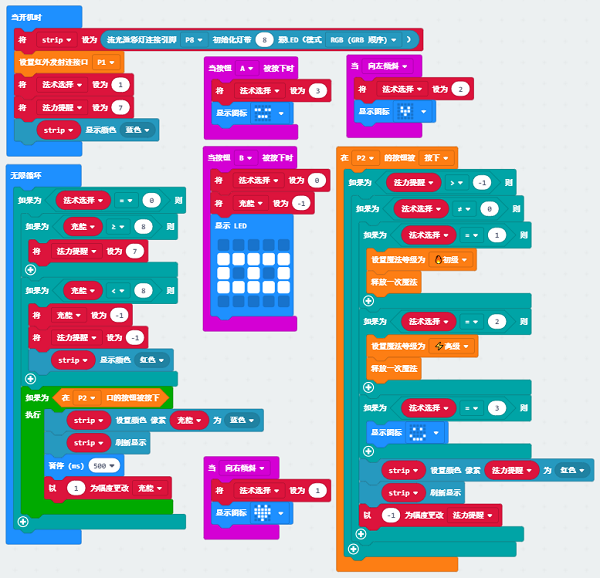

# 魔法棒套件案例06：魔法棒制作

## 目的
---

- 使用魔法棒套件制作一根多功能的魔法棒

## 使用材料
---

## 故事背景
---
为了应对各种突发情况，小恩决定将使用过的魔法都设置到魔法棒中，这样子才能快速的使用魔法，解决问题，带领团队夺回补给完成试炼。

## 软件
---

[微软makecode](https://makecode.microbit.org/#)

## 编程
---

### 如图所示编写程序

### 程序

请参考程序连接：[https://makecode.microbit.org/_b2PLoH8ADTxP](https://makecode.microbit.org/_b2PLoH8ADTxP)

你也可以通过以下网页直接下载程序。

<iframe style="position:absolute;top:0;left:0;width:100%;height:100%;" src="https://makecode.microbit.org/#pub:_b2PLoH8ADTxP]" frameborder="0" sandbox="allow-popups allow-forms allow-scripts allow-same-origin"></iframe>
  

### 现象
---
- 当开机时，灯环亮蓝色，通过按钮`A`、按钮`B`或者micro:bit主板的倾斜状态来切换当前使用功能，当按下按钮`A`则切换为显示笑脸；按下按钮`B`则是切换进入充能状态，LED灯全部变红，通过按紧连接`P2`端口的按钮充能让LED灯环亮蓝色；当`向右倾斜`则切换为打翻蜘蛛或者让飞碟起飞的功能；当`向左倾斜`则切换为让飞碟降落的功能；选择好法术后通过按下连接`P2`端口的按钮释放法术，每次释放法术都会使灯环的最后一个蓝色灯变成红色，当没有蓝色灯的时候无法释放法术，只能进入充能状态进行充能才能重新使用，在充能状态下，只有全部灯亮蓝色才算充能成功，否则充能失败，灯环亮红色。

## 思考
---
## 常见问题
---
## 相关阅读  
---
