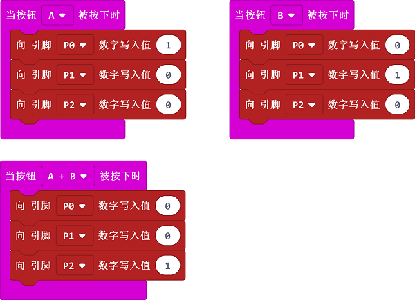
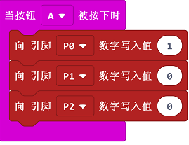

# 课程_05 三色LED

   

## 简介
---
三色LED是LED灯的一种。它能够发出红、绿、蓝三种不同颜色的光线。在本次实验中，我们将让RGB LED在红、绿、蓝三种颜色之间渐变转换。

## 元件清单
---
### 硬件：
- 1 x micro:bit
- 1 x USB线
- 1 x microbit面包板扩展板
- 1 x 面包板83 x 55 mm
- 1 x RGB LED
- 3 x 100欧姆电阻 
- 若干跳线

**温馨提示：如果你需要以上所有元件，你可以购买我们的[Elecfreaks小小科学家套件](https://item.taobao.com/item.htm?ft=t&id=597096675822)。**

## 主要元件介绍
---
### 三色LED

三色LED是LED的一种，把红色LED、绿色LED、蓝色LED集合成一个元件，就是RGB LED。我们都知道，光的三原色分别为红色、绿色、蓝色，利用这三种颜色进行不同组份地组合，能够合成出万物所有的颜色。同样，利用RGB LED进行不同亮度的组合，能够形成无数种颜色。  

  
三色LED分为两种类型，分别为共阴极与共阳极：共阴极的RGB LED公共端接GND；共阳极的RGB LED公共端接VCC。在本实验中，我们选用共阴极的三色LED。 

## 实验步骤
---
### 硬件连接
根据下面的图片将你的元件连接起来：

- 1.将led灯的RGB信号引脚分别对应连接扩展板的P0，P1，P2口，并连接一个100Ω的电阻。
- 2.将GND与扩展板GND通过面包板连接。

连接完成后如图:

### 软件

[微软Makecode在线编辑器:makecode.microbit.org](https://makecode.microbit.org/)

### 添加Package
- 无需添加

### 如图所示编写程序

### 代码详解
- 1.当A按下时，设置R为1，G、B的值为0，同理，编写当B按下时，当A+B按下时的代码块。

### 参考程序
请参考程序连接：[https://makecode.microbit.org/_Th3Vum76F4Tr](https://makecode.microbit.org/_Th3Vum76F4Tr)

你也可以通过以下网页直接下载程序，下载完成后即可开始运行程序。

<iframe style="position:absolute;top:0;left:0;width:100%;height:100%;" src="https://makecode.microbit.org/#pub:_Th3Vum76F4Tr" frameborder="0" sandbox="allow-popups allow-forms allow-scripts allow-same-origin"></iframe>
  
---

## 实验结果
---
按下按钮A，LED发出红光。 
按下按钮B，LED发出绿光。
同时按下按钮A和B， LED发出蓝光。

## 思考
---
如果想要用三色LED发出青色、品红色、黄色的光线，该如何设计电路与编程？

## 常见问题
---

## 更多信息，欢迎访问：
---
[micro:bit知识库地址](https://www.elecfreaks.com/learn-cn/)       
micro:bit官方推荐供应商：[恩孚科技淘宝店](https://shop69086944.taobao.com/?spm=a230r.7195193.1997079397.2.RSthR0)      
QQ技术交流群：570756726 

