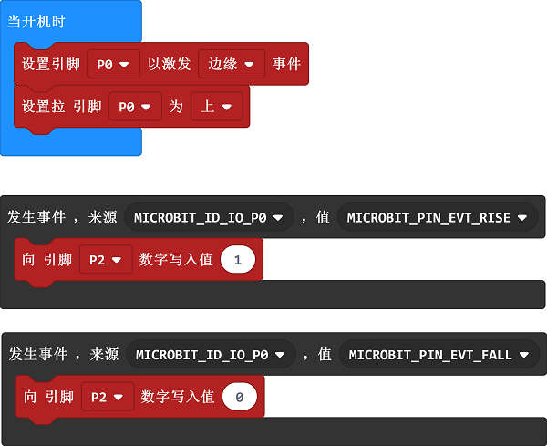
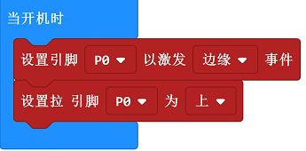
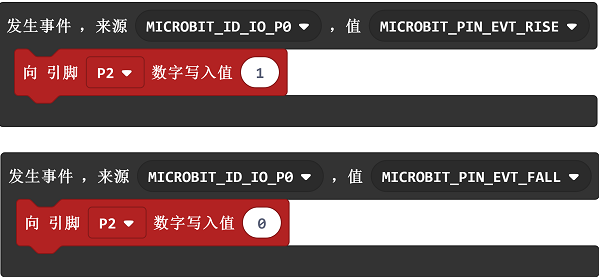

# 课程_06 自锁开关

  

## 简介
---
自锁开关，是一种常见的按钮开关。当我们初次按下开关按钮时，开关电路连接并保持这种状态，即自锁。再次按下开关按钮时，开关断开，同时开关按钮弹出来。在这次实验中，我们将使用自锁开关来控制LED的点亮与熄灭。

## 元件清单
---
### 硬件：
- 1 x micro:bit
- 1 x USB线
- 1 x microbit面包板扩展板
- 1 x 面包板83 x 55 mm
- 1 x 自锁开关
- 1 x LED
- 1 x 100欧姆电阻 
- 若干跳线

**温馨提示：如果你需要以上所有元件，你可以购买我们的[Elecfreaks小小科学家套件](https://item.taobao.com/item.htm?spm=a1z10.1-c-s.w4024-17803785896.2.18dc3f94XOgpWg&id=562837851877&scene=taobao_shop)。**

## 主要元件介绍
---
### 自锁开关

自锁开关一般是指开关自带机械锁定功能，按下去，松手后按钮是不会完全跳起来的，处于锁定状态，需要再按一次，才解锁完全跳起来。它就叫自锁开关。早期的直接完全断电的电视机、显示器就是使用的这种类型的开关。

注意：这种自锁开关包含两组刀双掷开关，本次试验只用到了其中一组，故剪去了其中一组的公共引脚。

## 实验步骤
---
### 硬件连接
根据下面的图片将你的元件连接起来：

- 1.将自锁开关连接到扩展板的P0口
- 2.将led灯通过100Ω电阻连接扩展板的P2口

连接完成后如图:

### 软件

[微软Makecode在线编辑器:makecode.microbit.org](https://makecode.microbit.org/)

### 如图所示编写程序

### 代码详解
- 1.对扩展板P0口设置事件监听，并将其设置为高电平

- 2.设置事件触发入口，当自锁开关被按下，电位改变，点亮led，再按一次，电位再次改变，熄灭led。

### 参考程序
请参考程序连接：[https://makecode.microbit.org/_Dhy5i9KVeLAK](https://makecode.microbit.org/_Dhy5i9KVeLAK)

你也可以通过以下网页直接下载程序，下载完成后即可开始运行程序。

<iframe style="position:absolute;top:0;left:0;width:100%;height:100%;" src="https://makecode.microbit.org/#pub:_Dhy5i9KVeLAK" frameborder="0" sandbox="allow-popups allow-forms allow-scripts allow-same-origin"></iframe>
  
---

## 实验结果
---
按下自锁开关，LED点亮；再按一次，LED熄灭。

## 思考
---
楼梯灯通常就是用单刀双掷开关来实现的，可以在楼上开灯楼下关灯，也可以在楼下开灯，去楼上关灯，如果我想用两只自锁按钮实现楼梯灯的功能，该如何设计电路与编程？

## 常见问题
---

## 更多信息，欢迎访问：
---
[micro:bit知识库地址](https://www.elecfreaks.com/learn-cn/)    
micro:bit官方推荐供应商：[恩孚科技淘宝店](https://shop69086944.taobao.com/?spm=a230r.7195193.1997079397.2.RSthR0)  
QQ技术交流群：570756726   

