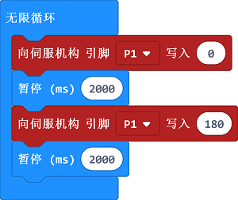

# 课程_08 舵机

## 简介
---
舵机是一种位置（角度）伺服的驱动器，适用于那些需要角度不断变化并可以保持的控制系统。在这次的实验中，我们将用micro:bit控制舵机在行程范围内循环转动。

## 元件清单
---
### 硬件：
- 1 x micro:bit
- 1 x USB线
- 1 x microbit面包板扩展板
- 1 x 面包板83 x 55 mm
- 1 x TowerPro SG-90 舵机(1.6kg) 
- 若干跳线

**温馨提示：如果你需要以上所有元件，你可以购买我们的[Elecfreaks小小科学家套件](https://item.taobao.com/item.htm?ft=t&id=597096675822)。**

## 主要元件介绍
---
### 舵机  

舵机由直流电机、减速齿轮组、电位器和控制电路组成的一套自动控制系统。通过发送信号，指定输出轴旋转角度。舵机一般而言都有最大旋转角度（比如180度）。与普通直流电机的区别主要在，直流电机是一圈圈转动的，舵机只能在一定角度内转动，不能一圈圈转（数字舵机可以在舵机模式和电机模式中切换，没有这个问题）。普通直流电机无法反馈转动的角度信息，而舵机可以。用途也不同，普通直流电机一般是整圈转动做动力用，舵机是控制某物体转动一定角度用，如机器人的关节。 舵机的伺服系统由可变宽度的脉冲来进行控制，控制线是用来传送脉冲的。脉冲的参数有最小值，最大值，和频率。一般而言，舵机的基准信号都是周期为20ms，宽度为1.5ms。这个基准信号定义的位置为中间位置。舵机有最大转动角度，中间位置的定义就是从这个位置到最大角度与最小角度的量完全一样。最重要的一点是，不同舵机的最大转动角度可能不相同，但是其中间位置的脉冲宽度是一定的，那就是1.5ms。  

注意：micro:bit官方已经将舵机的控制代码封装成积木块，用Makecode编程时，无需考虑脉冲宽度之类的复杂信息。

舵机有很多规格，但所有的舵机都有外接三根线，分别用棕、红、橙三种颜色进行区分（品牌不同，颜色可能会略有差异），棕色为接地线，红色为电源正极线，橙色为信号线。  

## 实验步骤
---
### 硬件连接
根据下面的图片将你的元件连接起来：
- 1.将舵机与扩展板的P1口连接

连接完成后如图:

### 软件

[微软Makecode在线编辑器:makecode.microbit.org](https://makecode.microbit.org/)

### 如图所示编写程序

### 代码详解
- 1.将P1口，以PWM输出方式，输出数字量0，延迟2s。
- 2.将P1口，以PWM输出方式，输出数字量1，延迟2s。
- 3.循环输出上述PWM信号。

### 参考程序
请参考程序连接：[https://makecode.microbit.org/_52MVspRmRWjc](https://makecode.microbit.org/_52MVspRmRWjc)

你也可以通过以下网页直接下载程序，下载完成后即可开始运行程序。

<iframe style="position:absolute;top:0;left:0;width:100%;height:100%;" src="https://makecode.microbit.org/#pub:_52MVspRmRWjc" frameborder="0" sandbox="allow-popups allow-forms allow-scripts allow-same-origin"></iframe>
  
---

## 实验结果
---
舵机在0至180度之间来回旋转。

## 思考
---
如果我们想用温度传感器和舵机做一个指针温度计，那么我们该如何设计电路与编程？

## 常见问题
---

## 更多信息，欢迎访问：
---
[micro:bit知识库地址](https://www.elecfreaks.com/learn-cn/)    
micro:bit官方推荐供应商：[恩孚科技淘宝店](https://shop69086944.taobao.com/?spm=a230r.7195193.1997079397.2.RSthR0)  
QQ技术交流群：570756726   

