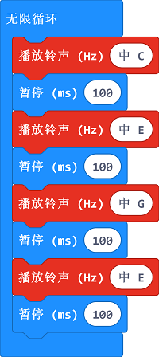

# 课程_09 蜂鸣器

  

## 简介
---
蜂鸣器是一种一体化结构的电子讯响器，广泛应用于计算机、打印机、复印机、报警器、电子玩具、汽车电子设备、电话机、定时器等电子产品中作发声器件。本次实验，我们用micro:bit驱动蜂鸣器，让它发出不同的声音的高频与低频间来回循环，就像警报声一样，并且在micro:bit屏幕上以柱形图的形式显示声音频率。

## 元件清单
---
### 硬件：
- 1 x micro:bit
- 1 x USB线
- 1 x microbit面包板扩展板
- 1 x 面包板83 x 55 mm
- 1 x 蜂鸣器
- 1 x TIP 120 NPN 三极管
- 1 x 100 欧姆电阻 
- 若干跳线

**温馨提示：如果你需要以上所有元件，你可以购买我们的[Elecfreaks小小科学家套件](https://item.taobao.com/item.htm?spm=a1z10.1-c-s.w4024-17803785896.2.18dc3f94XOgpWg&id=562837851877&scene=taobao_shop)。**

## 主要元件介绍
---
### 蜂鸣器  

蜂鸣器是一种发声器件，它由振动装置和谐振装置组成。按照控制方式分类，可把蜂鸣器又分为有源型与无源型。  

 
有源型蜂鸣器的工作发声原理是：蜂鸣器内部集成振荡系统与放大取样电路，当有直流电源通过蜂鸣器时会使谐振装置产生声音信号，有源型蜂鸣器的工作发声原理图如下：

 

无源型蜂鸣器的工作发声原理是：方波信号输入谐振装置转换为声音信号输出，无源型蜂鸣器的工作发声原理图如下：

注：本次实验，我们使用的是无源蜂鸣器。

### 三极管

三极管是一种控制电流的半导体器件，其作用是把微弱信号放大成幅度值较大的电信号。

如果直接把micro:bit产生的PWM信号输入至蜂鸣器，蜂鸣器只会发出微弱的声音，这是因为IO口的驱动电流通常都是非常微弱的，不足以直接驱动蜂鸣器这类器件。这时候，我们就需要用到三极管将PWM信号的电流放大，从而让蜂鸣器能发出正常的声响。
用三极管驱动蜂鸣器，典型应用电路如下：

## 实验步骤
---
### 硬件连接
根据下面的图片将你的元件连接起来：

- 1.将蜂鸣器与100Ω电阻以及三级管串连，连接P0口

连接完成后如图:

### 软件

[微软Makecode在线编辑器:makecode.microbit.org](https://makecode.microbit.org/)

### 如图所示编写程序

### 代码详解
- 1.发出一个C音，持续100ms，同理，编写EGE的音符代码

### 参考程序
请参考程序连接：[https://makecode.microbit.org/_DdPPjDCdmM1a](https://makecode.microbit.org/_DdPPjDCdmM1a)

你也可以通过以下网页直接下载程序，下载完成后即可开始运行程序。

<iframe style="position:absolute;top:0;left:0;width:100%;height:100%;" src="https://makecode.microbit.org/#pub:_DdPPjDCdmM1a" frameborder="0" sandbox="allow-popups allow-forms allow-scripts allow-same-origin"></iframe>
  
---

## 实验结果
---
蜂鸣器发出的声响在低频与高频间来回循环，并且把频率以柱形图的形式显示在micro：bit屏幕上。

## 思考
---
如果我们想用温度传感器与蜂鸣器做一个高温报警器，那么我们该如何设计电路与编程？

## 常见问题
---

## 更多信息，欢迎访问：
---
[micro:bit知识库地址](https://www.elecfreaks.com/learn-cn/)    
micro:bit官方推荐供应商：[恩孚科技淘宝店](https://shop69086944.taobao.com/?spm=a230r.7195193.1997079397.2.RSthR0)  
QQ技术交流群：570756726   

