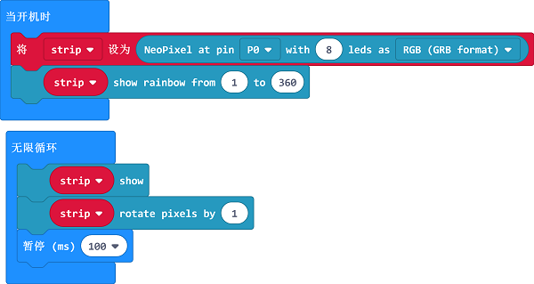
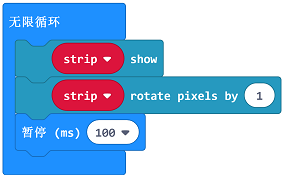

# 课程_11 七彩灯环

    

## 简介
---
LED七彩灯环是基于ws2812b灯珠。它的最大特点是单IO控制与无限级联。在这次的实验中，我们将用micro:bit来驱动灯环实现彩虹色渐变。

## 元件清单
---
### 硬件：
- 1 x micro:bit
- 1 x USB线
- 1 x micro:bit面包板扩展板
- 1 x 面包板 83 x 55 mm
- 1 x LED七彩灯环（8颗灯珠）  
- 若干跳线

**温馨提示：如果你需要以上所有元件，你可以购买我们的[Elecfreaks小小科学家套件](https://item.taobao.com/item.htm?spm=a1z10.1-c-s.w4024-17803785896.2.18dc3f94XOgpWg&id=562837851877&scene=taobao_shop)。**

## 主要元件介绍
---
### LED七彩灯环(8颗灯珠)

LED七彩灯环（8颗灯珠）是由8颗ws2812b灯珠级联而成的灯环，ws2812b是一个集控制电路与发光电路于一体的智能外控LED光源，其外型与一个5050LED灯珠相同。

像素点内部包含了智能数字接口数据锁存信号整形放大驱动电路，还包含有高精度的内部振荡器和12V高压可编程定电流控制部分，有效保证了像素点光的颜色高度一致。

数据协议采用单线归零码的通讯方式，像素点在上电复位以后，DIN端接受从控制器传输过来的数据，首先送过来的24bit数据被第一个像素点提取后，送到像素点内部的数据锁存器，剩余的数据经过内部整形处理电路整形放大后通过DO端口开始转发输出给下一个级联的像素点，每经过一个像素点的传输，信号减少24bit。像素点采用自动整形转发技术，使得该像素点的级联个数不受信号传送的限制，仅仅受限信号传输速度要求。

LED具有低电压驱动，环保节能，亮度高，散射角度大，一致性好，超低功率，超长寿命等优点。将控制电路集成于LED上面，电路变得更加简单，体积小，安装更加简便。

## 实验步骤
---
### 硬件连接
根据下面的图片将你的元件连接起来：

- 1.将七彩灯环的信号线与扩展板P0口连接起来

注意：灯环引出了两组线，一组是DI,另一组是DO，我们应当连接DI这一组。
连接完成后如图:

 

### 软件

[微软Makecode在线编辑器:makecode.microbit.org](https://makecode.microbit.org/)

### 添加Package
- 在MakeCode的代码抽屉中点击Advanced，查看更多代码选项。

点击“Extensions”，在弹出的对话框中搜索“neopixel"，下载neopixel代码库。

### 如图所示编写程序

### 代码详解
- 1.将8颗led设置成RGB模式，将引脚设置为P0口。

 

- 2.显示RGB颜色，设置颜色渐变。

### 参考程序
请参考程序连接：[https://makecode.microbit.org/_XdsavUFzaCyq](https://makecode.microbit.org/_XdsavUFzaCyq)

你也可以通过以下网页直接下载程序，下载完成后即可开始运行程序。

<iframe style="position:absolute;top:0;left:0;width:100%;height:100%;" src="https://makecode.microbit.org/#pub:_XdsavUFzaCyq" frameborder="0" sandbox="allow-popups allow-forms allow-scripts allow-same-origin"></iframe>
  
---

## 实验结果
---
我们可以看到LED彩虹灯环实现了运动的彩虹渐变效果。

## 思考
---
想象灯环是一只大眼睛，让灯环显示眨眼睛的效果，那么我们该如何设计电路与编程？

## 常见问题
---      

## 更多信息，欢迎访问：
---
[micro:bit知识库地址](https://www.elecfreaks.com/learn-cn/)    
micro:bit官方推荐供应商：[恩孚科技淘宝店](https://shop69086944.taobao.com/?spm=a230r.7195193.1997079397.2.RSthR0)  
QQ技术交流群：570756726   

