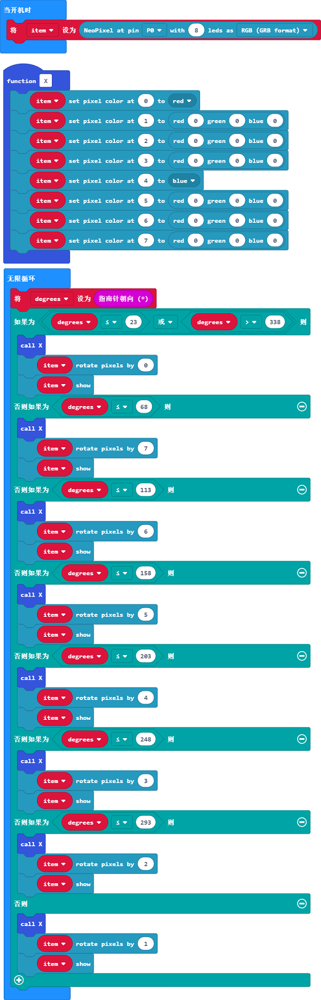
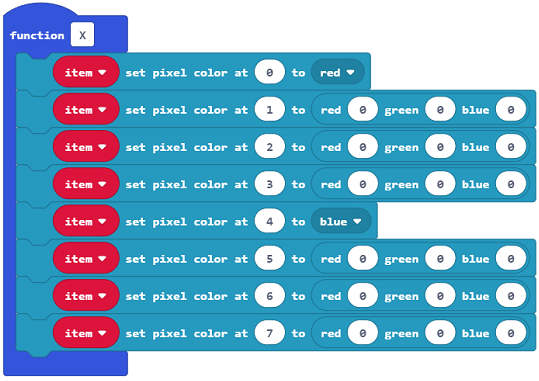
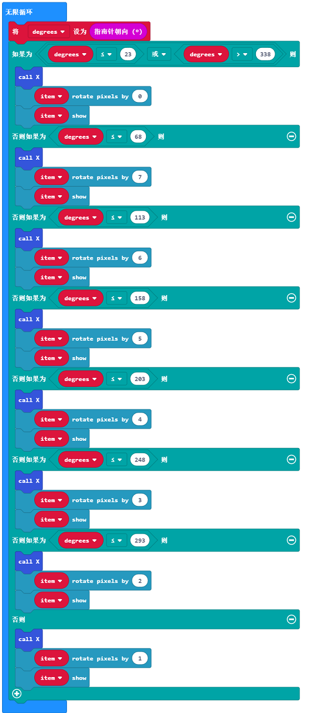

# 课程_13 指南针

  

## 简介
---
你知道指南针是什么吗？我相信你们很多人都曾经玩过指南针。今天，我们将用micro:bit来制作一个指南针，并在LED七彩灯环上显示方向。 想知道怎么做吗？只要阅读下面的文章，跟着我的步骤操作就可以了。让我们开始吧！  

## 元件清单
---
### 硬件：
- 1 x micro:bit
- 1 x USB线
- 1 x micro:bit面包板扩展板
- 1 x 面包板83 x 55 mm
- 1 x LED七彩灯环（8颗灯珠） 
- 若干跳线

**温馨提示：如果你需要以上所有元件，你可以购买我们的[Elecfreaks小小科学家套件](https://item.taobao.com/item.htm?ft=t&id=597096675822)。**

## 主要元件介绍
---
### 指南针

这里，指南针实际上指的是一个磁力计。磁力计是一个单独的芯片，用于感应磁场强度。在标准运行时中的软件算法使用了板载的加速度计将这些读数转换成板子原始独立的指南针读数。在使用前，必须校准指南针。校准的过程由运行软件自动发起。这个元件通过I2C母线连接到了应用处理器上。

 

## 实验步骤
---
### 硬件连接
根据下面的图片将你的元件连接起来：

- 将灯环的信号线接在P0口

连接完成后如图:

### 软件

[微软Makecode在线编辑器:makecode.microbit.org](https://makecode.microbit.org/)

### 添加Package
- 在MakeCode的代码抽屉中点击`高级`，查看更多代码选项。

点击`扩展`，在弹出的对话框中搜索“neopixel"，下载neopixel代码库。

### 如图所示编写程序

### 代码详解
- 1.将P0口设置为灯环控制引脚，将它的色彩模式设置为RGB模式

- 2.设置函数将第1颗灯珠与第5颗灯珠设置为红、蓝两种颜色

- 3.读取对应的指南针返回值，对应不同的数值，将点亮的灯珠进行改变

### 参考程序
请参考程序连接：[https://makecode.microbit.org/_7cmF18FJccok](https://makecode.microbit.org/_7cmF18FJccok)

你也可以通过以下网页直接下载程序，下载完成后即可开始运行程序。

<iframe style="position:absolute;top:0;left:0;width:100%;height:100%;" src="https://makecode.microbit.org/#pub:_7cmF18FJccok" frameborder="0" sandbox="allow-popups allow-forms allow-scripts allow-same-origin"></iframe>
  
---

## 实验结果
---
旋转整个装置，你可以看到LED七彩灯环始终指向同一个方向。
注意：每次当你开始用指南针的时候（例如：如果你刚好启动了micro:bit),micro:bit将会开始校准指南针（自我调整）。倾斜micro:bit,它就会要求你画一个圆。
如果你正在校准或者在金属附近使用指南针，这有可能会使micro:bit的方向感应出错。

## 思考
---
如果这个指南针案例不用灯环，直接在micro:bit的屏幕上用箭头来做指示，该如何设计电路与编程？

## 常见问题
---

## 更多信息，欢迎访问：
---
[micro:bit知识库地址](https://www.elecfreaks.com/learn-cn/)    
micro:bit官方推荐供应商：[恩孚科技淘宝店](https://shop69086944.taobao.com/?spm=a230r.7195193.1997079397.2.RSthR0)  
QQ技术交流群：570756726   

