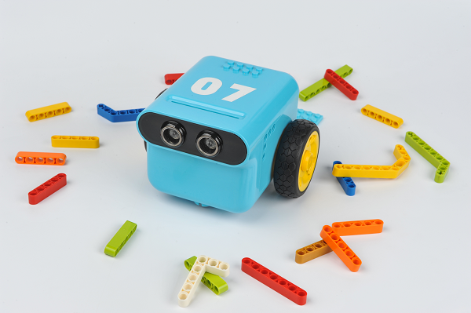
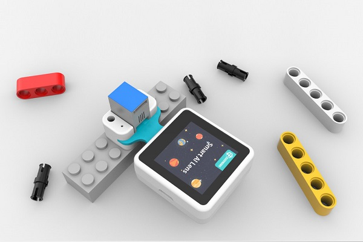
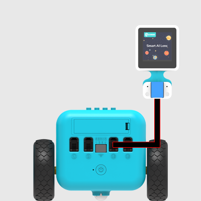
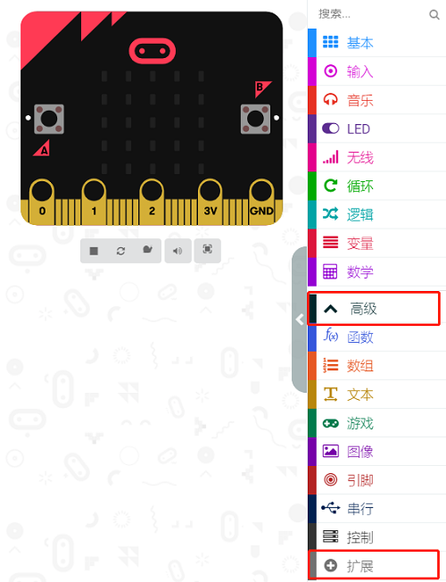
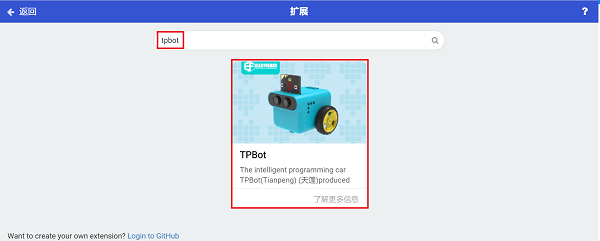
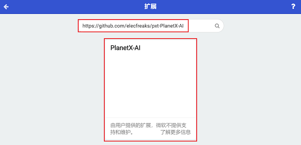
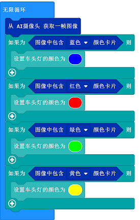
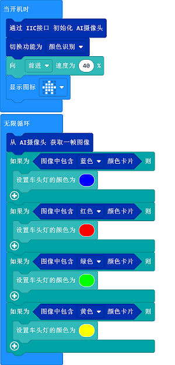

# 案例21：天蓬智能车-颜色识别

## 目的
---
- 搭建一辆使用AI摄像头识别颜色，并根据识别到的颜色改变车头灯颜色的天蓬智能车。

## 使用材料
---

- 1 x [天蓬智能车](https://item.taobao.com/item.htm?spm=a1z10.5-c-s.w4002-18602834185.41.68d15ccfBFHNPy&id=618758535761)



- 1 x  [AI摄像头](https://item.taobao.com/item.htm?spm=a1z10.1-c-s.w5003-22951491260.9.196458b3TgHzio&ft=t&id=632538261754&scene=taobao_shop)




## 硬件连接

将AI摄像头连接到天蓬智能车的IIC端口。（AI摄像头需要额外购买）



## 软件
---
[微软makecode](https://makecode.microbit.org/#)


## makecode编程
---


- 在MakeCode的代码抽屉中点击`高级`，查看更多代码选项。



- 为了给天蓬智能车编程，我们需要添加一个扩展库。在代码抽屉底部找到`扩展`，并点击它。这时会弹出一个对话框，搜索`tpbot`，然后点击下载这个代码库。



- 为了给AI摄像头编程，我们需要添加一个代码库。在代码抽屉底部找到“扩展”，并点击它。这时会弹出一个对话框。搜索 `https://github.com/elecfreaks/pxt-PlanetX-AI`，然后点击下载这个代码库。




##示例程序

- `当开机时`设置初始化AI摄像头，切换功能为`颜色识别`，然后显示图标。


- 在`无限循环`中，从AI摄像头获取一帧图像，根据识别到的图像中的颜色来切换车头灯的颜色。


- 完整程序：




### 程序
- 请参考程序连接：[https://makecode.microbit.org/_aAsAR1Tfj8kk](https://makecode.microbit.org/_aAsAR1Tfj8kk)

- 你也可以通过以下网页直接下载程序。

<div style="position:relative;height:0;padding-bottom:70%;overflow:hidden;"><iframe style="position:absolute;top:0;left:0;width:100%;height:100%;" src="https://makecode.microbit.org/#pub:_aAsAR1Tfj8kk" frameborder="0" sandbox="allow-popups allow-forms allow-scripts allow-same-origin"></iframe></div>  
--
---


## python编程
---
添加天蓬智能车软件库：[https://www.elecfreaks.com/learn-cn/microbitKit/TPbot_tianpeng/TPbot-python.html](https://www.elecfreaks.com/learn-cn/microbitKit/TPbot_tianpeng/TPbot-python.html)
添加AI摄像头软件库：[https://www.elecfreaks.com/learn-cn/microbitplanetX/ai/Plant-X-EF05035-python.html](https://www.elecfreaks.com/learn-cn/microbitplanetX/ai/Plant-X-EF05035-python.html)

### 程序

```
from microbit import *
from AILens import *
from TPBot import *

tp = TPBOT()
ai = AILENS()
# 设置摄像头功能为颜色识别
ai.switch_function(Color)
tp.set_motors_speed(40,40)
while True:
    # 从摄像头获取一帧
    ai.get_image()
    if (ai.get_color_type() == "Blue"):
        tp.set_car_light(0, 0, 255)
        tp.set_car_light(0, 0, 255)
    if (ai.get_color_type() == "Red"):
        tp.set_car_light(255, 0, 0)
        tp.set_car_light(255, 0, 0)
    if (ai.get_color_type() == "Green"):
        tp.set_car_light(0, 255, 0)
        tp.set_car_light(0, 255, 0)
    if (ai.get_color_type() == "Yellow"):
        tp.set_car_light(255, 255, 0)
        tp.set_car_light(255, 255, 0)     
```


---
## 结论
---
天蓬智能车向前行驶，
当摄像头识别到蓝色卡片时，车头灯亮蓝色，
当摄像头识别到红色卡片时，车头灯亮红色，
当摄像头识别到绿色卡片时，车头灯亮绿色，
当摄像头识别到黄色卡片时，车头灯亮黄色。


## 思考
---


## 常见问题
---
Q:使用案例中的代码发现小车不能正常运行？
A:电池电量不足，增大程序中的小车速度参数的数值或者更换电池，并测试。
Q:使用案例中的代码发现AI摄像头突然无法初始化进入功能选择界面？
A:电池电量不足，请更换新电池，并测试。

## 相关阅读  
---

