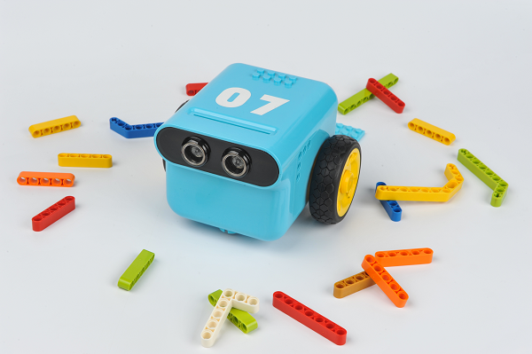
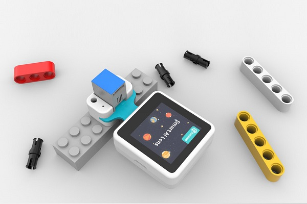
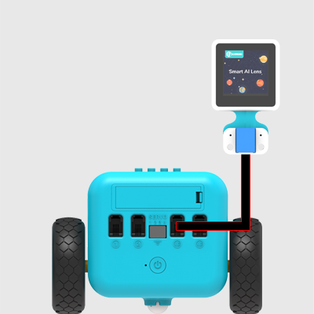
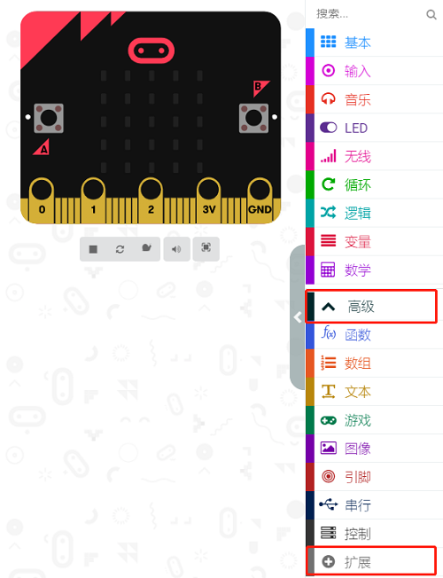
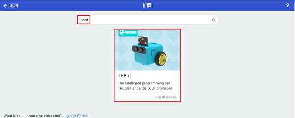
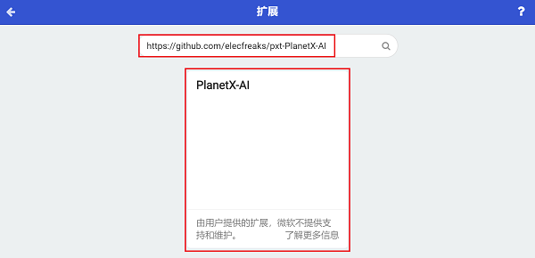
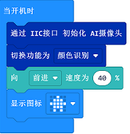
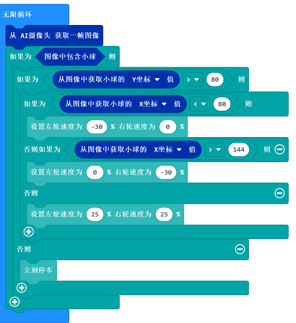
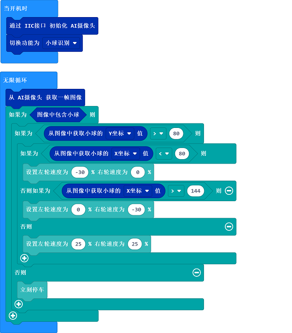

# 案例22：天蓬智能车-小球追踪

## 目的
---
- 搭建一辆使用AI摄像头进行小球追踪的天蓬智能车。

## 使用材料
---

- 1 x [天蓬智能车](https://item.taobao.com/item.htm?spm=a1z10.5-c-s.w4002-18602834185.41.68d15ccfBFHNPy&id=618758535761)



- 1 x  [AI摄像头](https://item.taobao.com/item.htm?spm=a1z10.1-c-s.w5003-22951491260.9.196458b3TgHzio&ft=t&id=632538261754&scene=taobao_shop)




## 硬件连接

将AI摄像头连接到天蓬智能车的IIC端口。（AI摄像头需要额外购买）



## 软件
---
[微软makecode](https://makecode.microbit.org/#)


## makecode编程
---


- 在MakeCode的代码抽屉中点击`高级`，查看更多代码选项。



- 为了给天蓬智能车编程，我们需要添加一个扩展库。在代码抽屉底部找到`扩展`，并点击它。这时会弹出一个对话框，搜索`tpbot`，然后点击下载这个代码库。



- 为了给AI摄像头编程，我们需要添加一个代码库。在代码抽屉底部找到“扩展”，并点击它。这时会弹出一个对话框。搜索 `https://github.com/elecfreaks/pxt-PlanetX-AI`，然后点击下载这个代码库。




##示例程序

- `当开机时`设置初始化AI摄像头，切换功能为`小球识别`。



- 在`无限循环`中，从AI摄像头获取一帧图像，根据识别到的小球位置来控制小车的行驶方向。


- 完整程序：




### 程序
- 请参考程序连接：[https://makecode.microbit.org/_TY634U7x5RaH](https://makecode.microbit.org/_TY634U7x5RaH)

- 你也可以通过以下网页直接下载程序。

<div style="position:relative;height:0;padding-bottom:70%;overflow:hidden;"><iframe style="position:absolute;top:0;left:0;width:100%;height:100%;" src="https://makecode.microbit.org/#pub:_TY634U7x5RaH" frameborder="0" sandbox="allow-popups allow-forms allow-scripts allow-same-origin"></iframe></div>  
--
---


## python编程
---
添加天蓬智能车软件库：[https://www.elecfreaks.com/learn-cn/microbitKit/TPbot_tianpeng/TPbot-python.html](https://www.elecfreaks.com/learn-cn/microbitKit/TPbot_tianpeng/TPbot-python.html)
添加AI摄像头软件库：[https://www.elecfreaks.com/learn-cn/microbitplanetX/ai/Plant-X-EF05035-python.html](https://www.elecfreaks.com/learn-cn/microbitplanetX/ai/Plant-X-EF05035-python.html)

### 程序

```
from microbit import *
from AILens import *
from TPBot import *

tp = TPBOT()
ai = AILENS()
# 设置摄像头功能为小球识别
ai.switch_function(Ball)

while True:
    # 从摄像头获取一帧
    ai.get_image()
    buff = ai.get_ball_data()
    # "buff[1]"为读取图像中小球位置的Y轴坐标
    if (buff[1] > 80):
        # "buff[0]"为读取图像中小球位置的X轴坐标
        if (buff[0]< 80):
            tp.set_motors_speed(-30,0)  
        elif (buff[0] > 144):
            tp.set_motors_speed(0,-30)
        else:
            tp.set_motors_speed(25,25)
    else:
        tp.set_motors_speed(0,0)
```


---
## 结论
---
天蓬智能车根据AI摄像头识别到的小球位置调整行驶方向，行驶到小球前方停车。


## 思考
---


## 常见问题
---
Q:使用案例中的代码发现小车不能正常运行？
A:电池电量不足，增大程序中的小车速度参数的数值或者更换电池，并测试。
Q:使用案例中的代码发现AI摄像头突然无法初始化进入功能选择界面？
A:电池电量不足，请更换新电池，并测试。

## 相关阅读  
---

