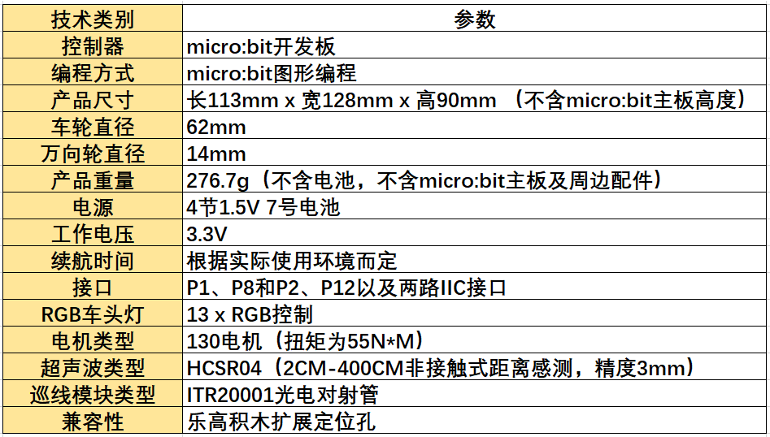
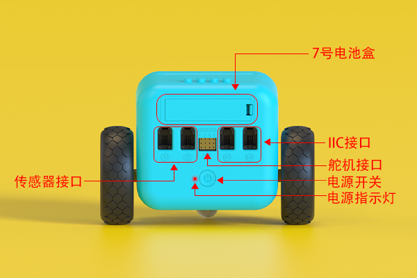
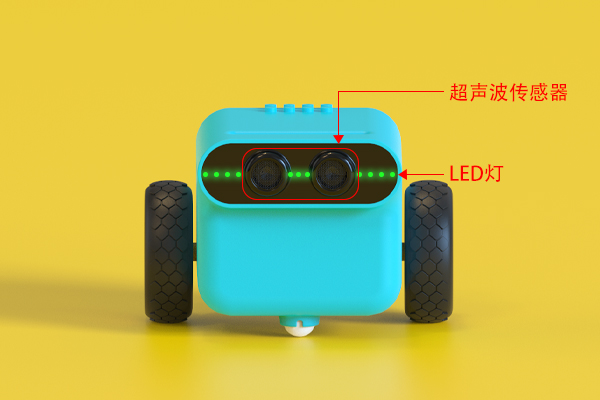

# 1.天蓬智能车简介

## 1.1 简介
---
 
- 天蓬智能车是一款micro:bit可编程智能车。它可以是玩具，在不插入micro:bit主板的时候能实现巡线与避障等娱乐功能；它也可以是教具，通过它可以学习编程技术。它还可以扩展电子模块和乐高积木，充分激发孩子的想象力与创造力。

## 1.2 产品图片
---

## 1.3 技术参数
---

## 1.4 购买链接
---

- 1 x [天蓬智能车](https://item.taobao.com/item.htm?spm=a1z10.5-c-s.w4002-18602834185.41.68d15ccfBFHNPy&id=618758535761)

## 接口说明
---

注意：舵机接口位置，舵机接线应竖着插入接口，最下方的线为接地线

## 使用说明
---
- 天蓬智能车可以在不安装micro:bit主板的时候使用，以下是相关的使用说明。
- 按下电源开关，让天蓬智能车处于待机状态，此时电源指示灯点亮，并且车头LED灯显示绿色呼吸灯。

- 当天蓬智能车处于待机状态时，按下电源开关，让天蓬智能车进入巡线避障模式，此时车头LED灯显示彩虹灯效，并进入巡线模式。

- 当天蓬智能车处于巡线模式时，如果遇到障碍物，则显示红色灯光，并停止行驶。

- 当天蓬智能车处于巡线避障模式时，按下电源开关，则退出巡线避障模式，回到待机状态。

- 无论天蓬智能车处于巡线避障模式还是待机状态，连续按下两次电源开关，都可以关闭电源。

## 常见问题
---

## 相关阅读  
---

