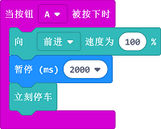

# 案例01：行驶控制

## 目的
---
- 用不同的方法控制天蓬智能车行驶。

## 使用材料
---

- [天蓬智能车（淘宝购买链接）](https://item.taobao.com/item.htm?ft=t&id=627045784239)

## 软件
---
[微软makecode](https://makecode.microbit.org/#)

## 编程
---

- 在MakeCode的代码抽屉中点击`高级`，查看更多代码选项。

- 为了给天蓬智能车编程，我们需要添加一个扩展库。在代码抽屉底部找到`扩展`，并点击它。这时会弹出一个对话框，搜索`tpbot`，然后点击下载这个代码库。

##示例程序一
- 在天蓬模块中拖出一个设置左右轮速度的积木块放入`当开机时`积木块中，并将参数都设置为100。

### 程序
- 请参考程序连接：[https://makecode.microbit.org/_0r5C5L029L9m](https://makecode.microbit.org/_0r5C5L029L9m)

- 你也可以通过以下网页直接下载程序。

<iframe style="position:absolute;top:0;left:0;width:100%;height:100%;" src="https://makecode.microbit.org/#pub:_0r5C5L029L9m" frameborder="0" sandbox="allow-popups allow-forms allow-scripts allow-same-origin"></iframe>
  
---

## 结论
---
- 天蓬智能车会一直向前行驶

##示例程序二
- 在天蓬模块中拖出一个`向前进速度为100%持续0秒`的积木块放入`当开机时`积木块中，并将参数都设置为速度100、持续3秒。

### 程序
- 请参考程序连接：[https://makecode.microbit.org/_XXH3yP66oRRp](https://makecode.microbit.org/_XXH3yP66oRRp)

- 你也可以通过以下网页直接下载程序。

<iframe style="position:absolute;top:0;left:0;width:100%;height:100%;" src="https://makecode.microbit.org/#pub:_XXH3yP66oRRp" frameborder="0" sandbox="allow-popups allow-forms allow-scripts allow-same-origin"></iframe>
  
---

## 结论
---

- 天蓬智能车全速前进三秒后停车

##示例程序三
- 在天蓬模块中拖出一个`向前进速度为100%`的积木块放入`当按钮A被按下时`中，然后设置暂停2000ms，然后在天蓬模块中拖出`立刻停车`放入`当按钮A被按下时`中。

### 程序
- 请参考程序连接：[https://makecode.microbit.org/_6i4awR07MA7E](https://makecode.microbit.org/_6i4awR07MA7E)

- 你也可以通过以下网页直接下载程序。

<iframe style="position:absolute;top:0;left:0;width:100%;height:100%;" src="https://makecode.microbit.org/#pub:_6i4awR07MA7E" frameborder="0" sandbox="allow-popups allow-forms allow-scripts allow-same-origin"></iframe>
  
---

## 结论
---

- 当按钮A被按下后，天蓬智能车全速前进两秒后停车

## 思考
---

## 常见问题
---

## 相关阅读  
---

