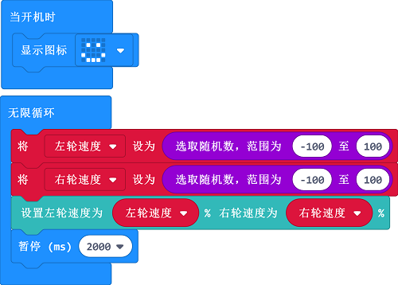

# 案例06：随机路线

## 目的
---
- 通过编程让天蓬智能车像是有思维一样，以它的想法自由行驶。

## 使用材料
---

- [天蓬智能车（淘宝购买链接）](https://item.taobao.com/item.htm?ft=t&id=627045784239)

## 软件
---
[微软makecode](https://makecode.microbit.org/#)

## 编程
---

- 在MakeCode的代码抽屉中点击`高级`，查看更多代码选项。

- 为了给天蓬智能车编程，我们需要添加一个扩展库。在代码抽屉底部找到`扩展`，并点击它。这时会弹出一个对话框，搜索`tpbot`，然后点击下载这个代码库。

##示例程序
- `当开机时`设置天蓬智能车的LED矩阵显示笑脸图标。
- 在`无限循环`中，分别设置变量`左轮速度`和`右轮速度`为-100~100之间的随机数，然后将天蓬智能车的左右轮速度分别设置为变量`左轮速度`和`右轮速度`的值，然后延时两秒。

### 程序
- 请参考程序连接：[https://makecode.microbit.org/_Lm56g1egqLv6](https://makecode.microbit.org/_Lm56g1egqLv6)

- 你也可以通过以下网页直接下载程序。

<iframe style="position:absolute;top:0;left:0;width:100%;height:100%;" src="https://makecode.microbit.org/#pub:_Lm56g1egqLv6" frameborder="0" sandbox="allow-popups allow-forms allow-scripts allow-same-origin"></iframe>
  
---

## 结论
---

- 开机时天蓬智能车的LED矩阵显示笑脸图标，然后每隔两秒自动切换左右轮速度行驶。

## 思考
---

## 常见问题
---

## 相关阅读  
---

