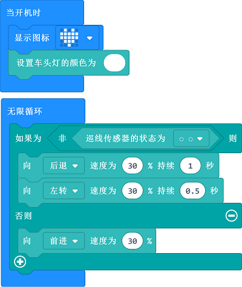

# 案例10：防坠落小车

## 目的
---
- 沿着桌面边缘贴一圈黑色胶纸，天蓬智能车检测到黑线时会迅速后退，然后换一个方向继续前进。

## 使用材料
---

- 1 x [天蓬智能车](https://item.taobao.com/item.htm?spm=a1z10.5-c-s.w4002-18602834185.41.68d15ccfBFHNPy&id=618758535761)

## 软件
---
[微软makecode](https://makecode.microbit.org/#)

## 编程
---

- 在MakeCode的代码抽屉中点击`高级`，查看更多代码选项。

- 为了给天蓬智能车编程，我们需要添加一个扩展库。在代码抽屉底部找到`扩展`，并点击它。这时会弹出一个对话框，搜索`tpbot`，然后点击下载这个代码库。

##示例程序
- `当开机时`设置micro:bit的LED矩阵显示爱心图标，天蓬智能车车头灯亮白色灯光。
- 在`无限循环`中，判断巡线传感器是否检测都黑线，当巡线传感器都检测到黑线时，小车以30%的速度后退一秒，然后以30%的速度左转0.5秒，如果巡线传感器没有检测到黑线，则小车以30%的速度前进。

### 程序
- 请参考程序连接：[https://makecode.microbit.org/_EuLWzL4ohego](https://makecode.microbit.org/_EuLWzL4ohego)

- 你也可以通过以下网页直接下载程序。

<iframe style="position:absolute;top:0;left:0;width:100%;height:100%;" src="https://makecode.microbit.org/#pub:_EuLWzL4ohego" frameborder="0" sandbox="allow-popups allow-forms allow-scripts allow-same-origin"></iframe>
  
---

## 结论
---

- 开机时micro:bit的LED矩阵显示爱心图案，天蓬智能车车头灯亮白色灯光，并向前行驶。当行驶到黑线范围时，天蓬智能车后退并左转，然后继续行驶。

## 思考
---

## 常见问题
---

## 相关阅读  
---

