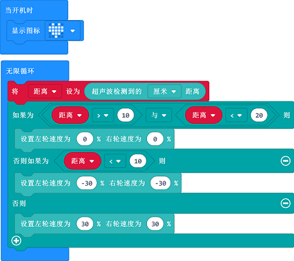

# 案例11：定距跟车

## 目的
---
- 通过编程让天蓬智能车与前方的车辆保持距离

## 使用材料
---

- 1 x [天蓬智能车](https://item.taobao.com/item.htm?spm=a1z10.5-c-s.w4002-18602834185.41.68d15ccfBFHNPy&id=618758535761)

## 软件
---
[微软makecode](https://makecode.microbit.org/#)

## 编程
---

- 在MakeCode的代码抽屉中点击`高级`，查看更多代码选项。

- 为了给天蓬智能车编程，我们需要添加一个扩展库。在代码抽屉底部找到`扩展`，并点击它。这时会弹出一个对话框，搜索`tpbot`，然后点击下载这个代码库。

##示例程序
- `当开机时`设置micro:bit的LED矩阵显示爱心图标。
- 在`无限循环`中，将超声波传感器检测到小车与前方障碍物的距离的值存入变量`距离`中，然后判断变量`距离`的值，当`距离`>10且`距离`<20时，设置小车左右轮速度为0，否则如果`距离`<10，则设置小车左右轮速度都为-30%，否则设置左右轮速度为30%。

### 程序
- 请参考程序连接：[https://makecode.microbit.org/_P6kVMjeWtiy4](https://makecode.microbit.org/_P6kVMjeWtiy4)

- 你也可以通过以下网页直接下载程序。

<iframe style="position:absolute;top:0;left:0;width:100%;height:100%;" src="https://makecode.microbit.org/#pub:_P6kVMjeWtiy4" frameborder="0" sandbox="allow-popups allow-forms allow-scripts allow-same-origin"></iframe>
  
---

## 结论
---

- 开机时micro:bit的LED矩阵显示爱心图案，天蓬智能车保持与前方障碍物的距离，当小车与前方障碍物距离较近时，小车向后行驶，当小车与前方障碍物的距离过大时，则小车向前行驶，当小车与障碍物距离处于设定阈值区间时，则小车停止行驶。

## 思考
---

## 常见问题
---
Q:使用案例中的代码发现小车不能正常运行？
A:电池电量不足，增大程序中的小车速度参数的数值，并测试。

## 相关阅读  
---

