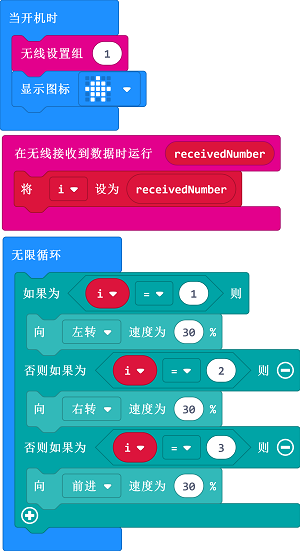

# 案例12：micro:bit远程控制

## 目的
---
- 使用micro:bit的按键控制天蓬智能车行驶。

## 使用材料
---

- 1 x [天蓬智能车](https://item.taobao.com/item.htm?spm=a1z10.5-c-s.w4002-18602834185.41.68d15ccfBFHNPy&id=618758535761)

## 软件
---
[微软makecode](https://makecode.microbit.org/#)

## 编程
---

- 在MakeCode的代码抽屉中点击`高级`，查看更多代码选项。

- 为了给天蓬智能车编程，我们需要添加一个扩展库。在代码抽屉底部找到`扩展`，并点击它。这时会弹出一个对话框，搜索`tpbot`，然后点击下载这个代码库。

##示例程序
### 遥控端
- `当开机时`设置micro:bit的LED矩阵显示设定图标，设置无线设置组为1。
- 当按钮`A`被按下时，无线发送数字1，当按钮`B`被按下时，无线发送数字2，当按钮`C`被按下时，无线发送数字3。

### 程序
- 请参考程序连接：[https://makecode.microbit.org/_CCkPrcgJVguX](https://makecode.microbit.org/_CCkPrcgJVguX)

- 你也可以通过以下网页直接下载程序。

<iframe style="position:absolute;top:0;left:0;width:100%;height:100%;" src="https://makecode.microbit.org/#pub:_CCkPrcgJVguX" frameborder="0" sandbox="allow-popups allow-forms allow-scripts allow-same-origin"></iframe>
  
---
### 接收端
- `当开机时`设置micro:bit的LED矩阵显示设定图标，设置无线设置组为1。
- 在无限接收到数据时，将接受到的数据存入变量`i`中。
- 在`无限循环`中，判断变量`i`的值，如果变量`i`等于1，则小车以30%的速度向左转，如果变量`i`等于2，则小车以30%的速度向右转，如果变量`i`等于3，则小车以30%的速度向前行驶。

### 程序
- 请参考程序连接：[https://makecode.microbit.org/_Pet2HkRtaYhb](https://makecode.microbit.org/_Pet2HkRtaYhb)

- 你也可以通过以下网页直接下载程序。

<iframe style="position:absolute;top:0;left:0;width:100%;height:100%;" src="https://makecode.microbit.org/#pub:_Pet2HkRtaYhb" frameborder="0" sandbox="allow-popups allow-forms allow-scripts allow-same-origin"></iframe>
  
---
## 结论
---

- 开机时micro:bit的LED矩阵显示设定图案，当按下按键A，则小车左转，按下按键B，则小车右转，按下按键A+B，则小车向前行驶。

## 思考
---

## 常见问题
---
Q:使用案例中的代码发现小车不能正常运行？
A:电池电量不足，增大程序中的小车速度参数的数值，并测试。

## 相关阅读  
---

