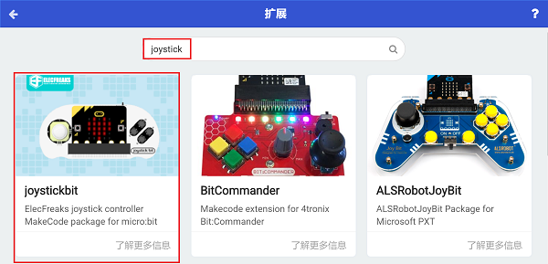
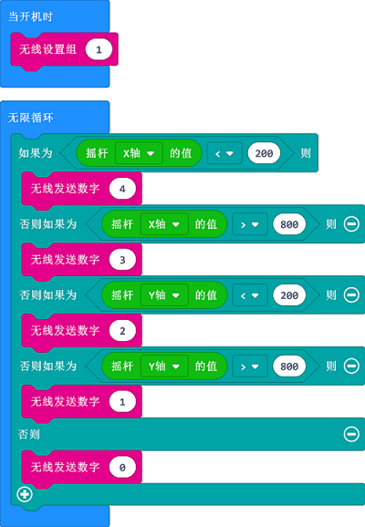
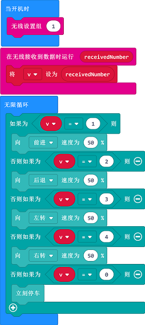

# 案例14：joystick:bit手柄远程控制天蓬智能车

## 目的
---
- 使用joystick:bit手柄远程控制天蓬智能车行驶。

## 使用材料
---

- 1 x [天蓬智能车](https://item.taobao.com/item.htm?spm=a1z10.5-c-s.w4002-18602834185.41.68d15ccfBFHNPy&id=618758535761)

## 软件
---
[微软makecode](https://makecode.microbit.org/#)

## 编程
---

- 在MakeCode的代码抽屉中点击`高级`，查看更多代码选项。

- 为了给天蓬智能车编程，我们需要添加一个扩展库。在代码抽屉底部找到`扩展`，并点击它。这时会弹出一个对话框，搜索`tpbot`，然后点击下载这个代码库。

- 为了给Joy:stick手柄编程，我们需要添加一个代码库。在代码抽屉底部找到“扩展”，并点击它。这时会弹出一个对话框。搜索`joystick`，然后点击下载这个代码库。

##示例程序
### 遥控端
- `当开机时`设置无线设置组为`1`。
- 在`无限循环`中，判断摇杆X轴和Y轴的值，当摇杆X轴的值小于200，则发送数字4，当摇杆X轴的值大于800，则发送数字3，当摇杆Y轴的值小于200，则发送数字2，当摇杆Y轴的值大于800，则发送数字1，否则发送数字0.

### 程序
- 请参考程序连接：[https://makecode.microbit.org/_hYULxqbJVd9P](https://makecode.microbit.org/_hYULxqbJVd9P)

- 你也可以通过以下网页直接下载程序。

<iframe style="position:absolute;top:0;left:0;width:100%;height:100%;" src="https://makecode.microbit.org/#pub:_hYULxqbJVd9P" frameborder="0" sandbox="allow-popups allow-forms allow-scripts allow-same-origin"></iframe>
  

---

### 接收端
- `当开机时`设置无线设置组为`1`。
- 当无线接收到数据积木块中，将接收到的值保存到变量`v`中；
- 在`无限循环`中，判断变量`v`的值，如果变量`v`的值等于1，则小车以50%的速度前进，否则如果变量`v`的值等于2，则小车以50%的速度后退，否则如果变量`v`的值等于3，则小车以50%的速度左转，否则如果变量`v`的值等于4，则小车以50%的速度右转，否则如果变量`v`的值等于0，则小车立即停车。

### 程序
- 请参考程序连接：[https://makecode.microbit.org/_Xb913AL79TLo](https://makecode.microbit.org/_Xb913AL79TLo)

- 你也可以通过以下网页直接下载程序。

<iframe style="position:absolute;top:0;left:0;width:100%;height:100%;" src="https://makecode.microbit.org/#pub:_Xb913AL79TLo" frameborder="0" sandbox="allow-popups allow-forms allow-scripts allow-same-origin"></iframe>
  
---
## 结论
---

- 使用joystick:bit手柄摇杆控制天蓬智能车行驶。

## 思考
---

## 常见问题
---

## 相关阅读  
---

