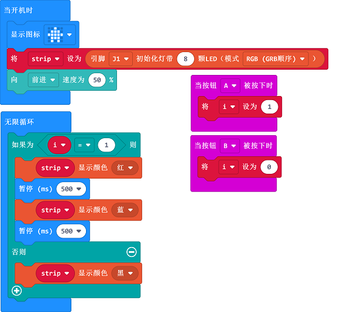

# 案例16：炫彩灯光

## 目的
---
- 模拟警车的灯光效果。

## 使用材料
---

- 1 x [天蓬智能车](https://item.taobao.com/item.htm?spm=a1z10.5-c-s.w4002-18602834185.41.68d15ccfBFHNPy&id=618758535761)

## 硬件连接

将彩虹灯环连接到天蓬智能车的端口1。

## 软件
---
[微软makecode](https://makecode.microbit.org/#)

## 编程
---

- 在MakeCode的代码抽屉中点击`高级`，查看更多代码选项。

- 为了给天蓬智能车编程，我们需要添加一个扩展库。在代码抽屉底部找到`扩展`，并点击它。这时会弹出一个对话框，搜索`tpbot`，然后点击下载这个代码库。

- 为了给彩虹灯环编程，我们需要添加一个代码库。在代码抽屉底部找到“扩展”，并点击它。这时会弹出一个对话框。搜索`PlanetX`，然后点击下载这个代码库。

##示例程序

- `当开机时`显示图标，初始化彩虹灯环为8颗LED并连接在J1端口，设置天蓬智能车前进速度为50%。
- 当A键按下时，设置变量`i`为1;当B键按下时，设置变量`i`为0.
- 在`无限循环`中，判断变量`i`的值，当变量`i`等于1时，设置彩虹灯环显示红色灯光，延时500ms，显示蓝色灯光，再延时500ms；否则设置彩虹灯环显示黑色。

### 程序
- 请参考程序连接：[https://makecode.microbit.org/_TvrRaMJLKPWr](https://makecode.microbit.org/_TvrRaMJLKPWr)

- 你也可以通过以下网页直接下载程序。

<iframe style="position:absolute;top:0;left:0;width:100%;height:100%;" src="https://makecode.microbit.org/#pub:_TvrRaMJLKPWr" frameborder="0" sandbox="allow-popups allow-forms allow-scripts allow-same-origin"></iframe>
  

---
## 结论
---

- 开启电源后，天蓬智能车向前行驶，通过按下micro:bit上的A键使彩虹灯环循环切换红色灯光和蓝色灯光，按下micro:bit上的B键则关闭彩虹灯环

## 思考
---

## 常见问题
---
Q:使用案例中的代码发现小车不能正常运行？
A:电池电量不足，增大程序中的小车速度参数的数值，并测试。

## 相关阅读  
---

