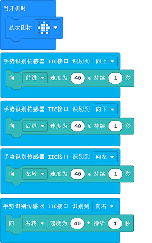

# 案例17：手势控制天蓬智能车

## 目的
---
- 通过挥手动作控制天蓬智能车前进、后退、左转、右转。

## 使用材料
---

- 1 x [天蓬智能车](https://item.taobao.com/item.htm?spm=a1z10.5-c-s.w4002-18602834185.41.68d15ccfBFHNPy&id=618758535761)

## 软件
---
[微软makecode](https://makecode.microbit.org/#)

## 编程
---

- 在MakeCode的代码抽屉中点击`高级`，查看更多代码选项。

- 为了给天蓬智能车编程，我们需要添加一个扩展库。在代码抽屉底部找到`扩展`，并点击它。这时会弹出一个对话框，搜索`tpbot`，然后点击下载这个代码库。

- 为了给手势识别传感器编程，我们需要添加一个代码库。在代码抽屉底部找到“扩展”，并点击它。这时会弹出一个对话框。搜索`PlanetX`，然后点击下载这个代码库。

##示例程序

-  `当开机时`显示图标。
- 通过手势识别传感器检测手势，当识别到手向上挥动的动作时，设置天蓬智能车以40%的速度向前行驶1s
- 按同样的方式编写当识别到手向下挥动、向左挥动、向右挥动时的程序。

### 程序
- 请参考程序连接：[https://makecode.microbit.org/_PqAPVDY7hDRR](https://makecode.microbit.org/_PqAPVDY7hDRR)

- 你也可以通过以下网页直接下载程序。

<iframe style="position:absolute;top:0;left:0;width:100%;height:100%;" src="https://makecode.microbit.org/#pub:_PqAPVDY7hDRR" frameborder="0" sandbox="allow-popups allow-forms allow-scripts allow-same-origin"></iframe>
  
---

## 结论
---

- 正对手势识别传感器，通过挥手动作控制天蓬智能车前进、后退、左转、右转。

## 思考
---

## 常见问题
---
Q:使用案例中的代码发现小车不能正常运行？
A:电池电量不足，增大程序中的小车速度参数的数值，并测试。

## 相关阅读  
---

