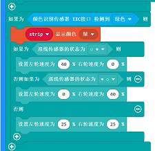
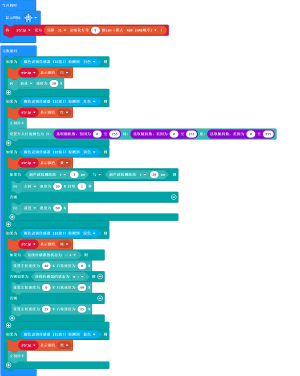

# 案例18：颜色识别控制天蓬智能车

## 目的
---
- 根据插入的颜色卡片切换到对应的彩虹灯环颜色并实现不同功能（前进、随机切换车头灯颜色、避障、巡线）。

## 使用材料
---

- 1 x [天蓬智能车](https://item.taobao.com/item.htm?spm=a1z10.5-c-s.w4002-18602834185.41.68d15ccfBFHNPy&id=618758535761)

## 软件
---
[微软makecode](https://makecode.microbit.org/#)

## 编程
---

- 在MakeCode的代码抽屉中点击`高级`，查看更多代码选项。

- 为了给天蓬智能车编程，我们需要添加一个扩展库。在代码抽屉底部找到`扩展`，并点击它。这时会弹出一个对话框，搜索`tpbot`，然后点击下载这个代码库。

- 为了给颜色识别传感器和彩虹灯环编程，我们需要添加一个代码库。在代码抽屉底部找到“扩展”，并点击它。这时会弹出一个对话框。搜索`PlanetX`，然后点击下载这个代码库。

##示例程序

- `当开机时`设置显示图标，初始化连接在J1端口的彩虹灯环为8颗LED灯。

- 在`无限循环`中，当颜色识别传感器识别到白色，则设置彩虹灯环显示白色，设置天蓬智能车前进速度为30%。

- 当颜色识别传感器识别到红色，则设置彩虹灯环显示红色，天蓬智能车停止行驶，设置天蓬智能车的车头灯的RGB值分别为0~255之间的随机数。

- 当颜色识别传感器识别到黄色，则设置彩虹灯环显示黄色，并判断超声波传感器的返回值是否在3~20的区间内.如果返回值在3~20的范围内，则设置天蓬智能车以30%的速度向左转1秒，否则以30%的速度前进。

- 当颜色识别传感器识别到绿色，则设置彩虹灯环显示绿色，并判断巡线传感器的状态，如果左侧检测到黑色，则设置左轮速度为0，右轮速度为40；如果右侧检测到黑色，则设置左轮速度为40，右轮速度为0，如果两侧都检测到黑色，则证明天蓬智能车没有偏离黑线，设置天蓬智能车以25%的速度前进。

- 当颜色识别传感器识别到蓝色，则设置彩虹灯环显示蓝色，设置天篷智能车停止行驶。

完整程序：

### 程序
- 请参考程序连接：[https://makecode.microbit.org/_YrH0rDiLJEKg](https://makecode.microbit.org/_YrH0rDiLJEKg)

- 你也可以通过以下网页直接下载程序。

<iframe style="position:absolute;top:0;left:0;width:100%;height:100%;" src="https://makecode.microbit.org/#pub:_YrH0rDiLJEKg" frameborder="0" sandbox="allow-popups allow-forms allow-scripts allow-same-origin"></iframe>
  
--
---
## 结论
---

- 将颜色卡片插入颜色识别传感器下方位置，激活不同的功能
- 插入白色卡片：彩虹灯环显示白色灯光，小车向前行驶
- 插入红色卡片：彩虹灯环显示红色灯光，小车立即停车并随机切换车头灯颜色
- 插入黄色卡片：彩虹灯环显示黄色灯光，小车进入避障模式
- 插入绿色卡片：彩虹灯环显示绿色灯光，小车进入巡线模式
- 插入蓝色卡片：关闭彩虹灯环，小车立即停车

## 思考
---

## 常见问题
---
Q:使用案例中的代码发现小车不能正常运行？
A:电池电量不足，增大程序中的小车速度参数的数值，并测试。

## 相关阅读  
---

