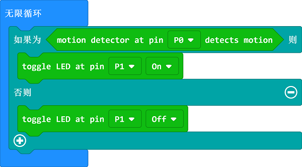

# 课程_02 智能灯

  

在这个项目中，我们将使用micro:bit小小发明家套件来制作一个智能灯。我们将会用到章鱼系列的人体红外传感器和LED灯模块。 当检测到有人进入房间的时候，LED灯就会亮起来。

## 目标
---

- 学习人体红外传感器的使用。
- 制作一些现实生活中常用的一些小装置。

## 所需材料：  
---  

- 1 x BBC micro:bit
- 1 x USB线
- 1 x 扩展板
- 1 X 人体红外传感器模块
- 1 x LED模块

**温馨提示: 如果你想要以上所有这些元器件，你可以购买我们的[micro:bit小小发明家套件](https://item.taobao.com/item.htm?spm=a230r.7195193.1997079397.9.z3IMPf&id=564707672256&abbucket=5)。**

## 制作过程
---

### 步骤 1： 元器件连接

将micro:bit插入扩展板顶部的插口，并且将人体红外传感器模块插入扩展板上的引脚P0。

将LED模块插入扩展板上的引脚P1，确保线的颜色和扩展板上的引脚颜色相同。

### 步骤 2： 编程前的准备

我们将在MakeCode中添加一个代码库以方便使用我们的元器件。在MakeCode的代码抽屉中点击“高级” 查看更多代码选项，然后在代码抽屉底部选择“扩展”。

此时，将会弹出一个对话框。在对话框中搜索“tinker kit", 然后点击下载这个代码库。 

注意：如果你收到提示说一些代码库因为不兼容问题将被删除，你可以根据提示操作或者在项目文件的菜单中新建一个项目。

### 步骤 3: 编程

在MakeCode的代码抽屉中点击Tinkercademy，找到与我们套件元器件相关的积木块。

在这个项目中，我们不需要初始化程序，而且这个程序的代码并不多。

如果你不想自己动手编写这些代码的话，你可以从下面这个链接下载程序的完整代码：

[https://makecode.microbit.org/_aVz7L53wXiAm](https://makecode.microbit.org/_aVz7L53wXiAm)

如果人体红外传感器检测到运动，LED灯就会亮起。如果没有任何物体运动，LED灯就会关闭。它的工作原理非常简单。

### 步骤 4: 成功

太棒啦！你已经成功地制作了一个智能灯哦！让我们一起来点亮它吧！

## 常见问题
---
