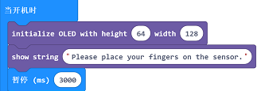
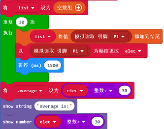
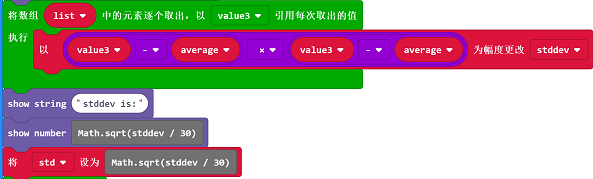

# 课程_09 测谎仪

有了这个测谎仪，你再也不用担心被骗啦！只要让测试者握住湿度传感器几分钟，你就可以知道他说的是真话还是假话哦！

## 项目简介
---

在这个项目中，我们将会制作一个非常简单的测谎仪。它可以通过测量我们皮肤的导电性来检测我们是否说谎。当人体处于紧张的状态时，我们的皮肤的导电性会增强，湿度传感器就会检测到我们皮肤导电性的变化。我们可以根据这个来判断一个人是否在说谎。

## 所需材料：  
---

- 1 x BBC micro:bit
- 1 x USB线
- 1 x 扩展板
- 1 x OLED模块
- 1 x 湿度传感器

**温馨提示: 如果你想要以上所有这些元器件，你可以购买我们的[micro:bit小小发明家套件](https://item.taobao.com/item.htm?spm=a230r.7195193.1997079397.9.z3IMPf&id=564707672256&abbucket=5)。**

## 目标：
---

- 了解OLED模块和湿度传感器的使用
- 学习基本的数据统计
- 使用湿度传感器来制作小装置

## 制作过程
---

### 步骤1 - 元器件连接

首先，将湿度传感器插入扩展板。尽量保证线的颜色和扩展板上引脚的颜色一致。这对于后面的步骤来说很关键。 

其次，将OLED插入扩展板。你可以将它插入到扩展板上的3排插孔的任意一行。 

### 步骤2 - 编程前的准备

为了使用我们准备好的套件，我们需要添加一个代码库。在MakeCode代码选择区域点击“Advanced”来查看更多代码选项。

这时会弹出一个对话框。在对话框中搜索“tinker kit”，然后点击下载这个代码库。

注意：如果你得到一个提示说一些代码库因为不兼容的原因将被删除，你可以根据提示继续操作，或者在项目菜单栏里面新建一个项目。

### 步骤3 - 编程

首先，用图片中所示的OLED选项初始化OLED模块。

这部分的代码可以测量并记录下一分钟内2个手指每秒钟的导电性。然后，它会计算出平均数。当测试者没有说谎时，这个被称为Calm（平静）数值。

这部分的代码可以计算第一分钟获取的读数的标准偏差。标准偏差说明了这些读数是多么地不同。一个大的标准偏差意味着读数方面更多的不同。积木块“Math.sqrt”主要用于计算所给出的数值的平方根，它被添加到了Javascript里面。

在最初的读数生成并记录之后，湿度传感器每5秒测量一次平均导电性。如果测量数据高于标准偏差的平均值，我们可以得出结论：测试者的皮肤导电性明显增强，因此他是在说谎。这时，LED屏幕上会显示一个“X”的形状。

如果你不想自己编写代码，你也可以通过下面的页面下载完整的代码：

[https://makecode.microbit.org/_bqqVugfTfdz0](https://makecode.microbit.org/_bqqVugfTfdz0)

或者，你也可以通过下面这个页面下载：

<iframe style="position:absolute;top:0;left:0;width:100%;height:100%;" src="https://makecode.microbit.org/#pub:_bqqVugfTfdz0" frameborder="0" sandbox="allow-popups allow-forms allow-scripts allow-same-origin"></iframe>

## 步骤4 - 使用

首先，把你的2个手指分别贴在湿度传感器的触角上。如果能用一个橡皮筋绑定，那样会更加简单、有效。（纯属我个人的想法）你可以用不同的方法来实验，例如：使用鳄鱼夹或者是胶布。

现在，开启测谎仪。这时测谎仪将会记录下你的皮肤在平静的状态下的导电性。然后，它将会计算出平均值和标准偏差。

在最初的读数生成后，请再询问一边测试者！如果测试者说谎了，他就会变得紧张不安，测谎仪就可以检测到他说谎了并且在屏幕上显示一个叉。  

### 步骤5 - 成功！

太棒啦！现在你可以用这个测谎仪轻松地测出谁说了谎哦！

## 常见问题
---
