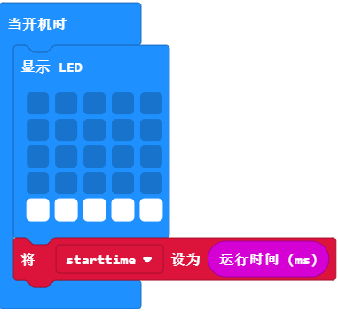
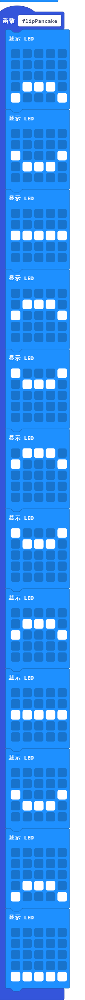
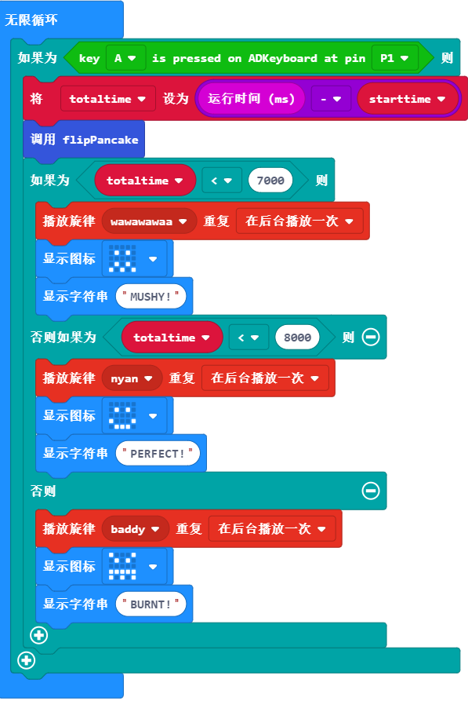
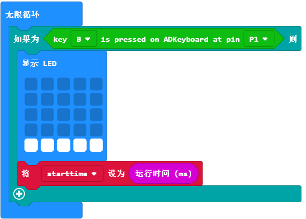
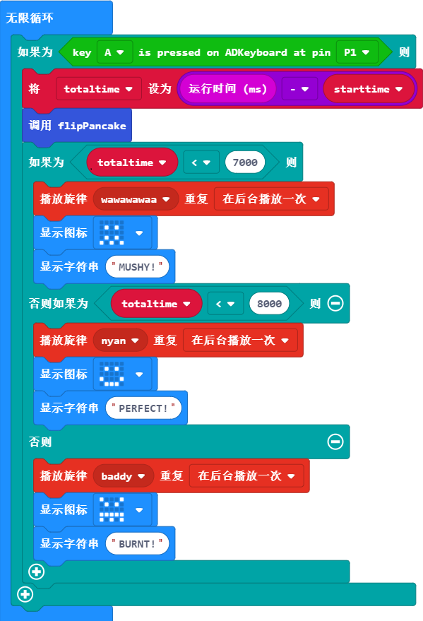
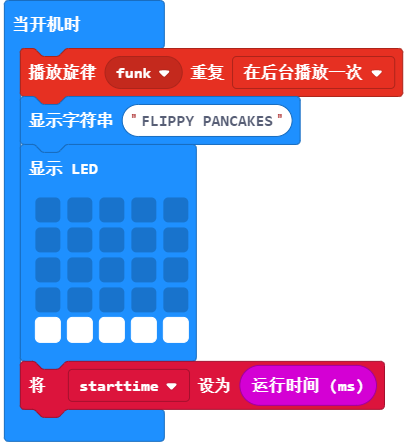

# 课程_14 抛煎饼游戏

你知道制作一块好吃的煎饼需要什么吗？

## 目标
---

我们将要制作一个抛煎饼的游戏。在游戏中，你必须在恰当的时机翻动煎饼。如果动作太快，你的煎饼会糊掉；太慢了，煎饼会烧焦哦！你将学习...

- 使用micro:bit、蜂鸣器和ADKeypad。
- 使用if-else语句来判断条件。
- 在MakeCode上创建你自己的函数。
- 定制属于你的游戏。

## 制作材料
---

- 1 x BBC micro:bit
- 1 x USB线
- 1 x 蜂鸣器
- 2 x 母对母跳线
- 1 x ADKeypad

**温馨提示: 如果你想要以上所有这些元器件，你可以购买我们的[micro:bit小小发明家套件](https://item.taobao.com/item.htm?spm=a230r.7195193.1997079397.9.z3IMPf&id=564707672256&abbucket=5)。**

## 制作过程
---

### 步骤 1

将蜂鸣器插到扩展板上的引脚P0。确保正极接到扩展板上的黄色信号引脚，负极接到黑色的接地引脚。

将ADKeypad插入到扩展板上的引脚P1,确保线的颜色和扩展板上引脚的颜色一致。

### 步骤 2

在Makecode中，我们将使用2个变量来追踪时间跨度。变量就和水桶一样可以用来装入不断变化的数值。 

每次当我们启动micro:bit的时候，一个隐藏的计时器会追踪开启后的时间。我们将用这个隐藏的计时器来计算初始时间，结束时间以及游戏的总时长。

在变量抽屉中，创建一个新的变量，将其命名为startTime（起始时间）。

当我们启动游戏的时候，我们想要将我们的变量startTime设置为micro:bit的运行时间。

此外，我们想用LED在屏幕上显示一个扁平的煎饼。

### 步骤 3

我们想要设置游戏。当按下ADKeypad上的按钮A，一个翻煎饼的动画将会显示在micro:bit上。

为了实现它，我们需要创建一个函数。一个函数是一段代码，每次被调用的时候就会执行一个特定的任务。在这个案例中，我们的任务是显示翻煎饼的动画。

要创建函数，你需要点击函数类目并选择“Make a Function"(创建一个函数）按钮。我将我的函数命名为“flipPancake”（翻煎饼）。

当你做完之后，一个叫做“function flipPancake”（函数 翻煎饼）的新积木块将会添加到你的电脑屏幕上。这就是我们定义函数的地方，即无论何时我们运行函数积木块，这个事件都会发生。

在这个案例中，我们将添加多个LED积木块到我们的函数flipPancake（翻煎饼）中，因此它就会显示煎饼好像被扔到了空中并摇晃着落下。

当你定义好了你的函数之后，你可以通过调用函数类目中的“call function flipPancake"(调用 函数 翻煎饼）随时运行它。

你可以随意制作你自己的翻煎饼动画。这仅仅只是一个示例哦！

### 步骤 4

现在，我们将要感应ADKeypad上的按钮按压。为了实现这一步，我们需要在MakeCode中引进一个特殊的代码库。

展开“Advanced"(高级）选项，将鼠标下拉至底部并点击”Add Package"(加载代码库）。

在搜索框中，输入“Tinkercademy"。点击标记有“tinkercademy-misc”的方框。

现在你将看到MakeCode中出现了一个新东西-一个鲜艳的绿色的Tinkercademy按钮就加载成功啦！

在这个类目中，你讲发现用来感应ADKeypad上按钮按压的积木块。这个代码库的引用只适用于当前这个项目。所以，如果你创建了一个新项目，你将需要重新引用它。

### 步骤 5

现在我们可以感应按钮按压了，让我们来编写游戏的主要代码吧！我们需要计算玩家按下按钮A之后时间，并发现煎饼是否糊了，制作成功了或者被烧焦了。

我们用一个forever（永远）循环来开始。在forever循环中放入一个if-else语句来测试按钮A是否被按下。If-else语句判断一个条件是否是true（真）。如果是true（真）， 那么执行程序。如果是false（假），那么就跳过它。因为这个if-else语句是在一个forever循环中，它将会永远检测按钮A是否被按下。

为了做这一步，我们将要检测当前micro:bit的运行时间并减去变量startTime（起始时间）的数值。我们将会得到当前游戏运行的总时间。我们把这个总时间存储在另一个变量totalTime（总时间）里面。（你可以在变量的目录中创建这个变量）

在计算完totalTime（总时间）后，我们就要调用flipPancake函数了! 它可以让煎饼动起来哦!

接下来，我们需要检验totalTime（总时间）来判断煎饼是糊了、制作成功了或者是被烧焦了。为了判断煎饼的状态，我们需要再次使用if-else语句。但是在这个案例中，我们将要连接这些if-else语句来逐个检验多个条件。当if-else语句被连接后，只有一个if-else语句能运行。当micro:bit发现那个可以运行的if-else语句为true（真）时，它将会跳过其他if-else语句的检验。通过点击if-else积木块上方的齿轮图标将更多的if-else积木块拖拽进来，以此达到连接多个if-else语句的目的。 

在这个案例中，我们通过检验totalTime（总时间）是否小于7000来开始（记住：总时间的单位是毫秒哦！所以 7000 毫秒 = 7 秒)。如果totalTime（总时间）小于7000，我们就判定煎饼糊了，并显示一个皱眉的表情和一则MUSHY（糊了）的信息。如果第一个条件是true（真），micro:bit将会跳过其余的条件检验哦！

如果totalTime（总时间）不小于7000，我们就检验totalTime（总时间）是否小于8000毫秒。我们知道这个时候totalTime（总时间）是大于7000毫秒。所以如果它小于8000， 我们就判定煎饼制作成功，并且显示一个笑脸和一则PERFECT（完美）的信息。

最后，如果以上两个条件都不是true(真）， 那么我们知道totalTime（总时间）一定是大于8000毫秒。因此，我们判定煎饼煎的时间太长，并显示一个生气的表情和一则BURNT（烧糊）的信息。

### 步骤 6

现在，我们已经让游戏运转起来了。接下来，我们需要设置游戏，让玩家在不需要重置micro:bit的情况下能够多次玩这个游戏。

为了实现这一目的，我们将会按下ADKeypad上的按钮B来重置游戏。我们再次使用一个forever循环，并将一个if-else语句放在里面来检验按钮B是否被按下（别忘了再次辨别正确的引脚好哦！）

当我们重新启动游戏的时候，我们还需要做什么呢？在这个案例中，我们唯一需要做的就是显示一块新的煎饼以及重置游戏的起始时间。

### 步骤 7

现在我们的游戏生效了（希望吧）！让我们来给游戏添加更多的乐趣吧！ 我们已经把一个蜂鸣器连接到了micro:bit上，但是还没有用过它哦！注意：将这段代码添加到你现在的代码中。这一步骤在之前已经被反复多次地提到过了哦！

micro:bit有很多未编程的音乐供我们使用。让我们给我们的游戏增加一点音乐吧！在这里，我们会给不同的游戏结果添加不同的音乐。对于糊了的煎饼或者是烧糊的煎饼，我们会添加一些悲伤的音乐。但是对于制作成功的煎饼，我们会演奏Nyan-cat(彩虹猫）的音乐哦！

我们需要把这些音乐设置为“once in the background”（在后台播放一次），否则它将会在音乐播放完后才开始启动游戏。

### 步骤 8

最后，让我们在启动micro:bit的时候，添加一些起始音乐和一则起始信息。注意：将这个添加到你现在的代码中。这一步已经被反复多次提到过哦！

我们可以再次使用蜂鸣器来演奏一首乐曲（同样，我们想让它在后台播放一次)。我们也可以显示游戏的名称哦！ 

如果你不想自己亲手编写代码，你可以通过下面这个链接直接下载程序的完整代码：

[https://makecode.microbit.org/_aepYrcgwLFEy](https://makecode.microbit.org/_aepYrcgwLFEy)

或者，你也可以从下面这个页面下载：

<iframe style="position:absolute;top:0;left:0;width:100%;height:100%;" src="https://makecode.microbit.org/#pub:_aepYrcgwLFEy" frameborder="0" sandbox="allow-popups allow-forms allow-scripts allow-same-origin"></iframe>

### 太棒啦!

现在你已经学会了如何使用ADKeypad, 你可以用它来控制LED灯、舵机和其他的元件哦！你还学习了if-else语句的使用并创建了你自己的函数，你可以把它用在很多micro:bit的项目中哦！试一试自己亲自动手制作一个属于你的煎饼游戏吧！

## 常见问题
---
