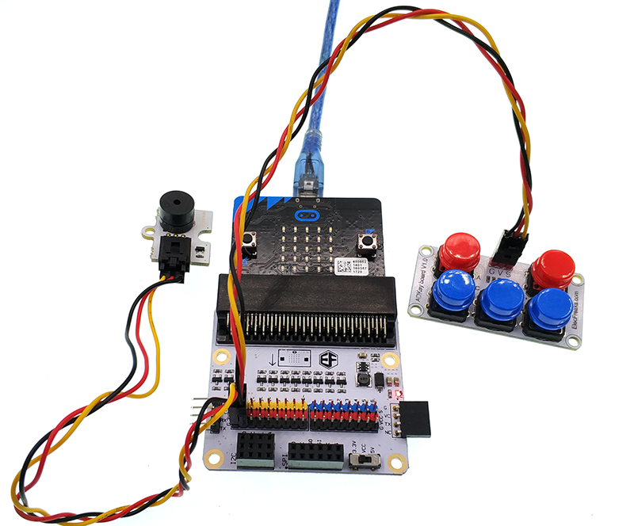
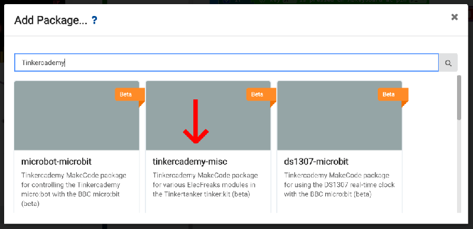

# 课程_15 跑迷宫游戏

你能通过重重关卡吗？

## 目标
---

我们将要创建一个迷宫游戏。在迷宫里面，你必须穿过一系列关卡，而且不能撞墙。你将会学习如何： 

- 使用蜂鸣器、ADKeypad和micro:bit
- 使用if语句来评估条件
- 使用变量来追中游戏状态，例如：玩家的位置
- 制作你自己的游戏并添加你自己的游戏层级

## 制作材料
---

- 1 x BBC micro:bit
- 1 x Micro USB线
- 1 x 蜂鸣器
- 2 x 母对母跳线
- 1 x ADKeypad

**温馨提示: 如果你想要以上所有这些元器件，你可以购买我们的[micro:bit小小发明家套件](https://item.taobao.com/item.htm?spm=a230r.7195193.1997079397.9.z3IMPf&id=564707672256&abbucket=5)。**

## 制作过程
---

### 步骤 1

将蜂鸣器连接到扩展板上的引脚P0。将它的正极连接到扩展板上的黄色的信号引脚，负极连接到黑色的接地引脚。 

将ADKeypad连接到扩展板上的引脚P1。要保证线的颜色和扩展板上的引脚颜色一致哦！ 

### 步骤 2

如何在micro:bit上创建一个迷宫游戏呢？我们将显示玩家的位置、LED墙以及在micro:bit主板上用LED绘制迷宫的路径。

如何在屏幕上追踪玩家的位置呢？micro:bit上5 x 5的点阵可以被当做是一个坐标轴。X坐标从左边的0开始一直到右边的4。Y坐标从顶部的0开始一直到底部的4。这就意味着顶部最左侧的LED的坐标是（0,0）。以此类推，底部最右侧的LED的坐标是（4,4）。

为了做到这一步，我们需要创建一些变量。变量就像水桶一样可以为我们存储一条条信息。无论什么时候我们想要这些存储的信息，我们只需要看看变量就行。我们需要两个变量来追踪玩家的位置。为什么需要两个变量呢？ 其中一个变量用于追踪玩家在X轴的位置，另一个变量用于追踪玩家在Y轴的位置。我们也需要一个变量来追踪迷宫游戏的关卡（是的，我们可以有多个游戏等级哦！）并且用另外一个变量来追踪游戏是否还在继续进行（与游戏结束相反）。

那么，让我们一起来设置这些吧！在“on start”（启动）事件中，我们（选择性地）演奏一首音乐并且在micro:bit上显示游戏的名称（MAZE RUNNER!）。我们还需要设置以上提到的那4个变量，并将它们命名为： level、 playerx、 playery、以及 gameOn。

这些变量应该设置在哪里呢？ 当然是从游戏的第一关开始啦。此时，我们将gameOn设置为True（真）。因为当我们给micro:bit供电的时候，我们想要直接启动游戏。我们可以选择任意一个位置作为玩家的位置，但是当迷宫游戏的等级上升时，我们需要记住这个位置，因为我们不想让玩家在墙里面开始这个游戏。在这个例子中，我选择让坐标点（0,3）作为玩家的初始位置。

### 步骤 3

现在我们已经设置好了我们的起始变量，接下来让我们在micro:bit屏幕上显示我们的玩家吧！

我们想让代表玩家的这颗LED灯闪烁以便于更容易地发现玩家。为了做这一步，我们将在一个forever（永远）循环里面使用“plot x y”（绘制X、Y）这个积木块。记住，这不会立马生效。在步骤6，当我们添加了迷宫墙的时候，micro:bit将会在每次绘制迷宫墙的时候移动玩家的位置。在这里添加一个pause（暂停）积木块的话，我们就能够让玩家的位置不会立即被重新绘制，并创造出一个闪烁的效果。

我们将使用我们上面创建的变量playerx和playery。为什么这么做呢？如果我们在这里输入了数字，玩家的位置就不能被轻易地移动了。使用变量可以让我们改变playerx和playery的值，那么forever（永远）循环就会绘制玩家的新位置。

记住pause（暂停）积木块的时间单位是毫秒，因此 300 ms = 0.3 seconds哦！你可以通过改变暂停的时间来控制它闪烁的速度哦！

### 步骤 4

现在micro:bit上可以显示玩家了，但是我们还不能让它移动。让我们添加玩家的移动。我们将要感应ADKeypad上按钮是否被按下。但是为了实现它，我们需要在MakeCode里面引进一个特殊的代码库。 

展开“Advanced”（高级）选区，下拉到底部，并点击“Add Packages”（添加代码库）。

在搜索框中，输入“Tinkercademy”，并点击选择“tinkercademy-misc”。

现在你可以在MakeCode里面看到一些新东西--一个鲜艳的绿色的Tinkercademy类目就已经添加完成了！

在这个类目里，你将会发现用于感应ADKeypad上按钮按压的积木块。记住： 只在当前这个项目中引用这个代码库。所以，如果你开始了一个新项目并想要用这个类目，你需要重新引进它。

### 步骤 5

现在我们已经添加了Tinkercademy的类目，我们可以用ADKeypad来控制玩家的上下左右移动。在这个案例中，我们将把按钮A设置为向上移动，按钮C设置为向下移动，按钮D设置为向左移动，按钮E设置为向右移动。 

为了实现这一步，我们将用到if语句。If语句检验一个条件是否是true（真）。如果条件是true（真），那么他们会运行if积木块内的任何积木块。当我们在forever（永远）循环中放置一个if语句，我们将永远测试这个条件是否是true（真）。

为了移动玩家，我们只需要改变变量playerx或playery。记住：减少playerx，玩家向左移动；增加playerx，玩家向右移动。我们用这些变量不断地绘制玩家的坐标位置。因此，当我们改变它们的时候，程序就会自动地改变玩家的位置哦！ 

在每个按钮被按下后，我们需要添加一个300ms的短暂的暂停。否则，当你每按下一个按钮的时候，由于程序运行的太快，玩家会移动很多步。

### 步骤 6

现在我们可以移动玩家了，接下来让我们开始创建我们迷宫游戏的等级吧！每次在我们开始设置一个关卡的时候，我们都需要做一些准备工作。

首先，我们需要在micro:bit屏幕上显示迷宫的墙；
其次，我们需要一直检验玩家是否撞墙（如果撞墙了，那么游戏就结束了哦！）。
再次，我们需要一直检验玩家是否到达了迷宫游戏的每个关卡的出口（如果他们成功闯关，就让他们知道他们已经成功了并继续进行到下一关吧！）

我们将在每个关卡使用一个forever（永远）循环。在这个循环中，我们用一个if语句来检验这个level（等级）变量是否等于1。这就意味着只有在level 变量等于1的时候，代码才会运行。

在if语句中，我们首先要显示迷宫的墙。我们用micro:bit上被点亮的LED灯来作为迷宫的墙，而那些没有被点亮的LED则作为迷宫的道路。用“showleds” 这个积木块就可以实现这一操作。 需要注意的一点是：你是否还记得上面我们设置的玩家的起始位置呢？一定要保证你的玩家的初始位置不在迷宫的墙里面哦！在这个案例中，玩家的初始位置是（0,3）。 

接下来，我们需要检验玩家是否撞墙了。怎么做呢？我们将再一次地使用if语句来检验我们的变量playerx和playery是否曾经位于墙所在的位置。我们用5x5的LED点阵的坐标系统来进行操作。在这个案例中，LED点阵上有2部分墙。

第一部分墙位于当playerx和playeryis两者都小于或等于2的地方。我们用这些条件创建了一个if语句，在if语句内我们将gameOn设置为“false”（假）。因为如果它是true（真），这就意味着玩家已经撞墙，游戏结束了。

第二部分墙位于当playerx或playery等于4的地方。我们用这些条件创建了另外一个if语句，在if语句内我们将gameOn设置为“false”（假）。因为如果它是true（真），那么就意味着玩家已经撞墙，游戏结束。

最后，我们需要添加的最后一个测试就是检验玩家是否成功通过了迷宫。在这个示例关卡中，迷宫的出口位置在（3,0）。我们创建另一个if语句来检验x是否等于3和y是否等于0。在这个if语句中，我们需要进行以下操作： 

首先，我们在背景中演奏一首成功的音乐；
其次， 我们设置玩家在下一关的起始位置（在这个案例中，我们使用相同的起始位置，但是这个起始位置也可以是不同的哦！）。
再次，我们显示一个笑脸来告诉玩家闯关成功。
最后，我们给变量level（等级）加1（这样下一关就会显示出来）。

### 步骤 7

设置一个游戏的等级还真是不简单呀！现在我们已经有了一个游戏等级，接下来让游戏结束的时候发生点什么吧！无论玩家什么时候撞墙了，它就会发生并被变量“gameOn”追踪到。

在一个forever（永远）循环里面，我们用一个if语句来检验变量“gameOn”的值。如果它是“false”（假），那么我们就让游戏跳过代码，自己运行起来吧！ 

在这个案例中，我们在背景中播放一段悲伤的音乐，重置变量“level（等级），熄灭代表玩家的那颗LED灯，显示一个生气的表情，并在末尾显示一个字符串告诉玩家按下按钮B可以让游戏重新开始。 

### 步骤 8

说到按下按钮B来让游戏重新开始，我们还没有创建相关的代码哦! 

在一个forever（永远）循环中，我们需要检验ADKeypad上的按钮B是否被按下。如果它被按下了，我们就将变量“level”（等级）设置为1，通过将“playerx”设置为0和“playery”设置为3来重置玩家的起始位置，并将变量“gameOn”设置为“true”。

### 步骤 9

现在我们的游戏应该能正常运转了哦!我们还差一件事没有完成，那就是更多的游戏等级。 

添加更多的游戏等级其实非常简单。你只要把上面level 1的所有代码复制就行。唯一需要改变的是迷宫的墙和我们if语句的坐标（用了检验玩家是否撞墙或成功闯关）。

建议： 
有时候，通过创建if语句来检验每堵墙是比较复杂的。在这些案例中，试着将你的墙拆分成一些独立的矩形，并给每个矩形创建一个if语句。

需要注意的一点是：在玩家成功通过这一关后，你需要重置变量playerx和playery，确保玩家的位置和下一关的位置一致。否则玩家的起始位置就会在墙里面哦！

### 步骤 10

当你完成了这些操作之后，你可以选择性地创建一个成功的环节。在这个案例中，一旦玩家已经成功完成了4关里面的前3关，我们就不再绘制玩家的位置，而是在后台播放一段胜利的音乐，并显示一条成功的消息！

如果你不想自己亲手编写代码，你可以通过下面这个链接直接下载程序的完整代码：

[https://makecode.microbit.org/_fCqa4399XUpv](https://makecode.microbit.org/_fCqa4399XUpv)

或者，你也可以通过下面这个页面下载。

<iframe style="position:absolute;top:0;left:0;width:100%;height:100%;" src="https://makecode.microbit.org/#pub:_fCqa4399XUpv" frameborder="0" sandbox="allow-popups allow-forms allow-scripts allow-same-origin"></iframe>

## 太棒啦!

现在你已经学会了如何使用ADKeypad。你可以试着去控制LED、舵机和其他元件哦！同时，你也学习了if语句。if语句在很多micro:bit项目中可是非常有用呢！你可以通过添加更多的游戏关卡，试着去做一个属于你自己的跑迷宫游戏哦！

## 常见问题
---