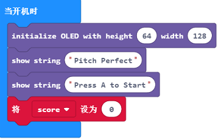
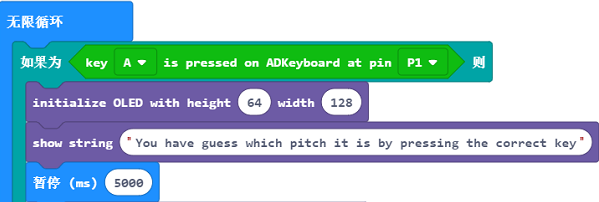
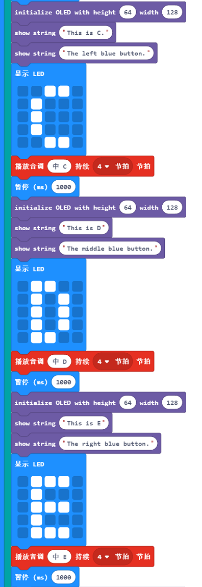
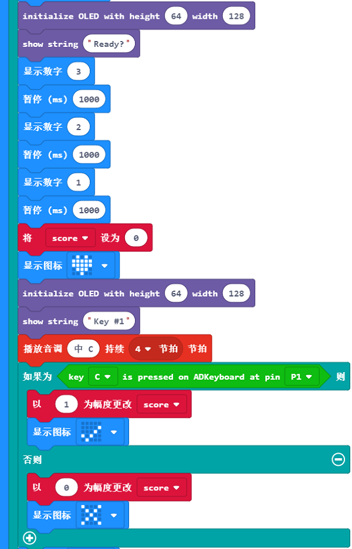
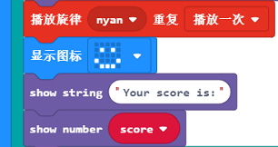

# 课程_17 猜音调游戏

如果你觉得你能够识别出正确的音调，那么就试一试我的这个游戏吧。或者，更厉害一点，创造一个这样的游戏吧！

## 目标
---

- 学习ADKeypad、OLED和蜂鸣器的使用。
- 用ADKeypad、OLED和蜂鸣器来进行创作。
- 了解if-else语句的作用。

## 所需材料
---  

- 1 x BBC micro:bit
- 1 x USB线
- 1 x 蜂鸣器
- 2 x 母对母跳线
- 1 x OLED
- 1 x ADKeypad
- 1 x 扩展板

**温馨提示: 如果你想要以上所有这些元器件，你可以购买我们的[micro:bit小小发明家套件](https://item.taobao.com/item.htm?spm=a230r.7195193.1997079397.9.z3IMPf&id=564707672256&abbucket=5)。**

## 制作过程
---

### 步骤 1:

首先，将你的蜂鸣器连接到扩展板上的引脚P0。确保正极（通常是较长的那一端）连接到扩展板上的黄色信号引脚，负极连接到扩展板上黑色的接地引脚。

将ADKeypad连接到扩展板上的引脚P1。确保线的颜色和扩展板上的颜色一致。然后，将OLED模块插入到扩展板底部左边的插槽。

### 步骤 2:

我们需要在代码编辑器中添加一个代码库来使用我们的套件元件。点击micro:bit文本编辑器中的Advanced，然后你就会看到一个叫做Add Package的选项。

这会弹出一个对话框。在对话框中搜索OLED，点击搜索按钮或者是按下enter键，然后选择oled-ssd1306。

注意：如果你收到一个提示说一些代码库因为不兼容的问题将被删除，你可以根据提示进行操作，或者你也可以在项目文件的菜单中新建一个项目。

### 步骤 3:

首先，你需要初始化OLED屏幕，使它的高度为64，宽度为128.这样你就可以使屏幕以合适的尺寸显示。 

接下来，你需要在游戏开头设置一个变量set score to 0（将得分设置为0）。这意味着游戏开始的时候，你的得分是0。然后，你需要在OLED屏幕上显示文字“Pitch Perfect”。

你需要编写一个简单的操作指导，教玩家如何开始游戏。因此，我们只需要编写一个简单的句子“Press A to start”（按下A键开始游戏）就可以了。

### 步骤 4：

因为在步骤3里面，我们写了“press A to start”（按下A键开始游戏）。我们需要给它写一个条件。条件基本上指的是程序的一个要求，用来要求程序开始加载它的指令。因此，一个按钮A被按下的if-else语句就足够了。此外，它将会嵌套在一个forever的积木块中。

接着，你需要编写关于如何玩游戏的另一套操作指引。我写的是：“You have guess which pitch it is by pressing the correct key”（按下正确的按键来猜测它的音调）。然后，你需要设置一个大约5000ms(50秒）的限制时间，让玩家能够阅读操作指引。 

### 步骤 5:

你将需要引导玩家聆听正在播放的声音的音调。我所做的是播放这个音调（例如：音调C）4拍（4秒），将音调C用LED显示在micro:bit上，并让OLED屏幕显示micro:bit屏幕上所显示的内容。

之后，我将会放入一个暂停，这样玩家就可以将音调用正确的字母和ADKeypad上的按键表示出来。此外，你可以在OLED屏幕中放入某个音调相对应的按键。例如：当播放的是音调C，我就写“Left blue button”（左边蓝色按钮）来进行提示。

如果你想知道：为什么初始化OLED显示和显示字符串的积木块会重复显示？ 这是因为它可能是在网页浏览器中模拟了一次刷新。如果你不初始化显示，文字可能会被带到下方，而不是生成新的文字。

### 步骤 6：

一旦玩家看完了关于音调发音的迷你简介，你就可以让他们开始游戏了。你可以在游戏开始的时候，给他们设置一个倒计时。

现在，你可以制作你的音调测试题了。所以，为了做这一步，你需要播放一个音调，并同时在micro:bit上显示一个定制的图像以及一条“Key #1”的信息。

接下来，如果玩家在ADKeypad上按下了正确的按键，他们就会得一分。如果没有按键，就没分。因此，你可以将变量score设置为用1来改变。如果按下正确的按键，就加1；否则，就减1。所以，我们需要一个关于玩家是否按下正确按键的if-else语句。

为了让玩家知道他们是否做出了正确的回答，你可以显示一个勾来代表正确的回答，一个叉来表示错误的回答。

重复这个步骤，你就可以玩很多测试题哦！

### 步骤 7:

当你对你的测试感到满意的时候，你可以显示最近的得分来结束游戏。你可以在OLED屏幕上显示“Your score is:”（你的得分是：）和变量score 显示的得分。为了让游戏更加有趣，我们可以添加一个笑脸。

现在你的游戏已经做好了哦！尽情地享受这个游戏带来的乐趣吧！

你可以点击下面的链接来查看完整的程序代码：

[https://makecode.microbit.org/_T8rMWcdT3gP8](https://makecode.microbit.org/_T8rMWcdT3gP8)

或者你也可以通过下面这个页面下载：

<iframe style="position:absolute;top:0;left:0;width:100%;height:100%;" src="https://makecode.microbit.org/#pub:_T8rMWcdT3gP8" frameborder="0" sandbox="allow-popups allow-forms allow-scripts allow-same-origin"></iframe>

## 常见问题
---
