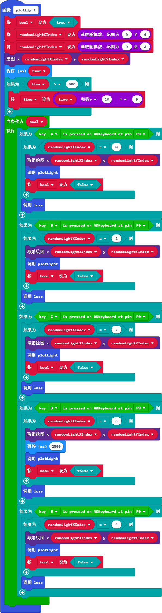
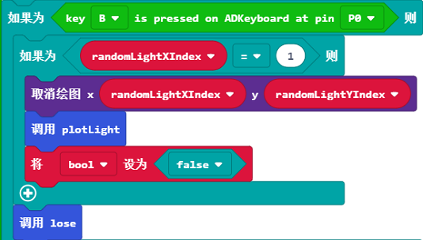
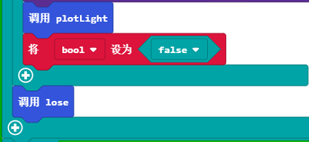
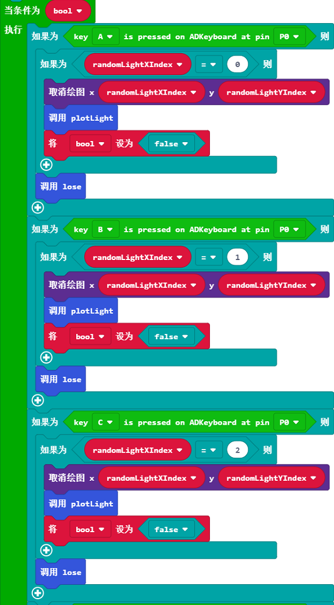
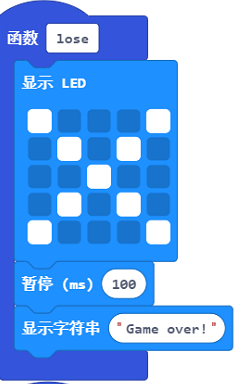
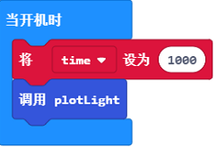

# 课程_18 手指灵敏度游戏

你的反应能力是否和我的一样好呢？

## 制作目标  
---  

在本文中，我们将要制作一个游戏。当micro:bit上的LED灯随机点亮的时候，玩家必须在ADKeypad上按下相应的按键(按键A对应起始列，按键E对应最后一列)。 随着游戏的继续进行，LED灯亮起的速度越来越快，你的按键速度也要越来越快。 你将会学习：

- 如何使用ADKeypad和micro:bit。
- 如何递归地使用函数。
- 如何使用while循环。
- 如何提高你的手指的灵敏度。

## 所需材料和前期准备
---

- 1 x BBC micro:bit
- 1 x USB线
- 1 x 母对母跳线
- 1 x ADKeypad

**温馨提示: 如果你想要以上所有这些元器件，你可以购买我们的[micro:bit小小发明家套件](https://item.taobao.com/item.htm?spm=a230r.7195193.1997079397.9.z3IMPf&id=564707672256&abbucket=5)。**

此外，你也需要一些关于if-else语句，变量等的使用经验。

## 制作过程  
---  

### 步骤 1  

  

将你的ADKeypad插入扩展板上引脚P0，尽量确保正极连接到黄色的信号引脚，负极连接到黑的的接地引脚。  

### 步骤 2  

  

为了增加LED被点亮的随机性，我们将会递归地使用一个函数。一个被递归地使用的函数会自动调用函数自身来实现最终目标。出于这个原因，我创建了函数plotLight。如果你还没有涉及到函数，你可以在本文中学习。  

然后，我将2个变量randomLightXIndex和randomLightY设置为0到4之间的整数。这是用来对应被点亮的那颗LED灯。这么做将保证被点亮的那颗LED灯的随机性（让我们先停止对于真正的随机性生成的源头的讨论），让游戏每次开始都变得不一样，不可预测。  

同时，我把布尔变量设置为true。尽管现在这看起来不太明显，但是随后你就会看到效果了。(现实中，这是在后来才添加的。我本来打算添加在后面的函数末尾。为什么这么做呢？稍后你就明白啦。). 这是一种编程常用的技巧(尤其是在和while循环一起使用的时候)。

为了增加难度，我决定使用一个时间变量。我们在后面使用这个变量来减少2颗LED灯被点亮的间隔。我们为停顿时间设置的下限是每半秒钟停顿一次。这样游戏才不会让游戏进行不下去。 当我们递归地调用这个函数时，if语句会修改停顿时间。因此，每次函数被调用时，停顿时间就会减少。  
在循环内部，我创建了一系列if-else语句。这些语句会周期性地检查是否是键盘上的某个按钮被按下，被按下的按钮是否与被点亮的LED灯的X坐标对应。我们需要这样做是因为按键并不能弹出一个能被micro:bit核心模组响应的事件（比如它是如何做到摇动或者按下按钮）。因此，我们必须创建属于我们自己的事件接收器。这个事件接收器只有在我们之前创建的布尔是true的情况下才会运行。

### 步骤 3  

  

在if-else语句中，我们将查看按键是否被按下以及它是否对应了LED的X坐标的那一列。如果是，则再次调用函数。这就是递归程序运行方式。通过再次调用函数，我们基本上点亮了另外一颗LED。记住，当我们再次调用函数时，我们需要减少时间变量的值，这样停顿的时间就会越短。  

注意：我并没有绘制第一颗LED的点。这是为了确保每个游戏环节不会出现两颗及两颗以上的LED灯被点亮，玩家不会被迷惑。如果你想让游戏变得更难，你可以显示多颗LED灯，并且只有在最近的LED灯被点亮的时候才需要按键。 你可以把这个作为一个扩展游戏哦！
有趣的是，我把布尔值设置为false。为什么呢？

### 步骤 4  

将布尔值设置为false是为了结束以上的while循环。这并不是非常必要的，而且我一开始忽略了这种做法。 但是，终止while循环将大大地提高程序运行的效率，这是非常重要的，而且也是值得我们需要考虑的。

同时，我也创建并命名了一个函数来处理玩家按键错误的情况。这在后面将会提到。  

### 步骤 5  

  

这对于一个函数来说好像有点多哦！不过对于初学编程的人来说还是比较合适的。所以，让我们再次回顾一遍吧！  
我们在这里使用了0到4之间的整数来决定被点亮的LED灯。（记住我们使用了一个从0开始的指数，这就意味着左上角的左边是
(0,0))。  

为了在为了的某个节点引用函数，我们减少了停顿时间，让游戏变得更加难。  

运行已有的事件接收器(正如函数本身的名字一样，它仅仅是等待一个事件发生。当发生之后，按照预设的代码执行）。我们用一个while循环来接收事件。如果在if-else语句的一个循环里面没有发现事件，它就不会被激活。因此。它将转到下一个循环中。当事件发生（在按下按键的情况下), 就会激活沉睡的if-else语句。用这种独特的方式，我们创造了一个事件接收器。（扩展：这和点击鼠标或者敲击键盘，浏览器接收事件信息的原理是一样的)。  

### 步骤 6  

  

在每个if-else语句中，如果按键错误，我们就会终止游戏，并告诉玩家我们对他的评价。  
如果正确的按键被按下，我们就会立刻跑到下一个LED灯，同时结束之前的while循环或者是为了提高程序运行效率的操作。(为了让你更加清楚，代码将会继续运行。但是最好不要养成这个坏习惯）。  

在继续进行到下一颗LED灯的时候，我们使用了一个叫做递归的概念。 为了完全理解递归内部的运转，我们必须熟悉一些概念像执行上下文。这是本教程范围之外知识点。  

### 步骤 7  

  

这工作量真不小呀!!  

但是在最后，我们创建了一个非常棒的函数，可以递归地被调用。这样的游戏可以简化得非常多，所以它的关键在于一个代码块！  

### 步骤 8  

  

现在我们可以把一些松散的字符串串起来。  
当玩家按错按键就调用这个lose函数。这基本上是不言而喻的。如果你能理解之前的部分，你就会明白代码在做什么。  

### 步骤 9  

  

现在开始点亮第一颗LED灯。  
当代码文件下载完成，程序就会调用这个函数。因为函数的递归性，游戏在我们玩家做出的最小的努力之后自行处理。这个效率真不错！  

如果你不想自己动手编程，你可以从下面这个链接下载程序的完整代码。  

[https://makecode.microbit.org/_eeyAFJMcg8z5](https://makecode.microbit.org/_eeyAFJMcg8z5)  

或者，你可以从下面这个页面下载完整代码：  

<iframe style="position: absolute; top: 0; left: 0; width: 100%; height: 100%;" src="https://makecode.microbit.org/#pub:_eeyAFJMcg8z5" width="300" height="150" frameborder="0" sandbox="allow-popups allow-forms allow-scripts allow-same-origin"></iframe>
  

&nbsp;

### 太棒啦!  

  

你已经完成了本教程了哦！如果你想进一步挑战自己，可以继续添加一个计数功能，来统计玩家的得分。提示：你可以创建一个counter的变量，在合适的时候增量。别忘了在micro:bit屏幕上显示得分哦！   
祝你成功!  

本程比较适合高阶一点的编程学习者。如果你刚好学到了这里，千万不要错过这个教程哦！如果你还没有学到这里，你可能需要数周的时间来完全理解像递归这一类的概念。 祝你好运吧！  

## 常见问题
---
