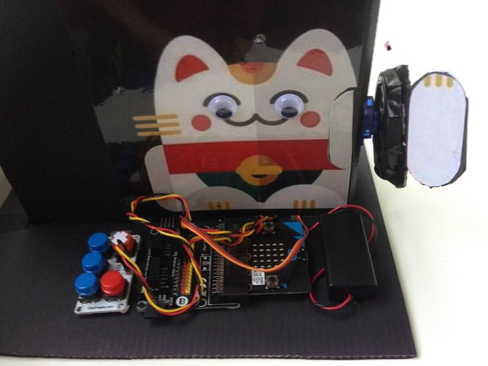

# 课程_27 招财猫
---
- 用micro:bit和迷你舵机做一个属于你的招财猫，按下按钮就能让它的手臂摆动。由新加坡国立大学的Tim设计。

## 目标
---

 1. 做一个纸板猫猫，安装可摇动手臂。
 2. 让猫猫随你所想而动。
 3. 小提示：跟着步棸一起做吧~ 
 
           
    
## 所需材料
---
- 1 x ADKeypad
- 1 x 电池包
- 2 x 黄色LED
- 1 x 扩展板
- 1 x micro:bit
- 1 x 迷你舵机

## 步棸 1 – 选择一只猫
---

- 找一只猫的图片，将纸板按照图片样式裁剪。
- 选你自己喜欢的猫猫~

## 步棸 2 – 连接电子件
---

连接以下零件至扩展板

1. ADKeypad连接至金手指‘0’
2. 迷你舵机连接至金手指 ‘1’
3. 2盏LED灯分别连接至金手指‘2’ 和‘8’

*是否按规定颜色线连接跳线与并不会影响电子件的使用。但毫无疑问，按照颜色连接能帮你更好的分辨电子连接口。*

## 步棸 3 – 将电子件与你的猫猫连接
---

1. 将迷你舵机安装在纸板猫猫的右边。
2. 在纸板上留两个圆孔，透出LED的闪光。

## 步棸 4 – micro:bit编程
---

1. 如上图在MakeCode页面中编写micro:bit代码。
2. 按下按钮‘A’(2盏LED灯发出光芒，舵机带动猫猫手臂摆动）

## 超酷哦!
---

现在你的招财猫会摇臂啦~想想还可以让它怎样活动把~ 

