# 课程_32 micro:bit防盗门
---
- 使用micro:bit，伺服电机和4x4键盘保护您的房屋或贵重物品！由新家坡国立大学的Mohd Shafiq编写。

## 目标
---
- 1.连接接线，使键盘与micro:bit接口连接
- 2.为门锁设置您自己的唯一密码
- 3.如果入侵者试图猜出您的密码，请添加一个锁定计数器

## 物料
- 1 x micro:bit
- 1 x 分线板
- 1 X 舵机
- 1 X 面包板
- 4 X 4薄膜键盘
- 3 X 5千欧姆电阻器
- 3 X 1千欧姆电阻器
- 1 X 10千欧姆电阻器
- 1 X OLED
- 18.5厘米 X 28厘米亚克力
- 1 X 小金属铰链
- 跳线

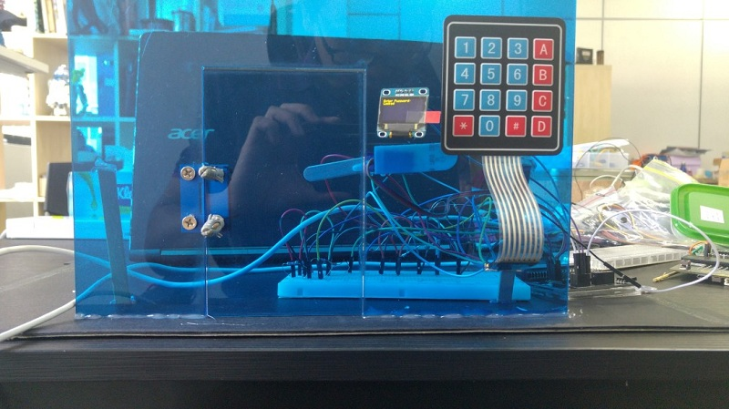

### 第一步-连接键盘

- 薄膜键盘有16个不同的开关，有16个不同的字符
- 开关按行和列组合在一起，例如（R1，C1）对应于1，依此类推。当控制器在引脚1和引脚5检测到1时，表示按键1被按下。这称为数字输出
- 因此，我们可以使用Micro:bit的数字引脚与它们的键盘连接。但是如果我们这样做，它将非常混乱。
- 让我们为4x4键盘创建驱动电路！
- 按照图示如下：

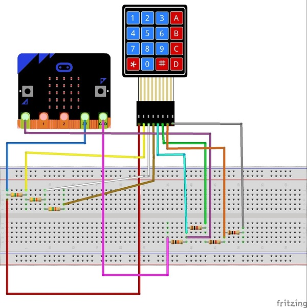

### 第2步 - 连线
- 将伺服电机的3个引脚连接到分线板的P2
- 将Micro:bit的接地（黑色引脚）连接到10kOh电阻
- 将3V（红色引脚）连接到5k欧姆电阻上
- 将A0（黄色引脚）连接到10k欧姆电阻和1k欧姆电阻之间的点
- 将分线板的GND，VCC，SC1和SDA 分别连接到OLED的GND，VCC，SC1和SDA 。

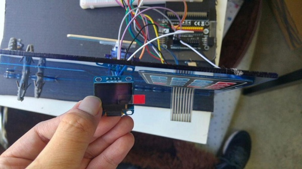

- 初始化：

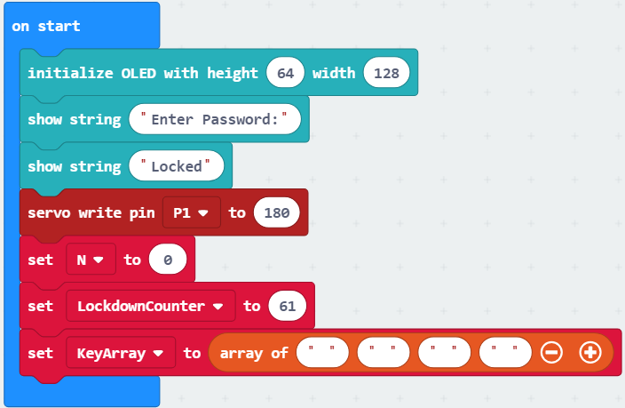

### 步骤3 - 编写Micro：bit
一开始我们必须：

- 将伺服初始化到位置180（锁定位置）
- 初始化OLED显示屏
- 初始化一个4x1阵列
- 初始化锁定计数器

- 按钮A用作输入字符按钮
- 每次按下4x4键盘上的某个键，您必须按下按钮A才能键入4位数字

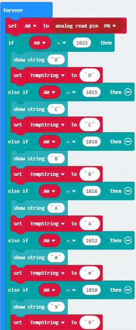

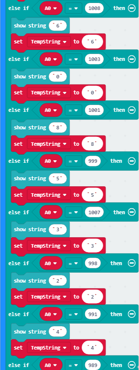

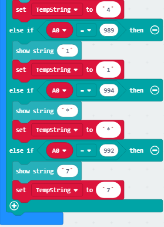

现在我们需要设置micro:bit来检测按键！

- 通过使用驱动电路，每次按键对应于0到1024的唯一模拟值
- 可以使用模拟读取功能读取模拟值
- 字符中的值存储在“TempString”变量中
- 代码块很长，因此下面提供了下载链接。

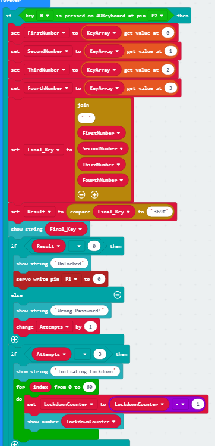

- 按钮D作为最后的“输入”按钮
- 按下按钮D使程序使用比较块检查输入的字符串是否等于“369＃”
- 如果答案为0则意味着字符串相等。如果它是1，则字符串不相等
- 每次入侵者输入错误的密码时，错误的尝试次数将增加1
- 一旦检测到3次错误尝试，程序将进入循环60秒

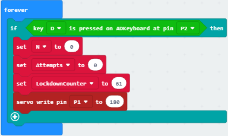

- 要重置尝试次数和输入的字符，请按下按钮D.
- 复位按钮也将伺服复位到“锁定位置”
## 程序快捷下载链接：

[下载链接](https://makecode.microbit.org/_1sWcTig6phRD)

## 第4步 - 搭建它！
- 使用激光切割机切出18.5厘米×28厘米的3毫米丙烯酸树脂
- 如果你没有丙烯酸，你可以用纸板代替
- 切出OLED的插槽以及键盘线
- 在门铰链上钻孔/戳孔，并用螺丝固定门
- 将一个冰淇淋棒连接到伺服器上。这将作为锁
- 在门的另一侧用冰淇淋棒粘贴舵机

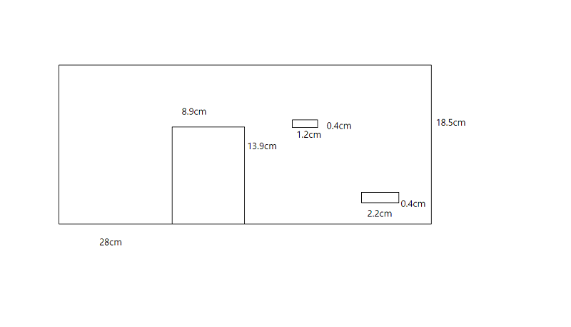
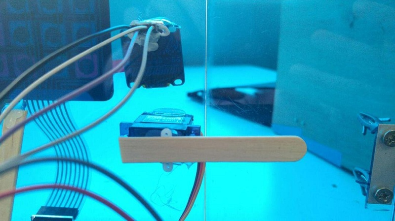

## 第5步 - 演示时间！

- 每按一次键，相应的字符将出现在OLED上
- 要在3中按下门钥匙，按钮A，6，按钮A，9，按钮A，＃
- 然后按下按钮B.
- 要重置按D键.
- 如果您尝试输入错误密码三次，OLED将显示锁定计时器。您只能在60秒后输入密码。
- 恭喜！你已经制作了自己的micro:bit 防盗门。
- 完成！

