# 课程_33 AngBao收藏家
---
- 使用micro:bit，Neopixel和Buzzer收集你的Ang Baos

## 目标
---
- 1.建立一个Ang Bao收藏家，计算你拥有的Ang Baos的数量！
- 2.当Ang Bao被投入时，LED灯条应该点亮，并显示Ang Baos的数量。
- 3.一个Ang Bao被放进去时播放“恭喜恭喜”。

## 物料
- 1 x micro:bit
- 4 x Neopixel LED灯条
- 1个HC-SR04超声波传感器
- 1个电池座
- 1 x 小刀
- 1 X 蜂鸣器
- 1 X 鞋盒
- 2 X AAA电池
- 很多红皮书
- 很多双面胶带

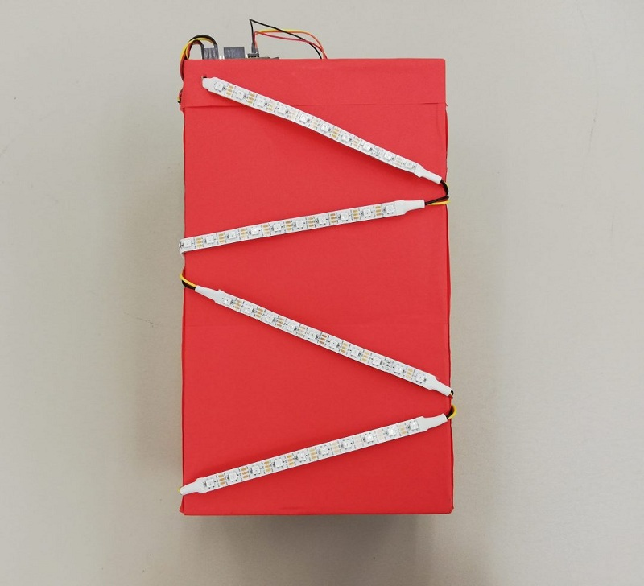

### 第1步 - 切割盒子！
- 在盒子的顶部切出一个矩形孔，用于插入Ang Baos
- 在盒子后面切出另一个孔，以便放置HC-SR04超声波传感器

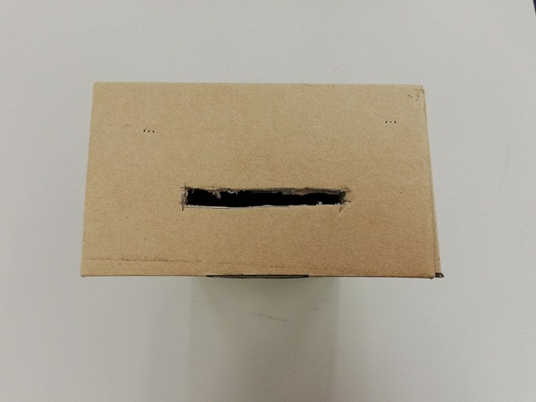

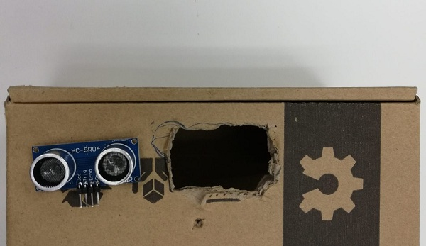

### 第2步 - 包裹起来！
- 用红纸包裹盒子。
- 如果它们被纸张覆盖，则重新切割孔。

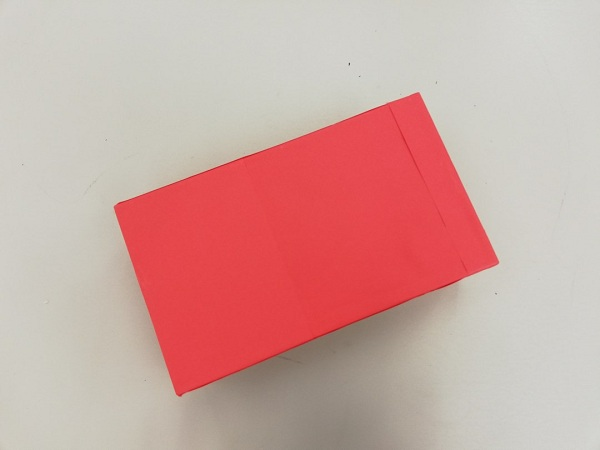

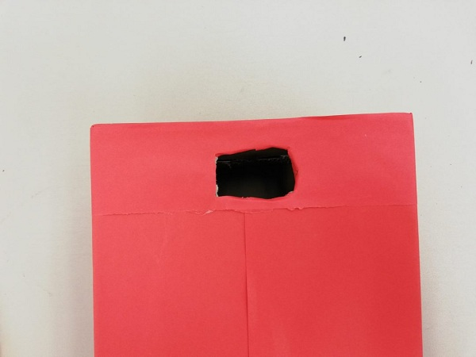

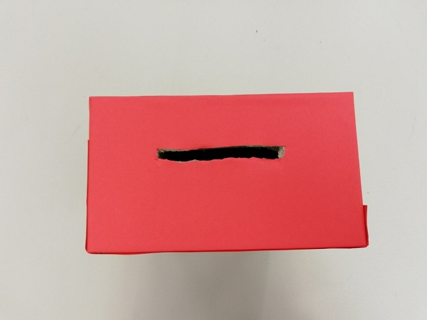

### 第3步 - 设置LED灯条
- 将4个LED条连接在一起（确保在连接电线时Din与Dout匹配）
- 在侧面戳孔以隐藏冗长的电线，将它们塞入孔中。
- 将LED灯条连接到P4

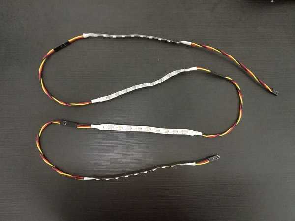

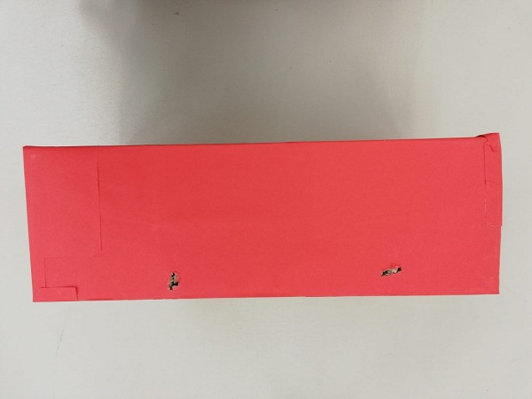

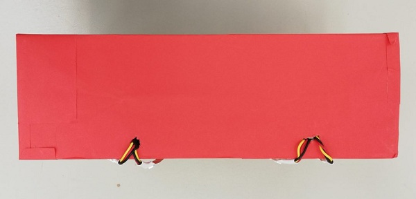

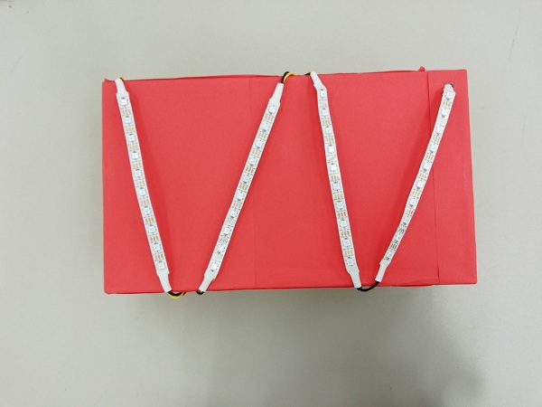

##第4步 - 设置其他组件
- 将HC-SR04粘贴到包装盒的背面
- 将触发引脚连接到P15，将Echo引脚连接到P16。
- 并将蜂鸣器连接到P0。

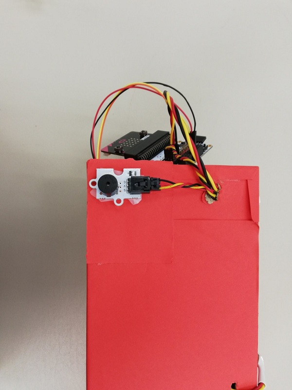

##步骤5 - 设置Micro:bit
- 将Micro:bit置于顶部。
- 图片显示了Micro：bit应该如何查看所有连接。

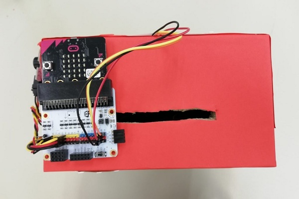

##第6步 - 添加Neopixel扩展
- 要添加Neopixel扩展程序：点击“高级”标签>“扩展程序”，然后搜索“Neopixel”

##第7步 - 对Micro:bit进行编程

- 在开始时，我们初始化我们将要使用的变量以及Neopixel LED条带。

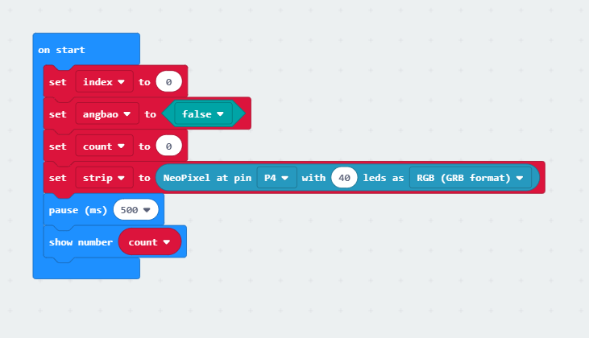

- 创建“音乐”功能，播放“恭喜恭喜”
 
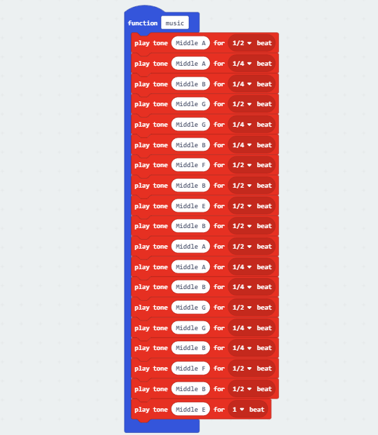

- 如果HC-SR04传感器检测到物体，它将打开灯并同时在后台播放“恭喜恭喜” 
- 该程序还保留了收到的Ang Baos数量，并显示Micro：bit LED和Neopixel LED Strip上的数量。

##代码便捷下载链接
[下载链接](https://makecode.microbit.org/_Av4KM3ErEe2A)

##演示时间！
- 插入Ang Bao后，LED灯条会亮起，蜂鸣器会播放音乐。
- 保持点亮的LED数量将表明收集的Ang Baos数量！

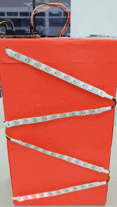
