# 课程_34 MicroPython:LED
---
- Micro:bit Tinker Kit 组件

## 入门
---
### 编译前准备
- 掌握Micro：bit Tinker Kit
- 下载Mu编辑器
[https://codewith.mu/](https://codewith.mu/)
- 在每个项目之前，写上“from microbit import *”

## LED
让LED连接到引脚0

### 示例：闪烁
引脚布局

- LED：Pin0

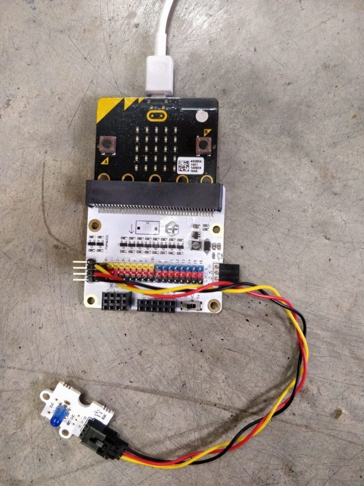

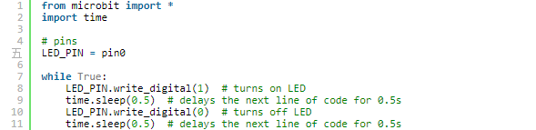

有关数字信号的更多信息，请单击[此](https://microbit-micropython.readthedocs.io/en/latest/pin.html)
## 舵机
附加库：[servo.py](https://tinkercademy.com/wp-content/uploads/2019/01/servo.zip)
（改编自https://github.com/microbit-playground/microbit-servo-class）

使用其他库：

- 选项1：
    将代码复制并粘贴到代码顶部的上述文件中

- 选项2（改编自https://github.com/microbit-playground/microbit-servo-class）：

1.从上面的链接下载文件并将其保存到主目录根目录下的/ mu_code /目录中

2.将使用舵机的代码刷到mu

3.屏幕上会显示一条错误消息，指出舵机模块不足。

4.完成后，单击mu中的'files'图标并将servo.py文件上传到您的microbit。

5.按下microbit上的重置。当程序再次运行时，它将加载模块。

要启动舵机，请写入：“servo_name =舵机（pin0）＃将舵机连接到pin0”

### 示例：扫描
引脚布局

- 舵机：Pin0

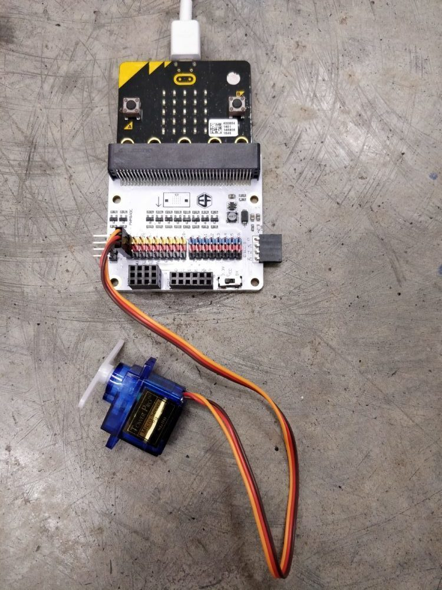

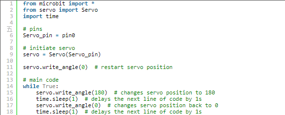

## OLED
附加库：[oled.py](https://gist.github.com/yuliantoeric/2eff0ed8fd2457f7862a8ea9979073ca)
使用其他库：将代码复制并粘贴到代码顶部的上述文件中
启动OLED：来自oled import *

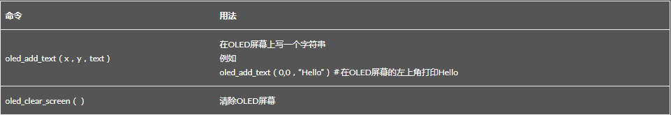

### 示例：Hello World！
引脚布局

- OLED：i2c

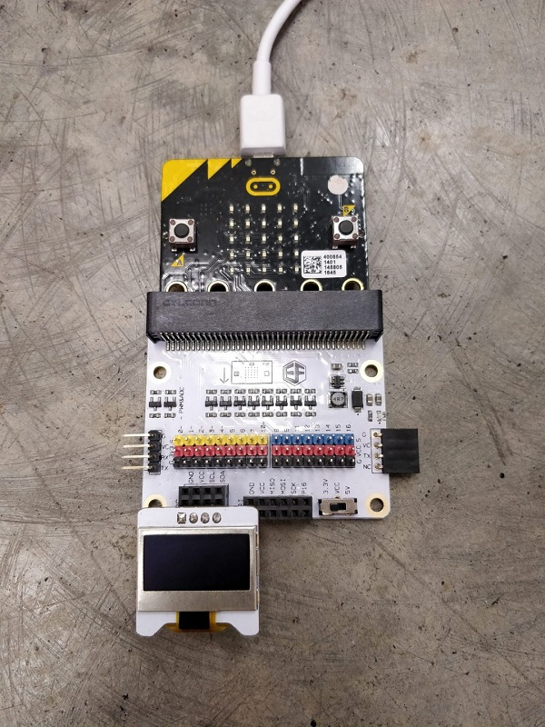

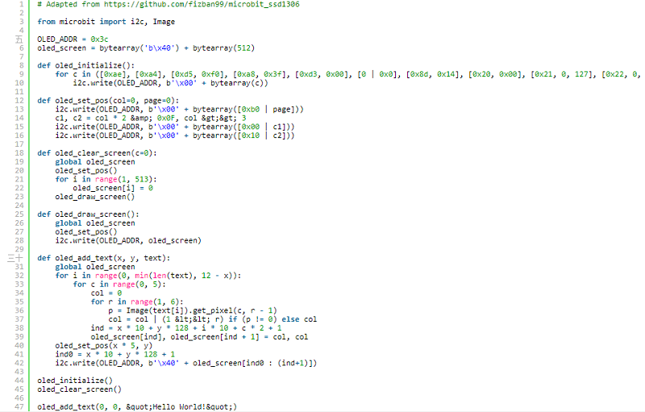

## 蜂鸣器
添加库：键入：代码顶部的“导入音乐”

音乐符号：
改编自https://microbit-micropython.readthedocs.io/en/latest/music.html

结构（不区分大小写）：注意[octave] [：duration]

例如

a4：1＃音符A在八度音阶4中持续1个音阶（由速度设定功能设定的任意持续时间）

R：2＃R表示休息（即静音），在这种情况下持续2个刻度

意外事件（锐器和平底鞋）：

夏普 - ＃

扁平 - b（小写）

例如
a＃4：1＃音符一个八度音阶的尖锐音，持续1个音符

注意：

- 八度和持续时间参数会转移到下一个音符，直到重新指定。
- 默认八度音程= 4，默认持续时间= 4

八度音程定义遵循以下[链接](https://en.wikipedia.org/wiki/Scientific_pitch_notation#Table_of_note_frequencies.)中的音符频率表

让蜂鸣器连接到pin0

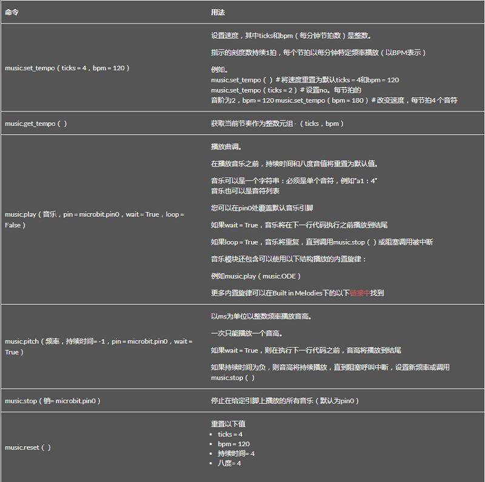

### 示例：门铃
引脚布局

- 被动蜂鸣器：pin0
- 碰撞传感器：pin1

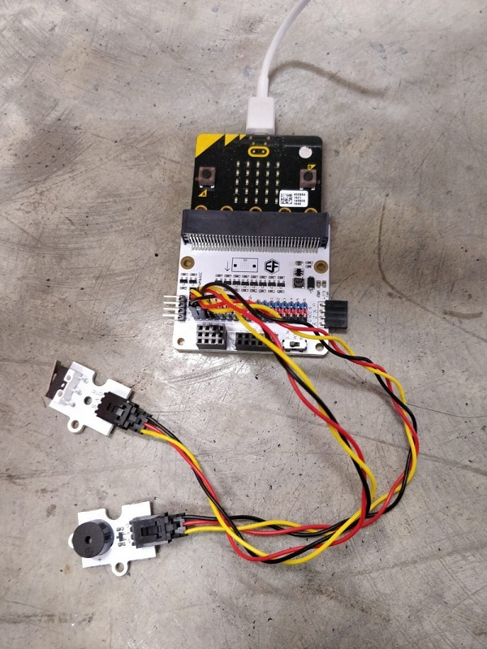

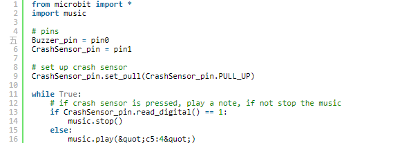

## PIR传感器
基本上是一个运动检测器

让PIR传感器连接到pin0

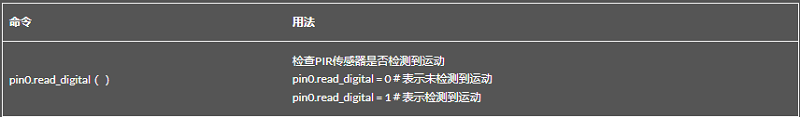

### 示例：运动警报
引脚布局
- 无源蜂鸣器：Pin0
- PIR传感器：pin1

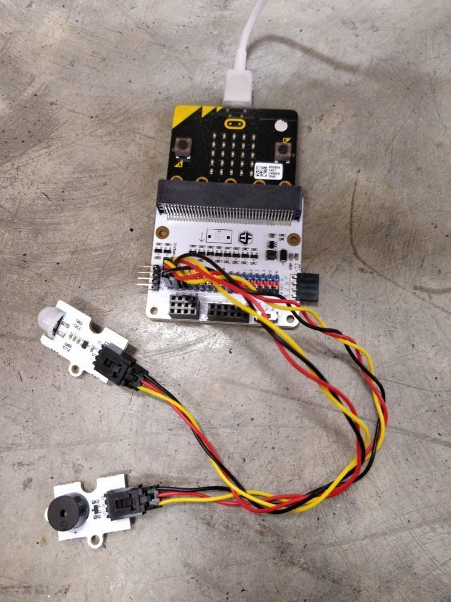

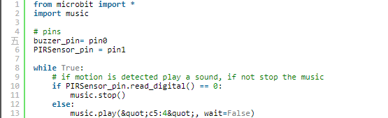

有关数字信号的更多信息，请单击[此](https://microbit-micropython.readthedocs.io/en/latest/pin.html)

## 碰撞传感器
注意：始终通过写入将连接到碰撞传感器的引脚拉力设置为PULL_UP：

“pin0.set_pull（pin0.PULL_UP）＃将碰撞传感器连接到pin0”

要了解有关上拉电阻的更多信息，请单击此[处](https://learn.sparkfun.com/tutorials/pull-up-resistors/all)

让碰撞传感器连接到pin0

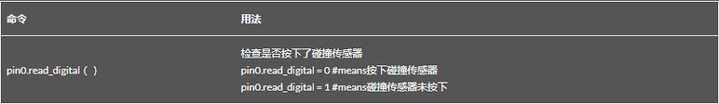

### 示例：LED开关
引脚布局

- 碰撞传感器：Pin0

- LED：pin1

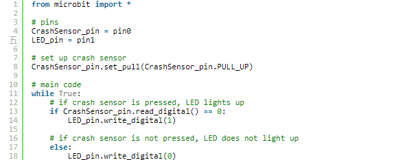

有关数字信号的更多信息，请单击[此](https://microbit-micropython.readthedocs.io/en/latest/pin.html)

## 土壤湿度传感器
让土壤湿度传感器连接到pin0

### 示例：显示土壤湿度
引脚布局

- 土壤湿度传感器：pin0

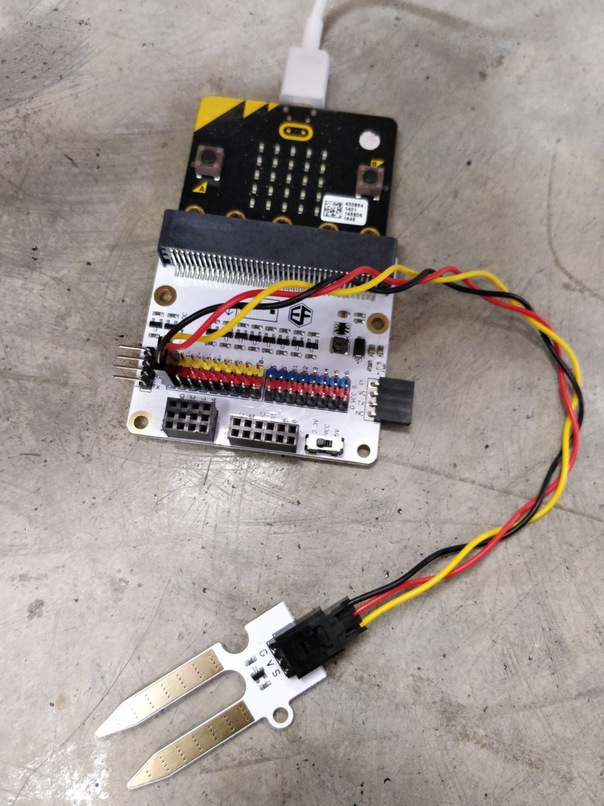

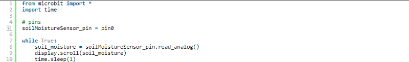

有关模拟信号的更多信息，请单击[此](https://microbit-micropython.readthedocs.io/en/latest/pin.html)

## ADKeypad

关于ADKeypad：
ADKeypad有5个标记从A到E的按钮。按下每个按钮时，它们会提供独特的模拟信号。

通过我们的实验，按钮提供以下信号范围。

- A - 0到10
- B - 45至55
- C - 90到100
- D - 135至140
- E - 535至545

*免责声明：您的ADKeyboard可能会产生不同的结果，请尝试找出您的值

让ADKeypad连接到pin0

### 示例：图像弹出窗口
引脚布局

- ADKeypad：pin0

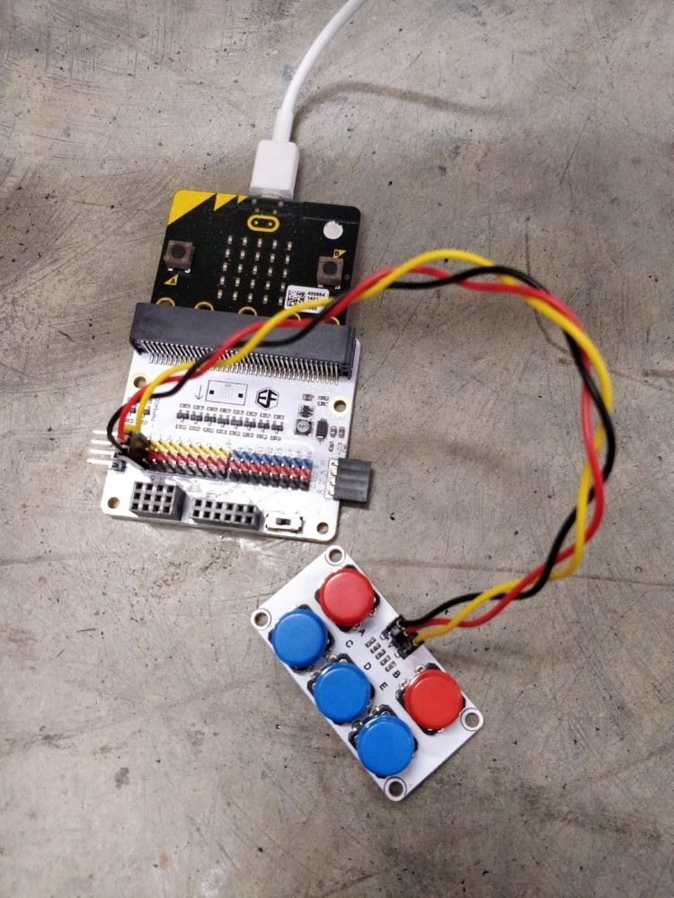

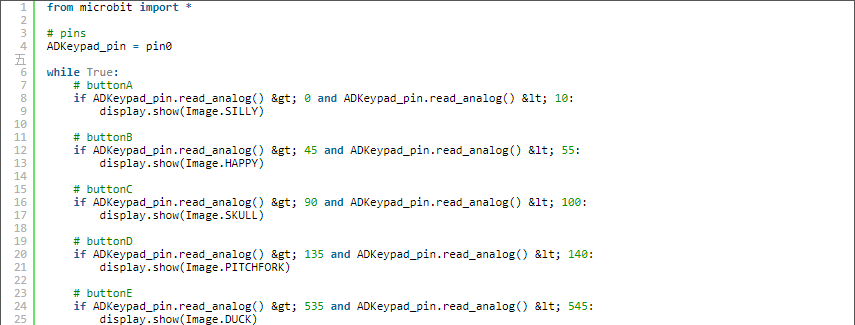

有关模拟信号的更多信息，请单击[此](https://microbit-micropython.readthedocs.io/en/latest/pin.html)

## 电位器

让电位器连接到pin0

### 示例：灯开关
引脚布局

- 电位器：pin0

- 红色LED：pin1

- 绿色LED：pin2

- 蓝色LED：pin8

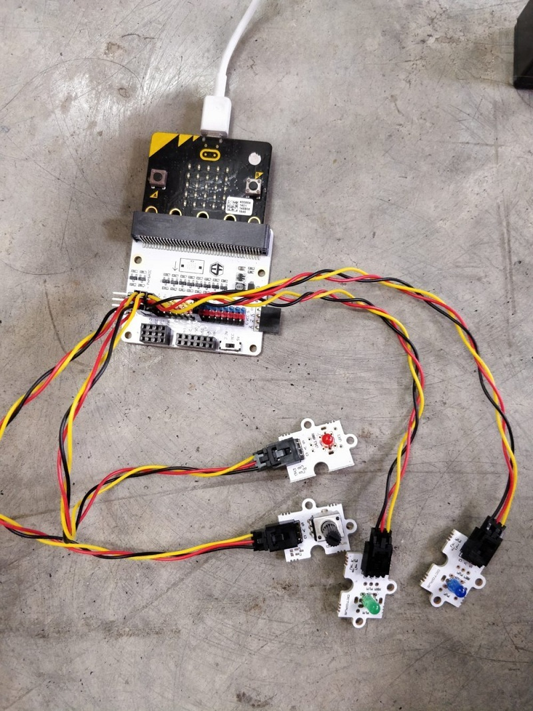

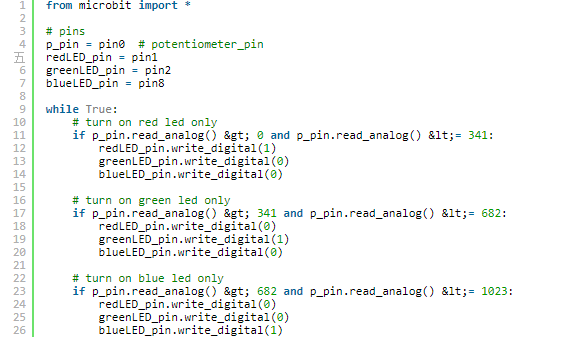

有关模拟信号的更多信息，请单击[此](https://microbit-micropython.readthedocs.io/en/latest/pin.html)
