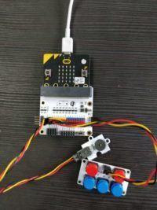
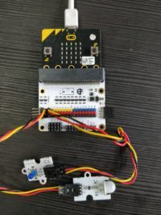
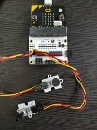

# 课程_35 MicroPython:音乐机器
---
- Micro:bit Tinker Kit 组件

## 入门
---
### 编译前准备
- 掌握Micro：bit Tinker Kit
- 下载Mu编辑器
[https://codewith.mu/](https://codewith.mu/)

## 项目01：音乐机器
引脚布局
- 蜂鸣器：Pin0
- ADKeypad：Pin2

关于ADKeypad的小注释
按下按钮时，ADKeypad返回模拟信号。按下的每个按钮将返回一个唯一的整数值，范围从0（表示0V）到1023（表示3V）。 

但是，在不同的时间按下每个按钮会给出一小部分值并且不同的ADKeypads可能会再次给出不同的信号，这种情况并不少见。因此，在此示例代码中，我们提供了一系列可能的值，按下时ADKeypad的按钮可能会返回。 

您可以随意测试ADKeypad在按下时可能返回的值，并更改示例代码中的值 .

    from microbit import *
		import music   
 		#pins
		ADKeypad_pin = pin2
		Buzzer_pin = pin0
		while True:
   			 // buttonA 
   			 if ADKeypad_pin.read_analog() > 0 and ADKeypad_pin.read_analog() < 10:
   			     music.play('f3:4', pin=Buzzer_pin)
   			  
   			 //buttonB 
   			 if ADKeypad_pin.read_analog() > 45 and ADKeypad_pin.read_analog() < 55:
   			     music.play('g3:4', pin=Buzzer_pin)
			 
   			 // buttonC 
   			 if ADKeypad_pin.read_analog() > 90 and ADKeypad_pin.read_analog() < 100:
   			     music.play('a3:4', pin=Buzzer_pin)
   			  
   			 // buttonD 
   			 if ADKeypad_pin.read_analog() > 136 and ADKeypad_pin.read_analog() < 139:
   			     music.play('b3:4', pin=Buzzer_pin)
   			  
   			 // buttonE 
   			 if ADKeypad_pin.read_analog() > 535 and ADKeypad_pin.read_analog() < 545:
   			     music.play('c2:4', pin=Buzzer_pin)

## 项目02：智能灯
引脚布局
- PIR传感器：Pin0
- LED：Pin1

  			from microbit import *
 
					#pins
				PIR_pin = pin0
				LED_pin = pin1
 
				while True:
    			# if PIR Sensor detects motion, turn on LED
    			if PIR_pin.read_digital(): 
       			 	LED_pin.write_digital(1)
   				 else:
       			 	LED_pin.write_digital(0)

## 项目03：Electro-Theremin
引脚布局

- 蜂鸣器：Pin0
- 电位器：Pin1

	from microbit import *
		import music
 
		#pins
		Potentiometer_pin = pin1
		Buzzer_pin = pin2
 
		# values for mapping 
		highest_p_note = 1023
		lowest_p_note = 1
		highest_note  = 988
		lowest_note = 131
 
		potentiometer_note = 0
		modified_note = lowest_note
 
		#modify the note 
		def modify_note(p_value): # p is potentiometer
    	new_note = (p_value-lowest_p_note)/(highest_p_note-lowest_p_note)*(highest_note-lowest_note)+ lowest_note
    	return int(new_note)
     
		while True:
    	potentiometer_note = Potentiometer_pin.read_analog()
    	display.show(potentiometer_note) 
    	modified_note = modify_note(potentiometer_note)
    	music.pitch(modified_note, pin = Buzzer_pin)

## 项目04：简单报警箱
引脚布局

- 碰撞传感器：Pin0
- LED：Pin8
- OLED：I2C行（位于BoB的底部）

        from microbit import *
			import time
			import math
 
			# Adapted from https://github.com/fizban99/microbit_ssd1306
			OLED_ADDR = 0x3c
			oled_screen = bytearray('b\x40') + bytearray(512)
 
			def oled_initialize():
   			 for c in ([0xae], [0xa4], [0xd5, 0xf0], [0xa8, 0x3f], [0xd3, 0x00], [0 | 0x0], [0x8d, 0x14], [0x20, 0x00], [0x21, 0, 127], [0x22, 0, 63], [0xa0 | 0x1], [0xc8], [0xda, 0x12], [0x81, 0xcf], [0xd9, 0xf1], [0xdb, 0x40], [0xa6], [0xd6, 1], [0xaf]):
        	i2c.write(OLED_ADDR, b'\x00' + bytearray(c))
			def oled_set_pos(col=0, page=0):
    		i2c.write(OLED_ADDR, b'\x00' + bytearray([0xb0 | page]))
    		c1, c2 = col * 2 & 0x0F, col >> 3
    		i2c.write(OLED_ADDR, b'\x00' + bytearray([0x00 | c1]))
   			 i2c.write(OLED_ADDR, b'\x00' + bytearray([0x10 | c2]))
			def oled_clear_screen(c=0):
    		global oled_screen
    		oled_set_pos()
  			  for i in range(1, 513):
     		   oled_screen[i] = 0
   			 oled_draw_screen()
 
			def oled_draw_screen():
    		global oled_screen
   			 oled_set_pos()
    		i2c.write(OLED_ADDR, oled_screen)
			def oled_add_text(x, y, text):
   			 global oled_screen
   			 for i in range(0, min(len(text), 12 - x)):
        	for c in range(0, 5):
            col = 0
            for r in range(1, 6):
                p = Image(text[i]).get_pixel(c, r - 1)
                col = col | (1 << r) if (p != 0) else col
            ind = x * 10 + y * 128 + i * 10 + c * 2 + 1
            oled_screen[ind], oled_screen[ind + 1] = col, col
    		oled_set_pos(x * 5, y)
    		ind0 = x * 10 + y * 128 + 1
    		i2c.write(OLED_ADDR, b'\x40' + oled_screen[ind0 : (ind+1)])
 
			#allow overflow to go onto the next line
				def oled_add_text_new_line(x, y, text):
    		length_text = len(text)
    		separated_text = []
    		counter = 0
    		num_of_lines = math.ceil(length_text/12)
    		letters_in_line = 12
     
    		for line in range(0,num_of_lines):
       		 separated_text.append([])
        	#separated_text[line].append(y*(line+1))
        	for l in range(0,letters_in_line):
           	 separated_text[line].append(text[letters_in_line*line+l])
            counter +=1
            if counter == length_text:
                break
     
   			 #draw letters
    		for i in range(0,len(separated_text)):
       		 oled_add_text(x,y+i,separated_text[i])
         
 
			# Screen divided into 12 columns and 4 rows
 
			oled_initialize()
			oled_clear_screen()
 
			# Start Simple Alarm Box Code here 
 
			#pins
			CrashSensor_pin = pin0
			LED_pin = pin8
 
			#set up crash sensor
			CrashSensor_pin.set_pull(CrashSensor_pin.PULL_UP)
 
			#other variables
			has_text = False
 
			while True:
    		if CrashSensor_pin.read_digital() == 1:
       		 if has_text == False : #checks if oled screen has the message already, if not add it
            oled_add_text_new_line(0, 0, "Your treasure is safe")
            has_text = True
        	LED_pin.write_digital(1)
         
    		else:
       			 #clear oled screen 
        		  oled_clear_screen()
      			  has_text = False
         
        		#make LED blink
       				 LED_pin.write_digital(0)
       				 time.sleep(0.1)
       				 LED_pin.write_digital(1)
        			time.sleep(0.1)

## 项目05：工厂监测设备
引脚布局

- 蜂鸣器：Pin0
- 土壤湿度传感器：Pin1
- OLED：I2C行（位于BoB的底部）

	from microbit import *
		import time
		import math
		import music
 
		# Adapted from https://github.com/fizban99/microbit_ssd1306
		OLED_ADDR = 0x3c
		oled_screen = bytearray('b\x40') + bytearray(512)
 
		def oled_initialize():
    	for c in ([0xae], [0xa4], [0xd5, 0xf0], [0xa8, 0x3f], [0xd3, 0x00], [0 | 0x0], [0x8d, 0x14], [0x20, 0x00], [0x21, 0, 127], [0x22, 0, 63], [0xa0 | 0x1], [0xc8], [0xda, 0x12], [0x81, 0xcf], [0xd9, 0xf1], [0xdb, 0x40], [0xa6], [0xd6, 1], [0xaf]):
        i2c.write(OLED_ADDR, b'\x00' + bytearray(c))
 
		def oled_set_pos(col=0, page=0):
    	i2c.write(OLED_ADDR, b'\x00' + bytearray([0xb0 | page]))
   	 	c1, c2 = col * 2 & 0x0F, col >> 3
   	 	i2c.write(OLED_ADDR, b'\x00' + bytearray([0x00 | c1]))
    	i2c.write(OLED_ADDR, b'\x00' + bytearray([0x10 | c2]))
 
		def oled_clear_screen(c=0):
   		 global oled_screen
   		 oled_set_pos()
   		 for i in range(1, 513):
        oled_screen[i] = 0
    	oled_draw_screen()
 
		def oled_draw_screen():
    	global oled_screen
    	oled_set_pos()
    	i2c.write(OLED_ADDR, oled_screen)
 
		def oled_add_text(x, y, text):
    	global oled_screen
   		 for i in range(0, min(len(text), 12 - x)):
       	 for c in range(0, 5):
            col = 0
            for r in range(1, 6):
                p = Image(text[i]).get_pixel(c, r - 1)
                col = col | (1 << r) if (p != 0) else col
            ind = x * 10 + y * 128 + i * 10 + c * 2 + 1
            oled_screen[ind], oled_screen[ind + 1] = col, col
    	oled_set_pos(x * 5, y)
    	ind0 = x * 10 + y * 128 + 1
    	i2c.write(OLED_ADDR, b'\x40' + oled_screen[ind0 : (ind+1)])
 
		#allow overflow to go onto the next line
		def oled_add_text_new_line(x, y, text):
    	length_text = len(text)
    	separated_text = []
    	counter = 0
    	num_of_lines = math.ceil(length_text/12)
    	letters_in_line = 12
     
    	for line in range(0,num_of_lines):
        separated_text.append([])
        #separated_text[line].append(y*(line+1))
        for l in range(0,letters_in_line):
            separated_text[line].append(text[letters_in_line*line+l])
            counter +=1
            if counter == length_text:
                break
     
    	#draw letters
   		 	for i in range(0,len(separated_text)):
        	oled_add_text(x,y+i,separated_text[i])
         
 
		# Screen divided into 12 columns and 4 rows
 
		oled_initialize()
		oled_clear_screen()
 
		# Start Plant Monitoring Device Code here 
 
		#pins
		Buzzer_pin = pin0
		MoistureSensor_pin = pin1
		Servo_pin = pin8
 
		#other variables
		healthWarning = False
		oled_add_text_new_line(0, 0, "Your plant is in good condition")
 
		while True:
    	if MoistureSensor_pin.read_analog() <50:
        if healthWarning == False : #checks if oled screen has the message already, if not add it
            oled_clear_screen()
            oled_add_text_new_line(0, 0, "Moisture level is: %d" % MoistureSensor_pin.read_analog())
            oled_add_text_new_line(0, 2, "Water your plant!")
            healthWarning = True
        	music.play('b3:1', pin = Buzzer_pin)
         
    	else:
        #clear oled screen
      	 if healthWarning == True:
            oled_clear_screen()
            healthWarning = False
            oled_add_text_new_line(0, 0, "Your plant is in good condition")
