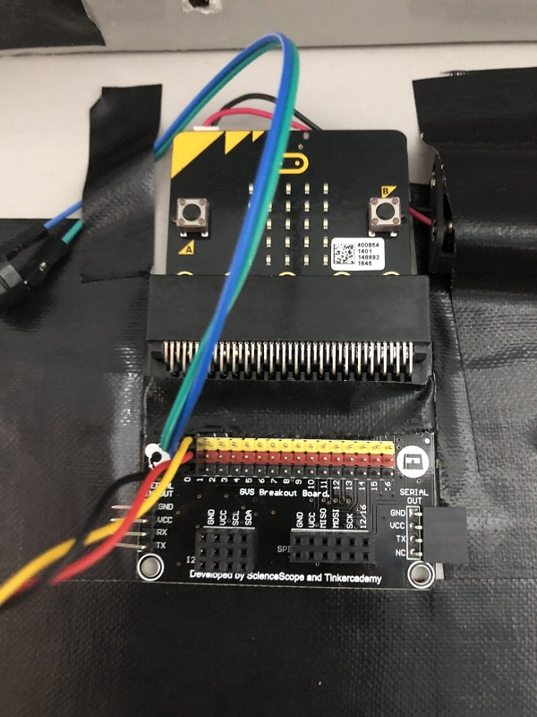
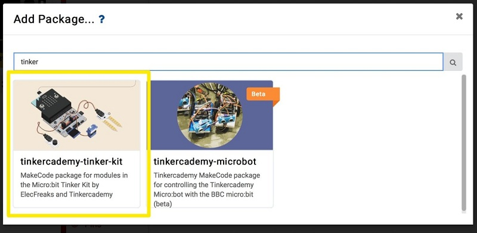

# 课程_36 无线控制警报门
---
- 用micro:bit增强门的安全性，本教程由新加坡科技与设计大学的Sean Lew在2018年暑期实习期间撰写。

## 目标
---
- 1.建立自己的无线警报门！
- 2.为任何入侵者或未锁定的门设置警报！

## 物料
- 2 x Microbit
- 1 x 分组板
- 1 x 碰撞传感器
- 1 x 蜂鸣器

### 第一步-设置！

- 将一个微型插槽插入分线板。
- 将蜂鸣器连接到分线板的引脚0，将碰撞传感器连接到引脚1。
- 在继续执行第2步之前，请确保下载“tinkercademy-tinker-kit”软件包。

### 第2步 - 信号发送端
- 将这些代码集拖到makecode平台中，然后将其下载到连接到分线板的micro：bit中。
- 按下碰撞传感器几下，看看你的代码是否正常工作！

### 步骤3 - 信号接收端
- 下载第二个micro：bit（接收器）的这组代码。
- 现在测试一下碰撞传感器，看看接收micro:bit是否正常工作！
- 现在您已经设置了第一个无线门安全装置，您可以使用超过1个门进行尝试！
- 随意添加其他形式的警报接收micro：bit以增强您自己的安全性。

- 完成！

