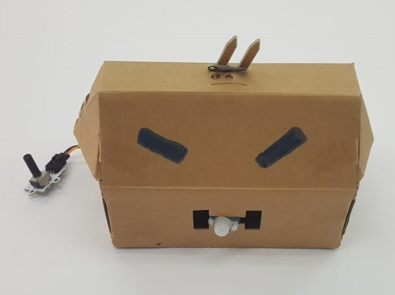
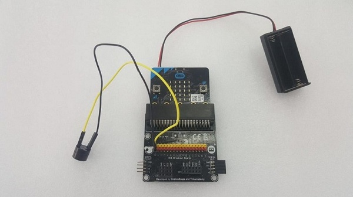
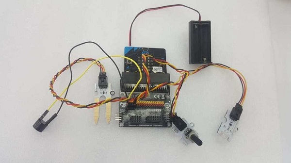
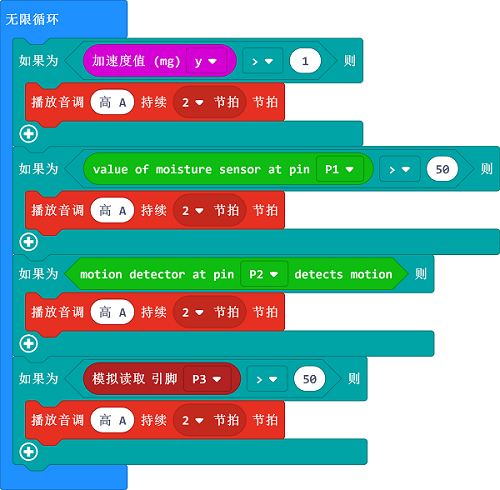

# 课程_37 隐形机器人
---
- 做一个隐形机器人在切换，触摸或监测到运动，抬起或被碰触时发出尖叫声，本教程由新加坡科技与设计大学的Shaun Toh在2018年暑期实习期间撰写。

## 目标
---
- 1.组装一个害羞的隐形机器人
- 2.输入代码来制作一个害羞的机器人

## 物料
- 1 x Micro:bit
- 电池
- 任何盒子（大到足以适合Micro：bit）
- PIR传感器
- 电位器
- 被动蜂鸣器
- 2 x 跳线

### 第一步-连接Micro：bit

- 如图所示，将蜂鸣器连接到引脚0。蜂鸣器上的+号与断路器板上的黄色端口相连。
- 将土壤湿度传感器连接到针脚1。
- 将PIR传感器连接到引脚2。
- 将电位计连接到引脚3。

### 第2步 - 添加Tinker Kit包
我们需要在代码编辑器中添加扩展库，以便能够使用套件组件。单击micro:bit文本编辑器中的高级，然后点击扩展。

这将打开一个对话框。搜索Tinker kit套件。单击搜索图标或按Enter键，然后选择tinkercademy-tinker-kit。

这将增加两个库：  Tinkercademy，用于我们套件中的通用传感器，  OLED用于OLED模块（我们的高度为64，宽度为128）。
我们在本教程中没有使用OLED模块，但您可以！

### 步骤3 - 开始编码！
写入Micro：bit代码 - 编码隐形的机器人
您的程序包含一些“if”语句。我们希望机器人只对四种情况做出反应。

- 第一个条件是机器人被拾起。
- 第二个条件是有人触摸土壤湿度传感器
- 第三个条件是机器人检测到它前面的运动，并且
- 最后一个条件是有人切换电位器。

## 你完成了！
你已经完成了构建隐藏机器人所需的所有组件，只要有人惊吓，它就会发出声音！将它放入任何大到足以容纳组件的盒子中，同时让它们中的一些伸出来，并且你有自己的隐形机器人！随意打扮，但要小心，否则它会惊讶地开始尖叫！

