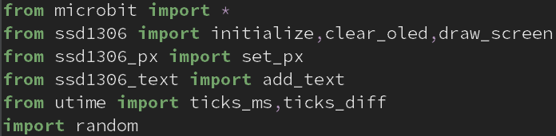
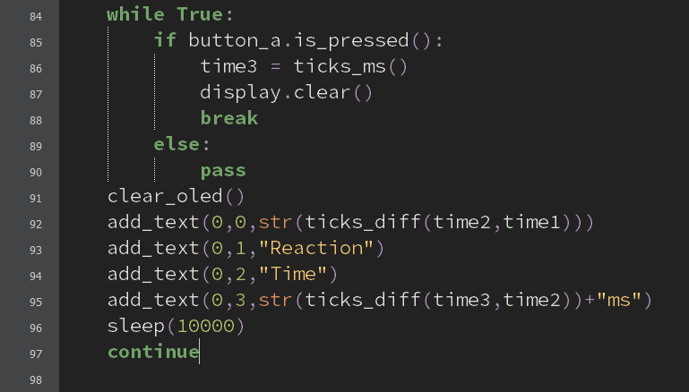
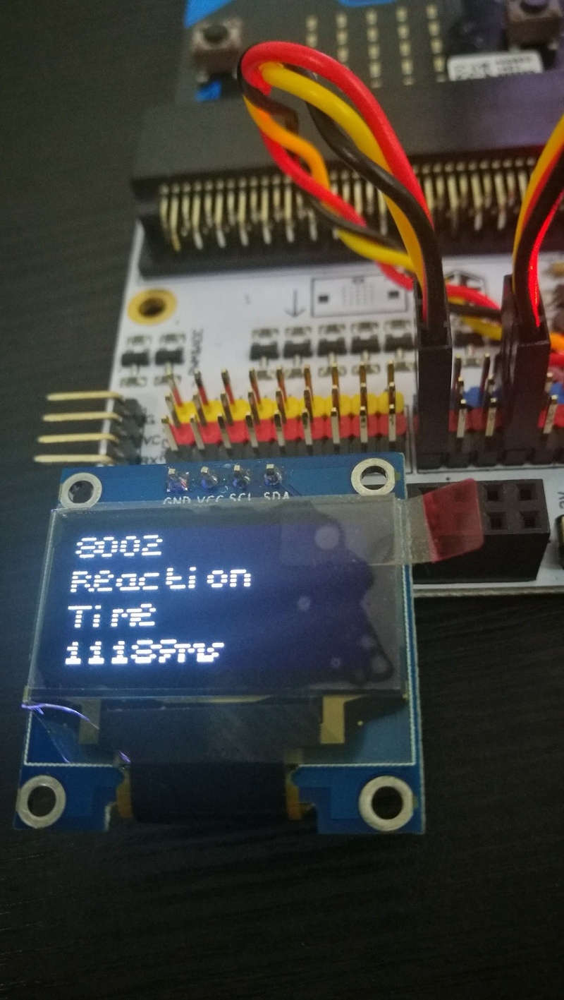
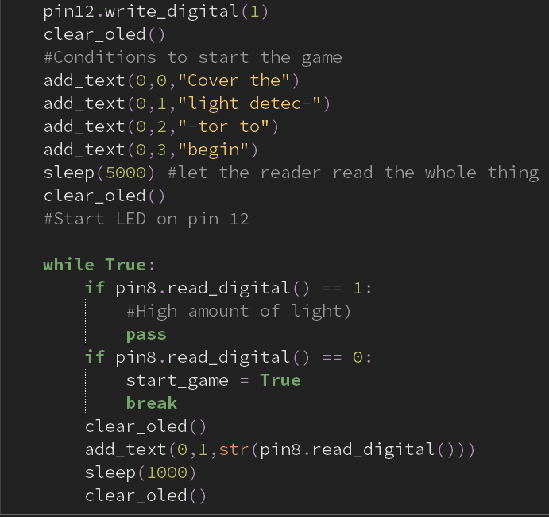
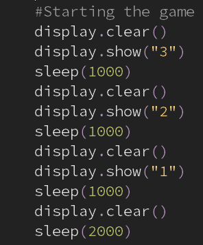

# 课程_38 Micropython:反应时间测试仪
---
- 使用micro:bit和OLED显示屏，做一个反应时间测试仪，本教程由莱佛士学院的Jensen撰写。

## 目标
---
- 1.组装反应时间测试仪
- 2.测试自己反应速度时尽量不要破坏它！

## 物料
- 1 x Tinker套件（或OLED显示屏）

### 第一步-输入/输出

- 将MicroBit连接到分线板。
- 将LED连接到引脚12，引脚12是数字引脚。
- 将光检测器连接到另一个数字引脚8。
- 棕色至G（接地），红色至V（电压），橙色至S（信号）。
- 这些告诉我们光线是打开还是关闭。
- 将OLED显示器连接到I2C引脚。任何一套都可以。
- 将micro：bit连接到计算机，然后下载Mu Editor。

### 第2步 - 文件传输
- 我们需要下载一些要在项目中使用的模块。
- 从此  链接下载模块作为zip文件。
- 在Mu Editor中编写代码（第一个屏幕截图）以导入文件。
- 确保文件与项目位于同一文件夹中。
- 将一些文件从计算机传输到microbit。
- 在Windows上，请务必将文件放在users /“Username”/ mu-code下的文件夹中，以便检测到我的mu-editor
- 这些文件是最初不在micro：bit上的模块，供您导入。

### 步骤3 - 加载屏幕
- 这个步骤并不是必需的，但它为您的项目增添了一点天赋。
- 我们在OLED模块上显示此负载
- 使用模块“add_text”，我们可以在显示器上显示文本和其他字符
- 我们使用函数“loading_screen（）”显示动画
- 如果您想要更多的加载屏幕变化，请前往帖子的底部。

### 步骤4 - 编写游戏代码
- 这是实际测试本身。
- 首先，我们必须有时间等待显示玩家按下按钮的指示器
- 我们随机生成数字并通过在将原始数字转换为字符串后将“000”添加到数字的末尾将其解析为毫秒。
- 变量time1和time2指的是在显示“＃”（玩家指示符）符号之前的2个任意时间点。
- 关于micropyit和MicroBit需要注意的一个要点是时间模块被utime模块取代，并且必须导入utime而不是时间。

### 第5步 - 更多逻辑程序
- 这是我们计算和显示玩家反应时间的步骤。
- 这是通过计算指示器显示和玩家按下按钮之间的时间来完成的。
- 然后，我们显示玩家对OLED显示屏的反应时间。

## 额外加载效果：
- 这个利用光传感器和LED开始游戏。
- 它会检测到光线，一旦光线被覆盖，游戏就会开始。
- 下一个动画很简单：在开始游戏之前显示字符“3”，“2”和“1”作为倒计时。代码非常自我解释。

