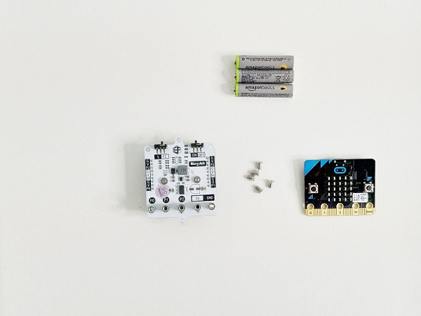
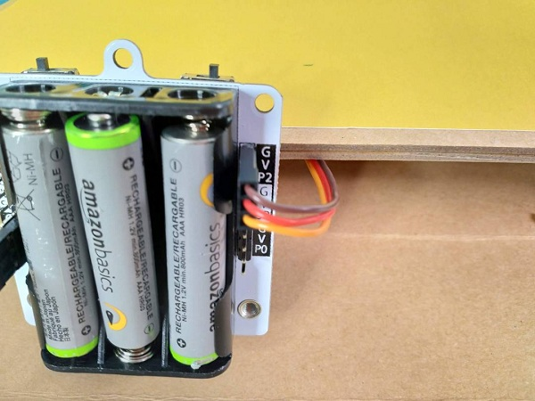
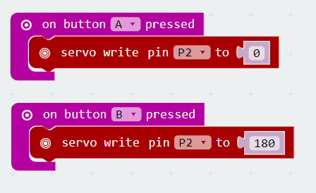
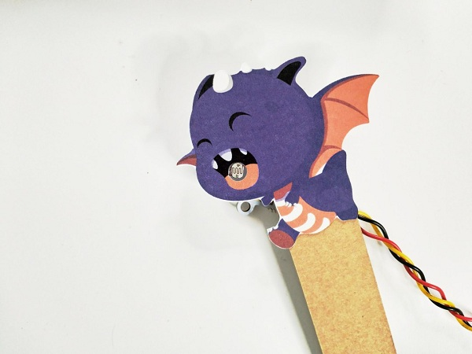

# 课程_39 编码射击
---
- 你有一个小镇可以拯救，还有一条龙可以射击！这是一个展示你创意的大好机会。

## 目标
---
- 1.组装射击机的所有部件
- 2.编辑micro:bit代码，检测激光打击信号，赢取高分。

## 物料
- 1 x 射击游戏盒子
- 1 x 光线传感器
- 1 x 舵机
- 1 x ring：bit
- 1 x micro：bit
- 5 x 螺丝
- 3 x AAA电池

### 第一步-整理你的城镇！

- 将所有山峦和灌木丛插入您所在城镇的路径。
 

- 将舵机安装到弹出中心的孔中。
 

- 将舵机电线穿入孔中，然后从前面的盒子中取出。

### 第2步 - 安装你的micro:bit

- 将micro:bit安装在ring:bit并用5个螺钉将其拧紧。
- 将所有3节电池插入电池组背面。
- 将左侧开关切换到P2，右侧开关切换到OFF。在我们编写micro：bit之后我们将打开它。

### 步骤3 - 连接所有器材!!
1.将舵机连接到ring：bit上的P2口。并确保棕色线到达G，黄色线到达P2。
2.将光敏传感器连接到ring:bit上的P1口。黑线应连接到G. 

### 步骤4 - 编码！
- 如果您从未尝试使用micro：bit进行编码，请查看我们的[入门教程！](https://tinkercademy.com/tutorials/getting-started-with-microbit/)

###第5步 - 真正的挑战 - 校准

校准你的龙以确保它在天空中来回飞行而不是反复地面对地面。

- 伺服牢固到位 - 按下微动：编码按钮A按下时将伺服转动到0度，按下按钮B时转动180度。  
- 按下按钮A后，将伺服臂放在伺服头上，观察按下按钮B时的位置。如果伺服臂指向太远或向侧面，请调整臂并减小编码角度。（例如调整0 - 180度至20 - 160度）
- 用相同角度的龙臂更换舵机  并拧紧它。

### 第6步 - 校准第2部分

在光传感器上。我们必须捕捉当前的光线水平，当激光经过时，传感器会提醒micro：bit光线强度提高了。

- 将光传感器穿过弹出窗口下方的孔并穿过盒子的前部。
- 将光传感器放入龙的嘴中，然后将其放下以固定它。
- 对micro：bit进行编码，按下按钮时，通过光传感器检测光线水平。

### 第7步 - 全部放在一起。
现在我们希望能够在龙被击中时阻止龙并且还能增加得分！

- 所以我们应该结合两段代码并使用IF逻辑块来检查我们是否被击中。 
- 如果我们被击中，那么我们更改micro:bit上的图标并暂停一段时间，然后再更改回默认图标。
- ELSE（如果我们没有检测到并命中）那么我们允许舵机按正常方式移动。
- 不喜欢自己编写 - 在这里找到[整个代码！](https://makecode.microbit.org/_hTm3afgh4F8f) 
- 此外 - 添加更多的块，以便在龙被击中时增加得分。
- 完成了！

