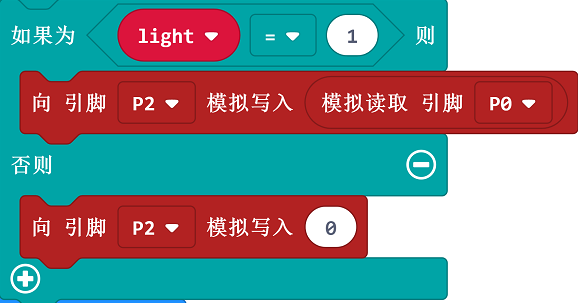

# 案例01：灯光控制器

## 目的
---

- 使用basic:bit套件完成灯光控制案例。

## 使用材料
---

- 1 x basic kit 基础套件

## 背景知识
---

## 硬件连接图
---

- 如图所示，将按键开关连接到basic:bit主板的P1口，LED模块连接到P2口，电位器模块连接到P0口。

- ***注意***：将basic:bit侧面的拨动开关，拨到P0，否则P0口会被蜂鸣器占用。

## 软件
---
- [微软makecode](https://makecode.microbit.org/#)在线积木块编程[https://makecode.microbit.org/#](https://makecode.microbit.org/#)

## 编程
---
### 步骤 1

- 当开机时需要将P1口设置一个上拉，以初始化按键模块。

### 步骤 2

- 以数字方式读取P1口返回值，赋值给`button`变量，来获取按键开关的状态。
- 判断如果`button`变量等于 1 ，意为按键按下，延时消抖。
- 判断`light`灯开关变量，如果`light`变量为 0 ，意为灯灭，则把`light`变量设为 1 ，如果不是，设置为0。

### 步骤 3

- 判断`light`灯开关变量，如果为 1，开灯，则以模拟数字方式读取P0口，即电位器的返回值，同时以模拟写入方式直接写入到P2口，即作为LED模块的参数。
- 如果`light`等开关变量不为 1 ，则意为关灯，向P2口模拟写入 0 ，关闭LED。

### 程序

请参考程序连接：[https://makecode.microbit.org/_DL87DfRpaL7z](https://makecode.microbit.org/_DL87DfRpaL7z)

你也可以通过以下网页直接下载程序。

<iframe style="position:absolute;top:0;left:0;width:100%;height:100%;" src="https://makecode.microbit.org/#pub:_DL87DfRpaL7z" frameborder="0" sandbox="allow-popups allow-forms allow-scripts allow-same-origin"></iframe>
  
---

## 结论
---

- 按下按键灯亮，再次按下灯灭。当灯亮时调节电位器旋钮，可以调节灯的亮度。

## 思考
---

- 延时消抖的作用和意义是什么？

## 常见问题
---

## 相关阅读  
---

