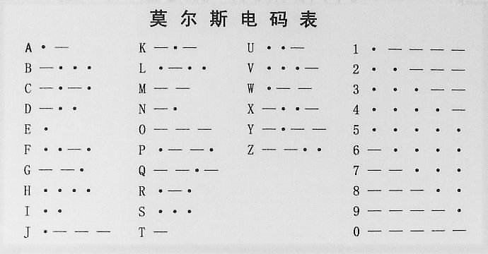

# 案例02：摩斯密码

## 目的
---

- 使用basic:bit套件完成莫尔斯密码编码。

## 使用材料
---

- 1 x basic kit 基础套件

## 背景知识
---
### 莫尔斯电码
- [摩尔斯电码](https://baike.baidu.com/item/%E6%91%A9%E5%B0%94%E6%96%AF%E7%94%B5%E7%A0%81)（又译为摩斯密码，Morse code）是一种时通时断的信号代码，通过不同的排列顺序来表达不同的英文字母、数字和标点符号。摩尔斯电码是一种早期的数字化通信形式，但是它不同于现代只使用零和一两种状态的二进制代码，它的代码包括五种： 点、划、点和划之间的停顿、每个词之间中等的停顿以及句子之间长的停顿。

### 莫尔斯电码表

## 硬件连接图
---

- 如图所示，将按键模块连接到basic:bit主板的P1口。

## 软件
---
- [微软makecode](https://makecode.microbit.org/#)在线积木块编程[https://makecode.microbit.org/#](https://makecode.microbit.org/#)

- 按钮模块以模拟值读取I/O口返回值，值如下。
	1. A按钮<10
	2. B按钮10-80
	3. C按钮80-130
	4. D按钮130-160
	5. E按钮160-600

## 编程
---
### 步骤 1

- 当开机时显示一个图标，设置变量`item`作为要发送的数据变量，变量`flag`作为字符串长度控制变量。
- 并且设置无线发送组为50。

### 步骤 2

- 判断flag变量(字符串长度)是否等于4，(本案例只取莫斯密码的英文，故长度最多4位)，如果等于4，显示字符A，提示用户。

### 步骤 3

- 以模拟值读取P1口，判断按下了哪个键，返回值80-130之间为C按钮按下，当C按钮按下时，将字符串长度变量加1，播放一个音调持续八分之一，点阵显示屏显示一个点，代表莫尔斯电码中的点，延时消抖，向字符串末尾写入一个字符“0”。

- 当按钮D按下时，与C按钮同理，区别是显示一个横，代表莫尔斯电码中的横，向字符串末尾写入“1”

### 步骤 4

- 当按下A按钮时，显示字符串，发送字符串，同时清空变量`item`和`flag`，初始化程序。

### 程序

请参考程序连接：[https://makecode.microbit.org/_3JrVPeeDVY2r](https://makecode.microbit.org/_3JrVPeeDVY2r)

你也可以通过以下网页直接下载程序。

<iframe style="position:absolute;top:0;left:0;width:100%;height:100%;" src="https://makecode.microbit.org/#pub:_3JrVPeeDVY2r" frameborder="0" sandbox="allow-popups allow-forms allow-scripts allow-same-origin"></iframe>
  
---

## 结论
---

- 按下按钮C，意为莫尔斯电码中的点，按下按钮D，意为莫尔斯电码中的横，按下C或者D总次数等于4时，显示字符A，需要按下A按钮，显示和发送当前字符串，并且初始化变量重置程序。

## 思考
---

- 延时消抖的作用和意义是什么？

## 常见问题
---

## 相关阅读  
---

