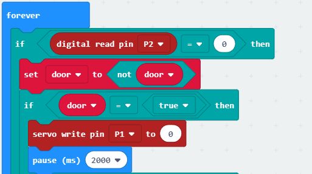

# 案例04：贴纸展示盒

## 目的
---

- 制作一个贴纸展示盒。

## 使用材料
---

- 1 x 舵机
- 1 x 瓦楞纸板
- 1 x 溶胶枪
- 1 x 剪刀
- 1 x 手工刀
- 1 x 碰撞传感器
- 1 x 电池盒
- 1 x basic kit主板

## 背景知识
---
### 什么是贴纸展示盒
- 想要别出心裁的展示你喜爱的贴纸么？那就做一个贴纸展示柜吧！

### 贴纸展示盒原理
- 使用micro：bit 通过basic kit扩展板，接收碰撞检测模块的信号，当接收到信号，控制舵机转动，打开展示柜的门，未接收到信号则保持不变。

## 结构场景搭建
---
准备一把美工刀，溶胶枪，剪刀和一些瓦楞纸板。

搭建成如图样式：

正面：

背面：

将元器件按如图摆放黏贴。

准备好要粘贴的图纸，将要粘贴的图纸粘贴在相应位置。

背面将图纸贴在相应位置，将线从另一边穿出去。

## 硬件连接图
---
-  将舵机连接在P1口，将碰撞传感器连接在P2口，将连接好的micro:bit和bisic:bit连上电池盒，如下。

## 软件
---

[微软makecode](https://makecode.microbit.org/#)

## 编程
---
### 步骤 1

在初始化积木块中，将P2电位拉高，保证信号稳定，然后将舵机值设置为180，即贴纸板为静止状态；

设置一个door变量，初值为false，用来保存贴纸板的状态。

### 步骤 2

在forever循环中，拖入if判断语句，判断P2口的值是否等于0时，即触碰开关是否被按下；

当P2值等于0时，即触碰开关被按下时，将控制门开关状态的变量DOOR取反，即如果为开门（true）即设置为关门（false），反之亦然。

在这之后再拖入一个if判断语句，判断控制们开关变量door的值，即判断门的开关状态，如果door值为真，则将门（即贴纸板）移动（将P1值设为0）。

### 步骤 3

当P2值不等于0时，即触碰开关未被按下，门（即贴纸板）变为关门状态（将P1值设为180）。

### 程序

请参考程序连接：[https://makecode.microbit.org/_A9M08Ea380yu](https://makecode.microbit.org/_A9M08Ea380yu)

你也可以通过以下网页直接下载程序。

<iframe style="position:absolute;top:0;left:0;width:100%;height:100%;" src="https://makecode.microbit.org/#pub:_A9M08Ea380yu" frameborder="0" sandbox="allow-popups allow-forms allow-scripts allow-same-origin"></iframe>
  
---

## 结论
---
当你按下触碰按钮，贴纸展板会移动展示。

## 思考
---
如何向小伙伴展示更多你心仪的贴纸呢？

## 常见问题
---

## 相关阅读  
---

