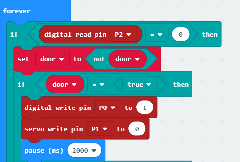

# 案例05：震惊盒子

## 目的
---

- 制作一个震惊盒子。

## 使用材料
---

- 1 x 舵机
- 1 x 瓦楞纸板
- 1 x 溶胶枪
- 1 x 剪刀
- 1 x 手工刀
- 1 x 碰撞传感器
- 1 x 电池盒
- 1 x basic kit主板

## 背景知识
---
### 什么是震惊盒子
- 想要搞怪一下么？那就来做一个震惊盒子吧，关灯情况下，效果更好噢，来和小伙伴一起观看吧！

### 贴纸展示盒原理
- 使用micro:bit 通过basic kit扩展板，接收碰撞检测模块的信号，当接收到信号，控制舵机转动，变换四个角度不同的脸。

## 结构场景搭建
---
准备一把美工刀，溶胶枪，剪刀和一些瓦楞纸板。

搭建成如图样式：

先做好一个四面贴上四张脸的四方小盒子，将它固定在舵机的转叶上，再将它固定在一张瓦楞纸板上：

逐渐的将四个面都用中间挖好中间小盒子大小的中空纸板围起来，注意围的离舵机近一点，效果更好：

将多余的纸板裁掉，准备一张瓦楞纸板上面用小刀切一个能穿过线的小口，将灯线从中穿过，盖在小盒的顶部

将元器件按如图摆放黏贴。

## 硬件连接图
---

将小灯连接在P0口，舵机连接在P1口，碰撞传感器连接在P2口，将连接好的micro:bit和bisic:bit连上电池盒，如下。
  

###注意要将bisic:bit的开关拨到P0位置。

## 软件
---
[微软makecode](https://makecode.microbit.org/#)

## 编程
---
### 步骤 1

打开编程页面后，将P2口设置为高电平，保证一个稳定的信号。

然后将舵机控制转动的状态设置一个初值为false的变量为door，用来控制人脸转动的状态。

### 步骤 2

在forever循环中，拖入if判断语句，判断P2口的值是否等于0时，即触碰开关是否被按下；

当P2值等于0时，即触碰开关被按下时，将控制转动状态的变量DOOR取反，即如果为转动（true）即设置为不转动（false），反之亦然。

在这之后再拖入一个if判断语句，判断控制转动变量door的值，即判断转动的开关状态，如果door值为真，则将人脸转动（将P1值设为0），灯点亮。

### 步骤 3

当P2值不等于0时，即触碰开关未被按下，人脸转动回初始样式（将P1值设为180），灯熄灭。

### 程序

请参考程序连接：[https://makecode.microbit.org/_6athRsVt02Aw](https://makecode.microbit.org/_6athRsVt02Aw)

你也可以通过以下网页直接下载程序。

<iframe style="position:absolute;top:0;left:0;width:100%;height:100%;" src="https://makecode.microbit.org/#pub:_6athRsVt02Aw" frameborder="0" sandbox="allow-popups allow-forms allow-scripts allow-same-origin"></iframe>
  
---

## 结论
---
当触碰模块作为按钮被点亮，舵机状态被设置为0，转动180度，转动人脸，然后换一个方向继续控制人脸转动。

## 思考
---
怎样将震惊盒子的展示方式变为每一面依次旋转呢？

## 常见问题
---

## 相关阅读  
---

