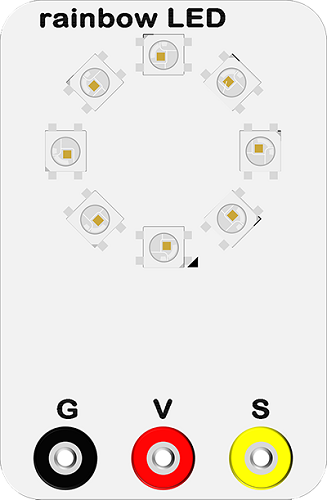

# 软件编程案例10：彩虹LED灯环

## 简介 ##
---
- LED七彩灯环是基于ws2812b灯珠。它的最大特点是单IO控制与无限级联。在这次的实验中，我们将用micro:bit来驱动灯环实现彩虹色渐变。
## 硬件连线图 ##
---

- 使用香蕉线按如上图连接电路，电池盒内放入2颗7号AAA电池。

## 电路原理图 ##
---

- micro:bit插槽的GND端和电池GND相连内部，形成电流回路。

## 主要元件介绍 ##
---
### LED七彩灯环（8颗灯珠）
- LED七彩灯环（8颗灯珠）是由8颗ws2812b灯珠级联而成的灯环，ws2812b是一个集控制电路与发光电路于一体的智能外控LED光源，其外型与一个5050LED灯珠相同。
- 像素点内部包含了智能数字接口数据锁存信号整形放大驱动电路，还包含有高精度的内部振荡器和12V高压可编程定电流控制部分，有效保证了像素点光的颜色高度一致。
- 数据协议采用单线归零码的通讯方式，像素点在上电复位以后，DIN端接受从控制器传输过来的数据，首先送过来的24bit数据被第一个像素点提取后，送到像素点内部的数据锁存器，剩余的数据经过内部整形处理电路整形放大后通过DO端口开始转发输出给下一个级联的像素点，每经过一个像素点的传输，信号减少24bit。像素点采用自动整形转发技术，使得该像素点的级联个数不受信号传送的限制，仅仅受限信号传输速度要求。
- 在实验箱板载了八颗灯珠组成的灯环。

*- 连线时注意正负极。*

## 软件编程设计
---
### 步骤 1

- 点击打开[微软makecode在线积木块编程https://makecode.microbit.org/#](https://makecode.microbit.org/#)。

- 点击New Project按钮，新建一个项目。

- 点击Advanced(高级)查看更多代码选项，并在底部找到Extensions(扩展代码库)。

- 搜索neopixel，添加neopixel代码库。

### 步骤 2
- 在on start 积木块中初始化七彩LED，设置引脚为P0，8颗灯珠，使用RGB色彩。
- 之后将灯环设置为彩虹渐变。

### 步骤 3 
- 设置好了LED的颜色后，不代表它就会开始工作。为了让它真正工作，你需要使用show积木块。
- 之后设置rotate pixels按环形移位灯珠的颜色信息。

### 程序

- 请参考程序连接：[https://makecode.microbit.org/_LJAe7W97fDat](https://makecode.microbit.org/_LJAe7W97fDat)

- 你也可以通过以下网页直接下载程序。

<iframe style="position:absolute;top:0;left:0;width:100%;height:100%;" src="https://makecode.microbit.org/#pub:_LJAe7W97fDat" frameborder="0" sandbox="allow-popups allow-forms allow-scripts allow-same-origin"></iframe>
  
---

## 结论
---
- 我们可以看到LED彩虹灯环实现了运动的彩虹渐变效果。
- 

## 思考
---
- 想象灯环是一只大眼睛，让灯环显示眨眼睛的效果，那么我们该如何设计电路与编程？

## 常见问题
---

## 相关阅读  
---

