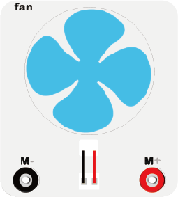

# 软件编程案例11：直流电机

## 简介 ##
---
- 电机是依据电磁感应定律实现电能转换为动能的一种装置。在这次的实验中，我们将用一个开关来控制电机的启动与停止。

## 硬件连线图 ##
---

- 使用香蕉线按如上图连接电路，电池盒内放入2颗7号AAA电池。

## 电路原理图 ##
---

- micro:bit插槽的GND端和电池GND相连内部，形成电流回路。

## 主要元件介绍 ##
---
### 直流电机
- 电机是依据电磁感应定律实现电能转换为动能的一种装置。电机的分类非常多，最常见的为直流电机，当在电机两端加上直流电压时，电机会旋转，电压越高，旋转的速度越快。
- 在实验箱板载了一个直流电机，连接了一个风扇来展示点击的转动。

*- 连线时注意正负极。*

## 软件编程设计
---
### 步骤 1

- 点击打开[微软makecode在线积木块编程https://makecode.microbit.org/#](https://makecode.microbit.org/#)。

- 点击New Project按钮，新建一个项目。

### 步骤 2

- 在on start积木块中插入向P0口写入0，防止电机误启动，将P1引脚拉高，以等待按键信号。

### 步骤 3

- 判断数字读取P1口的值是否为0，如果是向P0口写入1启动电机，如果不等于0，则向P0口写入0停止电机。

### 程序

- 请参考程序连接：[https://makecode.microbit.org/_Y94cmyMePXsh](https://makecode.microbit.org/_Y94cmyMePXsh)

- 你也可以通过以下网页直接下载程序。

<iframe style="position:absolute;top:0;left:0;width:100%;height:100%;" src="https://makecode.microbit.org/#pub:_Y94cmyMePXsh" frameborder="0" sandbox="allow-popups allow-forms allow-scripts allow-same-origin"></iframe>
  
---

## 结论
---
- 按下按钮时，电机开始旋转，再按一次，电机停止旋转。

## 思考
---
- 如果要用电位器对电机进行速度控制，该如何设计电路与编程？

## 常见问题
---

## 相关阅读  
---

