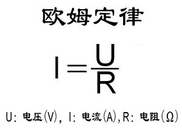

# 电路设计案例01：按键开关控制LED灯

## 简介 ##
---
使用实验箱套件完成一个纯电路设计，不使用micro:bit编程完成对一颗LED的控制。

## 硬件连线图 ##
---

- 使用香蕉线按如上图连接电路，电池盒内放入2颗7号AAA电池。

## 主要元件介绍 ##
---
### 按钮开关 ###
- 按键开关主要是指轻触式按键开关，也称之为轻触开关。按键开关是一种电子开关，属于电子元器件类，使用时以满足操作力的条件向开关操作方向施压开关功能闭合接通，当撤销压力时开关即断开，其内部结构是靠金属弹片受力变化来实现通断的。
- 在电路原理图中使用如下电路符号表示。

### LED ###

- LED全称发光二极管，它是半导体二极管的一种，可以把电能转化成光能。发光二极管与普通二极管一样是由一个PN结组成，也具有单向导电性。使用二极管时要严格区分正负极，正极接电源负极接地，否则会造成二极管反向击穿，元件损坏。
- 在电路原理图中使用如下电路符号表示。

### 电阻 ###

- 电阻器（Resistor）在日常生活中一般直接称为电阻。是一个限流元件，将电阻接在电路中后，它可限制通过它所连支路的电流大小。理想的电阻器是线性的，即通过电阻器的瞬时电流与外加瞬时电压成正比。即欧姆定律(在同一电路中，通过某段导体的电流跟这段导体两端的电压成正比，跟这段导体的电阻成反比。)
- 欧姆定律及电路符号如下图所示。

## 电路分析 ##
---

- 2节7号AAA电池的电压为3V，即额定电压3V，LED的额定工作电流为30mA,根据欧姆定律计算，电阻值为100Ω。故需要串联一个100Ω电阻限流，否则会因为电流过大而烧坏LED。
- 当按钮按下，电路导通，LED灯亮起。

## 结论
---

- 按下按钮开关，LED灯亮起。

## 思考
---

- 如何用电位器控制LED灯的亮度，如何设计电路。

## 常见问题
---

## 相关阅读  
---
